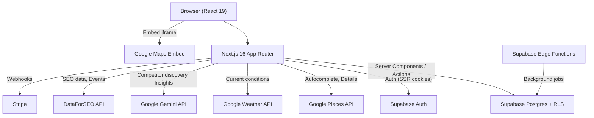
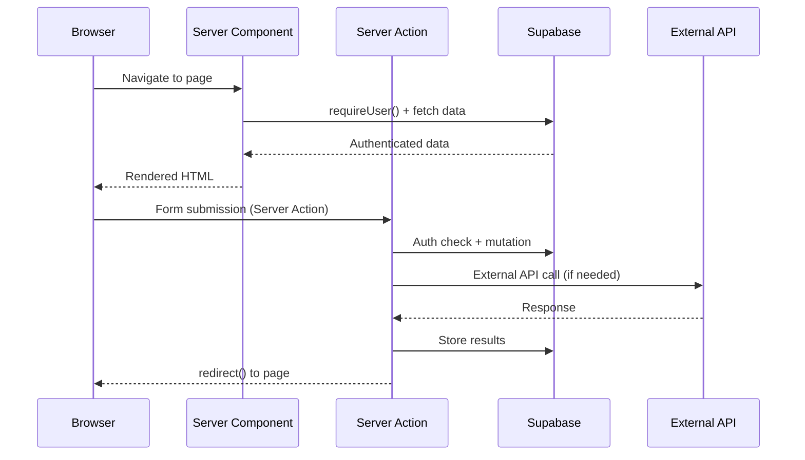
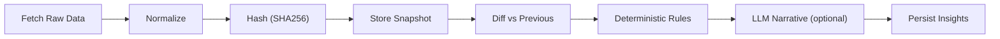
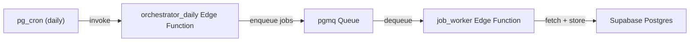
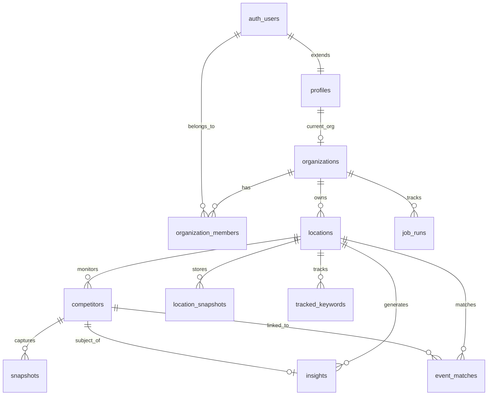

# Prophet -- Codebase Blueprint

> **Author:** Anand, GitHub Username: anandiyerdigital
> **Last updated:** February 8, 2026
> **Branch:** `dev`
> **Purpose:** Complete technical reference for the Prophet codebase. Intended for developers, AI coding tools, and anyone who needs to understand the entire application without reading every source file.

---

## Table of Contents

1. [Executive Summary](#1-executive-summary)
2. [Tech Stack and Dependencies](#2-tech-stack-and-dependencies)
3. [Environment Variables](#3-environment-variables)
4. [Project Structure](#4-project-structure)
5. [Architecture Overview](#5-architecture-overview)
6. [Authentication and Authorization](#6-authentication-and-authorization)
7. [Database Schema](#7-database-schema)
8. [Multi-Tenancy Model](#8-multi-tenancy-model)
9. [Routing and Pages](#9-routing-and-pages)
10. [Server Actions Reference](#10-server-actions-reference)
11. [API Routes Reference](#11-api-routes-reference)
12. [External API Integrations](#12-external-api-integrations)
13. [Provider Architecture](#13-provider-architecture)
14. [Data Pipeline: Snapshots and Insights](#14-data-pipeline-snapshots-and-insights)
15. [Billing and Tier System](#15-billing-and-tier-system)
16. [UI Component Library](#16-ui-component-library)
17. [Supabase Edge Functions](#17-supabase-edge-functions)
18. [Testing](#18-testing)
19. [Deployment](#19-deployment)
20. [Known Limitations and Future Work](#20-known-limitations-and-future-work)

---

## 1. Executive Summary

**Prophet** is a competitive intelligence platform for local businesses (initially restaurants). It automates competitor discovery, daily monitoring, SEO visibility tracking, local event intelligence, and actionable insight generation.

### What it does

- **Competitor Discovery:** AI-powered (Gemini with Google Maps grounding) discovery of nearby competitors, enriched with Google Places data.
- **Competitor Monitoring:** Tracks approved competitors with daily snapshots, diffing, and deterministic change detection.
- **SEO Visibility Dashboard:** Semrush-style domain overview via DataForSEO -- organic/paid traffic estimates, keyword rankings, competitor overlap, ranking distribution, top pages, subdomains, historical trends, ad creatives.
- **Local Events Intelligence:** Discovers nearby events via DataForSEO Google Events SERP, matches events to tracked competitors, generates event-driven insights.
- **Insight Engine:** Deterministic rules generate structured insights across competitors, SEO, and events. LLM (Gemini) adds narrative summaries and recommendations.
- **Multi-tenant SaaS:** Organizations with roles (owner/admin/member), Stripe billing with tier-based limits, Supabase RLS for data isolation.

### Current state

The application has shipped MVP through most of the PRD phases:
- Auth, onboarding, organization management (Phase 1)
- Location management with Google Places integration (Phase 2)
- Competitor discovery with Gemini + Google Places enrichment (Phase 3)
- Snapshot pipeline with competitor and location-level snapshots (Phase 4)
- Deterministic insight engine with competitor, SEO, and event insight rules (Phase 5)
- Stripe billing with 4 tiers and limit enforcement (Phase 6)
- AI chat endpoint (scaffolded, LLM integration pending), interactive loading overlays (Phase 7 partial)

### What is NOT yet shipped

- Background job automation (pg_cron + pgmq + Edge workers are scaffolded but not deployed)
- Email digests/notifications (Edge Function stub exists)
- Full "Ask Prophet" chat with LLM
- Data retention cleanup policies

---

## 2. Tech Stack and Dependencies

### Runtime

| Technology | Version | Purpose |
|---|---|---|
| Next.js | 16.1.5 | App Router, Server Components, Server Actions, Turbopack |
| React | 19.2.3 | UI framework |
| TypeScript | ^5 | Type safety (strict mode) |
| Node.js | 20+ | Runtime (inferred from tsconfig target ES2017) |

### Database and Auth

| Technology | Version | Purpose |
|---|---|---|
| Supabase JS | ^2.93.1 | Database client, Auth, Realtime |
| Supabase SSR | ^0.8.0 | Server-side cookie-based auth for Next.js |
| PostgreSQL | (Supabase-managed) | Primary database with RLS |

### UI and Styling

| Technology | Version | Purpose |
|---|---|---|
| Tailwind CSS | ^4 | Utility-first CSS (v4, CSS-based config) |
| @tailwindcss/postcss | ^4 | PostCSS plugin for Tailwind v4 |
| Recharts | ^3.7.0 | React charting (bar, area, pie charts) |
| Framer Motion | ^12.29.2 | Animations (fade-in, carousel, overlays) |

### Payments

| Technology | Version | Purpose |
|---|---|---|
| Stripe | ^20.2.0 | Subscription billing, webhook handling |

### Testing

| Technology | Version | Purpose |
|---|---|---|
| Playwright | ^1.58.0 | End-to-end browser testing |

### External APIs (not npm packages)

| API | Purpose |
|---|---|
| Google Places API (New) | Location search, place details, reviews |
| Google Maps Embed API | Mini-map iframes |
| Google Weather API | Current conditions for competitor locations |
| Google Gemini API | Competitor discovery (2.5 Flash), insight narratives (3 Pro Preview), quick tips (2.5 Flash) |
| DataForSEO | SEO data (12 endpoints), local events SERP |

### Configuration

| File | Purpose |
|---|---|
| `next.config.ts` | Next.js configuration (default, no custom settings) |
| `tsconfig.json` | TypeScript strict mode, `@/*` path alias, excludes `supabase/functions/**` |
| `postcss.config.mjs` | PostCSS with `@tailwindcss/postcss` |
| `eslint.config.mjs` | ESLint with `eslint-config-next` |
| `playwright.config.ts` | E2E test configuration, base URL `http://localhost:3000` |
| `app/globals.css` | Tailwind v4 import + CSS custom properties for background/foreground/fonts |

---

## 3. Environment Variables

All environment variables are stored in `.env.local` (gitignored). Here is the complete list referenced across the codebase:

| Variable | Required | Used In | Purpose |
|---|---|---|---|
| `NEXT_PUBLIC_SUPABASE_URL` | Yes | `lib/supabase/server.ts`, `client.ts`, `admin.ts` | Supabase project URL |
| `NEXT_PUBLIC_SUPABASE_ANON_KEY` | Yes | `lib/supabase/server.ts`, `client.ts` | Supabase anonymous/public key |
| `SUPABASE_SERVICE_ROLE_KEY` | Yes | `lib/supabase/admin.ts` | Supabase service role key (server-only, bypasses RLS) |
| `GOOGLE_MAPS_API_KEY` | Yes | `lib/places/google.ts`, `lib/weather/google.ts`, `components/places/mini-map.tsx` | Google Maps Platform (Places, Embed, Weather) |
| `GOOGLE_AI_API_KEY` | Yes | `lib/providers/gemini.ts`, `lib/ai/gemini.ts`, `app/api/ai/quick-tip/route.ts` | Google AI / Gemini API key |
| `DATAFORSEO_LOGIN` | Yes | `lib/providers/dataforseo/client.ts` | DataForSEO API username |
| `DATAFORSEO_PASSWORD` | Yes | `lib/providers/dataforseo/client.ts` | DataForSEO API password |
| `STRIPE_SECRET_KEY` | Yes | `app/api/stripe/webhook/route.ts` | Stripe secret key |
| `STRIPE_WEBHOOK_SECRET` | Yes | `app/api/stripe/webhook/route.ts` | Stripe webhook signing secret |
| `STRIPE_PRICE_ID_STARTER` | Yes | `lib/billing/tiers.ts` | Stripe price ID for Starter tier |
| `STRIPE_PRICE_ID_PRO` | Yes | `lib/billing/tiers.ts` | Stripe price ID for Pro tier |
| `STRIPE_PRICE_ID_AGENCY` | Yes | `lib/billing/tiers.ts` | Stripe price ID for Agency tier |
| `NEXT_PUBLIC_APP_URL` | No | `app/(dashboard)/competitors/actions.ts` | App base URL (defaults to `http://localhost:3000`) |
| `OPENAI_API_KEY` | No | `app/api/ai/chat/route.ts` | OpenAI key (referenced but not actively used) |
| `ANTHROPIC_API_KEY` | No | `app/api/ai/chat/route.ts` | Anthropic key (referenced but not actively used) |

---

## 4. Project Structure

```
prophet/
├── app/                                    # Next.js App Router
│   ├── layout.tsx                          # Root layout (Geist fonts, metadata)
│   ├── page.tsx                            # Landing page (/)
│   ├── globals.css                         # Tailwind v4 + CSS custom properties
│   ├── favicon.ico
│   │
│   ├── (auth)/                             # Auth route group (shared layout)
│   │   ├── layout.tsx                      # Minimal slate background wrapper
│   │   ├── login/
│   │   │   ├── page.tsx                    # Login UI (magic link + Google OAuth)
│   │   │   └── actions.ts                  # sendMagicLinkAction, signInWithGoogleAction
│   │   └── signup/
│   │       ├── page.tsx                    # Signup UI
│   │       └── actions.ts                  # Re-exports login actions
│   │
│   ├── auth/
│   │   └── callback/
│   │       └── route.ts                    # OAuth callback: exchanges code, redirects
│   │
│   ├── onboarding/
│   │   ├── page.tsx                        # First-time setup (org + first location)
│   │   └── actions.ts                      # createOrganizationAction, createLocationAction
│   │
│   ├── (dashboard)/                        # Dashboard route group (auth-gated)
│   │   ├── layout.tsx                      # Sidebar nav, auth guard, org check
│   │   ├── actions.ts                      # signOutAction
│   │   ├── home/
│   │   │   └── page.tsx                    # Dashboard overview (metrics summary)
│   │   ├── competitors/
│   │   │   ├── page.tsx                    # Competitor management (discover/approve/ignore)
│   │   │   └── actions.ts                  # discoverCompetitorsAction, approve, ignore
│   │   ├── insights/
│   │   │   ├── page.tsx                    # Insight feed with filters and charts
│   │   │   └── actions.ts                  # generateInsightsAction, markRead, dismiss
│   │   ├── events/
│   │   │   ├── page.tsx                    # Local events intelligence
│   │   │   └── actions.ts                  # fetchEventsAction
│   │   ├── visibility/
│   │   │   ├── page.tsx                    # SEO visibility dashboard (organic + paid)
│   │   │   └── actions.ts                  # refreshSeoAction
│   │   ├── locations/
│   │   │   ├── page.tsx                    # Location management CRUD
│   │   │   └── actions.ts                  # createLocationFromPlace, update, delete
│   │   └── settings/
│   │       ├── page.tsx                    # Settings index
│   │       ├── billing/
│   │       │   └── page.tsx                # Subscription tier and Stripe status
│   │       └── team/
│   │           └── page.tsx                # Team management (placeholder)
│   │
│   ├── api/                                # API route handlers
│   │   ├── ai/
│   │   │   ├── chat/
│   │   │   │   └── route.ts                # POST: AI chat (LLM integration pending)
│   │   │   └── quick-tip/
│   │   │       └── route.ts                # POST: Lightweight Gemini quick tip
│   │   ├── places/
│   │   │   ├── autocomplete/
│   │   │   │   └── route.ts                # GET: Google Places autocomplete proxy
│   │   │   └── details/
│   │   │       └── route.ts                # GET: Google Places details proxy
│   │   └── stripe/
│   │       └── webhook/
│   │           └── route.ts                # POST: Stripe webhook handler
│   │
│   └── docs/
│       └── PRD.md                          # Master Product Requirements Document
│
├── components/                             # React components
│   ├── competitors/
│   │   └── discover-form.tsx               # Client: Competitor discovery form + RefreshOverlay
│   ├── filters/
│   │   └── auto-filter-form.tsx            # Client: Auto-navigating filter dropdowns
│   ├── insights/
│   │   └── insights-dashboard.tsx          # Client: Charts dashboard (Recharts)
│   ├── insight-card.tsx                    # Server: Insight card with evidence + recommendations
│   ├── motion/
│   │   └── fade-in.tsx                     # Client: Framer Motion fade-in wrapper
│   ├── places/
│   │   ├── location-add-form.tsx           # Client: Add location via Google Places
│   │   ├── location-search.tsx             # Client: Google Places autocomplete search
│   │   └── mini-map.tsx                    # Server: Google Maps Embed iframe
│   ├── ui/                                 # Base UI components
│   │   ├── badge.tsx                       # Server: Badge (default/success/warning)
│   │   ├── button.tsx                      # Server: Button (primary/secondary/ghost)
│   │   ├── card.tsx                        # Server: Card, CardHeader, CardTitle, CardDescription
│   │   ├── input.tsx                       # Server: Input field
│   │   ├── label.tsx                       # Server: Label
│   │   ├── location-filter.tsx             # Client: Location dropdown (URL param navigation)
│   │   ├── refresh-overlay.tsx             # Client: Animated loading overlay with insight carousel
│   │   └── separator.tsx                   # Server: Horizontal separator
│   └── visibility/
│       ├── intent-serp-panels.tsx          # Client: Keyword intent + SERP feature panels
│       ├── keyword-tabs.tsx                # Client: Tabbed keyword table (All/Improved/etc.)
│       ├── ranking-distribution.tsx        # Client: Bar chart for rank position distribution
│       ├── traffic-chart.tsx               # Client: Area chart for traffic over time
│       ├── visibility-charts.tsx           # Client: Pie chart for share of voice
│       └── visibility-filters.tsx          # Client: Location dropdown + Organic/Paid tabs
│
├── lib/                                    # Shared business logic
│   ├── utils.ts                            # cn() class name merger
│   ├── auth/
│   │   └── server.ts                       # getUser(), requireUser()
│   ├── billing/
│   │   ├── tiers.ts                        # SubscriptionTier, TIER_LIMITS, getTierFromPriceId()
│   │   └── limits.ts                       # Guardrail functions (ensure*Limit, get*Cadence, etc.)
│   ├── supabase/
│   │   ├── server.ts                       # createServerSupabaseClient() (SSR cookies)
│   │   ├── client.ts                       # createBrowserSupabaseClient()
│   │   └── admin.ts                        # createAdminSupabaseClient() (service role)
│   ├── ai/
│   │   ├── gemini.ts                       # generateGeminiJson() via Gemini 3 Pro Preview
│   │   └── prompts/
│   │       ├── insights.ts                 # buildInsightNarrativePrompt()
│   │       └── prophet-chat.ts             # buildProphetPrompt()
│   ├── places/
│   │   └── google.ts                       # fetchAutocomplete(), fetchPlaceDetails(), mapPlaceToLocation()
│   ├── weather/
│   │   └── google.ts                       # fetchCurrentConditions() -> WeatherSnapshot
│   ├── providers/                          # Provider Abstraction Layer (PAL)
│   │   ├── types.ts                        # NormalizedSnapshot, ProviderCandidate, Provider interface
│   │   ├── index.ts                        # getProvider() registry
│   │   ├── scoring.ts                      # scoreCompetitor() relevance scoring
│   │   ├── gemini.ts                       # Gemini provider (competitor discovery)
│   │   ├── dataforseo.ts                   # DataForSEO provider (local finder + snapshots)
│   │   └── dataforseo/                     # DataForSEO API clients
│   │       ├── client.ts                   # postDataForSEO(), extractFirstResult()
│   │       ├── domain-rank-overview.ts     # Labs Domain Rank Overview
│   │       ├── ranked-keywords.ts          # Labs Ranked Keywords
│   │       ├── keywords-for-site.ts        # Labs Keywords For Site
│   │       ├── competitors-domain.ts       # Labs Competitors Domain
│   │       ├── domain-intersection.ts      # Labs Domain Intersection
│   │       ├── relevant-pages.ts           # Labs Relevant Pages
│   │       ├── subdomains.ts               # Labs Subdomains
│   │       ├── historical-rank-overview.ts # Labs Historical Rank Overview
│   │       ├── serp-organic.ts             # SERP Google Organic
│   │       ├── google-events.ts            # SERP Google Events
│   │       ├── ads-search.ts               # Google Ads Search (Transparency Center)
│   │       └── backlinks-summary.ts        # Backlinks Summary (subscription-gated)
│   ├── insights/                           # Competitor insight engine
│   │   ├── types.ts                        # SnapshotFieldChange, SnapshotDiff, GeneratedInsight
│   │   ├── index.ts                        # Re-exports all insight functions
│   │   ├── normalize.ts                    # normalizeSnapshot() (canonical format)
│   │   ├── hash.ts                         # computeDiffHash() (SHA256)
│   │   ├── diff.ts                         # diffSnapshots() (compare previous vs current)
│   │   ├── rules.ts                        # buildInsights() (deterministic rules)
│   │   └── trends.ts                       # buildWeeklyInsights() (T-7 trend analysis)
│   ├── seo/                                # SEO insight engine
│   │   ├── types.ts                        # DomainRankSnapshot, NormalizedRankedKeyword, etc.
│   │   ├── normalize.ts                    # Normalizers for all DataForSEO SEO responses
│   │   ├── hash.ts                         # SEO-specific hashing utilities
│   │   └── insights.ts                     # generateSeoInsights() (10 deterministic rules)
│   └── events/                             # Events insight engine
│       ├── types.ts                        # NormalizedEvent, EventMatchRecord, etc.
│       ├── normalize.ts                    # normalizeEventsSnapshot() from DataForSEO
│       ├── hash.ts                         # computeEventUid(), computeEventsSnapshotDiffHash()
│       ├── match.ts                        # matchEventsToCompetitors() deterministic matching
│       └── insights.ts                     # generateEventInsights() (5 insight rules)
│
├── types/                                  # Shared TypeScript types
│   ├── database.types.ts                   # Auto-generated Supabase database types
│   └── prophet.types.ts                    # ActionResult<T> standard return shape
│
├── supabase/                               # Supabase configuration
│   ├── migrations/                         # SQL migrations (5 files)
│   │   ├── 20260127010101_initial_schema.sql
│   │   ├── 20260127010200_membership_bootstrap.sql
│   │   ├── 20260127010300_fix_org_member_policies.sql
│   │   ├── 20260206010100_events_tables.sql
│   │   └── 20260207010100_seo_tables.sql
│   └── functions/                          # Supabase Edge Functions (Deno)
│       ├── orchestrator_daily/
│       │   └── index.ts                    # SEO insight generation rules
│       ├── job_worker/
│       │   └── index.ts                    # SEO normalization utilities
│       └── digest_weekly/
│           └── index.ts                    # Weekly digest (stub)
│
├── tests/
│   └── auth-onboarding.spec.ts             # Playwright smoke test
│
├── public/                                 # Static assets
│   ├── file.svg, globe.svg, next.svg, vercel.svg, window.svg
│
├── BLUEPRINT.md                            # This file
├── README.md
├── package.json
├── package-lock.json
├── .gitignore
├── eslint.config.mjs
├── playwright.config.ts
├── postcss.config.mjs
└── next.config.ts
```

---

## 5. Architecture Overview

### 5.1 High-Level System Architecture



### 5.2 Request and Data Flow



### 5.3 Insight Pipeline



This pipeline applies to all three insight sources:
- **Competitor insights:** DataForSEO/Google Places snapshot -> normalize -> diff -> rules (rating change, review velocity, hours change)
- **SEO insights:** DataForSEO Labs/SERP -> normalize -> diff -> rules (10 rule types)
- **Event insights:** DataForSEO Events SERP -> normalize -> match to competitors -> rules (5 rule types)

### 5.4 Background Job Architecture (Designed, Not Yet Deployed)



---

## 6. Authentication and Authorization

### 6.1 Auth Methods

Two methods are supported via Supabase Auth:

1. **Magic Link** -- email-based passwordless login (`supabase.auth.signInWithOtp()`)
2. **Google OAuth** -- redirect-based OAuth2 (`supabase.auth.signInWithOAuth()`)

Both are implemented in `app/(auth)/login/actions.ts`.

### 6.2 Auth Callback

`app/auth/callback/route.ts` handles the OAuth redirect:
1. Receives `?code=...` query param
2. Exchanges code for session via `supabase.auth.exchangeCodeForSession(code)`
3. Fetches user profile to check `current_organization_id`
4. Redirects to `/home` if org exists, or `/onboarding` if not

### 6.3 Server-Side Auth Pattern

Auth is checked server-side using two functions in `lib/auth/server.ts`:

```typescript
// Returns user or null (does not throw/redirect)
async function getUser(): Promise<User | null>

// Returns user or redirects to /login (used as a guard)
async function requireUser(): Promise<User>
```

Both use `createServerSupabaseClient()` which reads Supabase auth cookies via Next.js `cookies()`.

### 6.4 Auth Guards

- **Dashboard layout** (`app/(dashboard)/layout.tsx`): Calls `requireUser()`, then checks for `current_organization_id`. Redirects to `/onboarding` if missing.
- **Individual pages**: Also call `requireUser()` as the first operation.
- **There is no `middleware.ts`**: All auth is enforced at the layout/page level.

### 6.5 Supabase Clients

| Client | File | Auth | Use Case |
|---|---|---|---|
| Server | `lib/supabase/server.ts` | User's session (cookies) | All server components and actions |
| Browser | `lib/supabase/client.ts` | User's session (browser) | Client-side realtime (not actively used) |
| Admin | `lib/supabase/admin.ts` | Service role key (bypasses RLS) | Fallback writes when RLS blocks admin actions |

### 6.6 RLS Helper Functions

To avoid recursive RLS policy evaluation (where `organization_members` policies reference `organization_members`), two `SECURITY DEFINER` functions are used:

```sql
-- Returns true if the current user is a member of the given org
public.is_org_member(org_id uuid) -> boolean

-- Returns true if the current user is an owner or admin of the given org
public.is_org_admin(org_id uuid) -> boolean
```

These are defined in migration `20260127010300_fix_org_member_policies.sql` and used in `organization_members` RLS policies.

---

## 7. Database Schema

### 7.1 Migrations

| Migration | Purpose |
|---|---|
| `20260127010101_initial_schema.sql` | Core tables, indexes, RLS policies for all base tables |
| `20260127010200_membership_bootstrap.sql` | Policy allowing the first org member to self-insert as owner |
| `20260127010300_fix_org_member_policies.sql` | `is_org_member()` / `is_org_admin()` SECURITY DEFINER helpers; refactored membership policies |
| `20260206010100_events_tables.sql` | `location_snapshots`, `event_matches` tables with RLS |
| `20260207010100_seo_tables.sql` | `website` column on `locations`, `snapshot_type` on `snapshots`, `tracked_keywords` table |

### 7.2 Tables

#### `organizations`
| Column | Type | Notes |
|---|---|---|
| `id` | uuid PK | `gen_random_uuid()` |
| `name` | text NOT NULL | |
| `slug` | text UNIQUE NOT NULL | |
| `subscription_tier` | text NOT NULL DEFAULT 'free' | CHECK: free/starter/pro/agency |
| `stripe_customer_id` | text | Nullable |
| `stripe_subscription_id` | text | Nullable |
| `billing_email` | text | Nullable |
| `settings` | jsonb DEFAULT '{}' | |
| `created_at` | timestamptz | |
| `updated_at` | timestamptz | |

#### `profiles`
| Column | Type | Notes |
|---|---|---|
| `id` | uuid PK | References `auth.users(id)` ON DELETE CASCADE |
| `email` | text | |
| `full_name` | text | |
| `avatar_url` | text | |
| `current_organization_id` | uuid | References `organizations(id)` |
| `created_at` | timestamptz | |
| `updated_at` | timestamptz | |

#### `organization_members`
| Column | Type | Notes |
|---|---|---|
| `id` | uuid PK | |
| `organization_id` | uuid NOT NULL | References `organizations(id)` CASCADE |
| `user_id` | uuid NOT NULL | References `auth.users(id)` CASCADE |
| `role` | text NOT NULL DEFAULT 'member' | CHECK: owner/admin/member |
| `created_at` | timestamptz | |
| UNIQUE | `(organization_id, user_id)` | |

#### `locations`
| Column | Type | Notes |
|---|---|---|
| `id` | uuid PK | |
| `organization_id` | uuid NOT NULL | References `organizations(id)` CASCADE |
| `name` | text NOT NULL | |
| `address_line1` | text | |
| `address_line2` | text | |
| `city` | text | |
| `region` | text | |
| `postal_code` | text | |
| `country` | text DEFAULT 'US' | |
| `geo_lat` | double precision | |
| `geo_lng` | double precision | |
| `timezone` | text DEFAULT 'America/New_York' | |
| `primary_place_id` | text | Google Places ID |
| `website` | text | Added in SEO migration |
| `settings` | jsonb DEFAULT '{}' | Stores category, types, etc. |
| `created_at` | timestamptz | |
| `updated_at` | timestamptz | |

**Index:** `idx_locations_org` on `(organization_id)`

#### `competitors`
| Column | Type | Notes |
|---|---|---|
| `id` | uuid PK | |
| `location_id` | uuid NOT NULL | References `locations(id)` CASCADE |
| `provider` | text NOT NULL DEFAULT 'dataforseo' | |
| `provider_entity_id` | text NOT NULL | Google Place ID or provider-specific ID |
| `name` | text | |
| `category` | text | |
| `address` | text | |
| `phone` | text | |
| `website` | text | |
| `relevance_score` | numeric | 0-100 weighted score |
| `is_active` | boolean NOT NULL DEFAULT true | false = ignored/removed |
| `metadata` | jsonb DEFAULT '{}' | status, placeDetails, rating, sources, etc. |
| `last_seen_at` | timestamptz | |
| `created_at` | timestamptz | |
| `updated_at` | timestamptz | |
| UNIQUE | `(provider, provider_entity_id, location_id)` | |

**Indexes:** `idx_competitors_location`, `idx_competitors_active`

**metadata.status:** `"pending"` | `"approved"` | `"ignored"` -- tracks approval workflow.

#### `snapshots`
| Column | Type | Notes |
|---|---|---|
| `id` | uuid PK | |
| `competitor_id` | uuid NOT NULL | References `competitors(id)` CASCADE |
| `captured_at` | timestamptz NOT NULL | |
| `date_key` | date NOT NULL | |
| `provider` | text NOT NULL | |
| `snapshot_type` | text NOT NULL DEFAULT 'listing_daily' | e.g. `seo_domain_rank_overview_weekly` |
| `raw_data` | jsonb NOT NULL | Normalized payload |
| `diff_hash` | text NOT NULL | SHA256 for change detection |
| `created_at` | timestamptz | |
| UNIQUE | `(competitor_id, date_key, snapshot_type)` | |

**Indexes:** `idx_snapshots_competitor_date`, `idx_snapshots_date_type`

#### `location_snapshots`
| Column | Type | Notes |
|---|---|---|
| `id` | uuid PK | |
| `location_id` | uuid NOT NULL | References `locations(id)` CASCADE |
| `provider` | text NOT NULL | e.g. `dataforseo_google_events`, `seo_domain_rank_overview` |
| `date_key` | date NOT NULL | |
| `captured_at` | timestamptz NOT NULL | |
| `raw_data` | jsonb NOT NULL | |
| `diff_hash` | text NOT NULL | |
| `created_at` | timestamptz | |
| UNIQUE | `(location_id, provider, date_key)` | |

**Index:** `idx_location_snapshots_loc_date`

Used for location-scoped data: events snapshots and SEO domain-level snapshots.

#### `event_matches`
| Column | Type | Notes |
|---|---|---|
| `id` | uuid PK | |
| `location_id` | uuid NOT NULL | References `locations(id)` CASCADE |
| `competitor_id` | uuid | References `competitors(id)` SET NULL |
| `date_key` | date NOT NULL | |
| `event_uid` | text NOT NULL | Stable hash of event |
| `match_type` | text NOT NULL | `venue_name`, `venue_address`, `url_domain` |
| `confidence` | text NOT NULL | CHECK: high/medium/low |
| `evidence` | jsonb DEFAULT '{}' | Match details |
| `created_at` | timestamptz | |
| UNIQUE | `(location_id, competitor_id, date_key, event_uid, match_type)` | |

#### `insights`
| Column | Type | Notes |
|---|---|---|
| `id` | uuid PK | |
| `location_id` | uuid NOT NULL | References `locations(id)` CASCADE |
| `competitor_id` | uuid | References `competitors(id)` SET NULL |
| `date_key` | date NOT NULL | |
| `insight_type` | text NOT NULL | e.g. `rating_change`, `seo_organic_visibility_up`, `events.weekend_density_spike` |
| `title` | text NOT NULL | |
| `summary` | text NOT NULL | |
| `confidence` | text NOT NULL | CHECK: high/medium/low |
| `severity` | text NOT NULL DEFAULT 'info' | CHECK: info/warning/critical |
| `evidence` | jsonb DEFAULT '{}' | |
| `recommendations` | jsonb DEFAULT '[]' | |
| `status` | text NOT NULL DEFAULT 'new' | CHECK: new/read/dismissed |
| `created_at` | timestamptz | |
| UNIQUE | `(location_id, competitor_id, date_key, insight_type)` | |

**Index:** `idx_insights_location_date`

#### `tracked_keywords`
| Column | Type | Notes |
|---|---|---|
| `id` | uuid PK | |
| `location_id` | uuid NOT NULL | References `locations(id)` CASCADE |
| `keyword` | text NOT NULL | |
| `source` | text NOT NULL DEFAULT 'auto' | CHECK: auto/manual |
| `is_active` | boolean NOT NULL DEFAULT true | |
| `tags` | jsonb DEFAULT '{}' | |
| `created_at` | timestamptz | |
| `updated_at` | timestamptz | |
| UNIQUE | `(location_id, keyword)` | |

#### `job_runs`
| Column | Type | Notes |
|---|---|---|
| `id` | uuid PK | |
| `organization_id` | uuid NOT NULL | References `organizations(id)` CASCADE |
| `job_type` | text NOT NULL | |
| `status` | text NOT NULL DEFAULT 'queued' | CHECK: queued/running/succeeded/failed |
| `attempt` | integer NOT NULL DEFAULT 1 | |
| `trace_id` | uuid | |
| `message` | text | |
| `metadata` | jsonb DEFAULT '{}' | |
| `started_at` | timestamptz | |
| `finished_at` | timestamptz | |
| `created_at` | timestamptz | |

### 7.3 Entity Relationship Diagram



### 7.4 RLS Policy Summary

Every table has RLS enabled. The general pattern is:

- **SELECT (read):** Allowed if user is a member of the owning organization (join through `organization_members`).
- **INSERT/UPDATE/DELETE (write):** Allowed if user is an owner or admin of the owning organization.
- **profiles:** Users can only read/insert/update their own profile.
- **organizations:** Any authenticated user can create; only members can read; only owner/admin can update.
- **organization_members:** Special bootstrap policy allows the first user to insert themselves as owner when the org has zero members.

Nested tables (competitors, snapshots, insights, etc.) join through `locations` to resolve the organization membership.

---

## 8. Multi-Tenancy Model

### 8.1 Hierarchy

```
Organization
  ├── Members (users with roles: owner/admin/member)
  ├── Locations
  │     ├── Competitors (discovered, approved/ignored)
  │     │     └── Snapshots (daily data captures)
  │     ├── Location Snapshots (events, SEO domain data)
  │     ├── Event Matches (event-competitor links)
  │     ├── Tracked Keywords (SEO keywords)
  │     └── Insights (generated findings)
  └── Job Runs (background processing)
```

### 8.2 Organization Context

A user's "active" organization is stored in `profiles.current_organization_id`. This is set during onboarding and used throughout the dashboard to scope all queries. All dashboard pages:

1. Call `requireUser()` to get the authenticated user
2. Query `profiles` for `current_organization_id`
3. Query `locations` scoped to that organization
4. All further queries (competitors, snapshots, insights) scope through location IDs

### 8.3 Onboarding Flow

1. User signs up (magic link or Google OAuth)
2. OAuth callback checks for `current_organization_id` -- none found, redirects to `/onboarding`
3. Onboarding page collects: organization name, slug, and first location (via Google Places search)
4. `createOrganizationAction` in a single transaction: creates org, inserts `organization_members` (role: owner), upserts profile with `current_organization_id`, creates first location
5. Redirects to `/home`

---

## 9. Routing and Pages

### 9.1 Route Groups

Next.js parenthesized route groups organize routes without affecting URL paths:

- **`(auth)`:** Login and signup pages. Shares a minimal layout (`layout.tsx`).
- **`(dashboard)`:** All main app pages. Shares a sidebar layout with auth guard.

### 9.2 Layout Hierarchy

```
Root Layout (app/layout.tsx)
  ├── (auth) Layout (app/(auth)/layout.tsx) -- minimal, slate background
  │     ├── /login
  │     └── /signup
  ├── (dashboard) Layout (app/(dashboard)/layout.tsx) -- sidebar + auth guard
  │     ├── /home
  │     ├── /competitors
  │     ├── /insights
  │     ├── /events
  │     ├── /visibility
  │     ├── /locations
  │     └── /settings (+ /settings/billing, /settings/team)
  ├── /onboarding (no group, uses root layout only)
  └── / (landing page)
```

### 9.3 Page Details

#### `/` (Landing Page)
- Static marketing page with product overview and CTAs

#### `/login` and `/signup`
- Forms with email input for magic link and Google OAuth button
- Server actions in `app/(auth)/login/actions.ts`

#### `/onboarding`
- Auth-gated (redirects to `/login` if not authenticated)
- Two-step form: org creation + first location via Google Places

#### `/home`
- Dashboard overview: counts of locations, approved competitors, recent insights
- Quick navigation cards

#### `/competitors`
- **Location filter:** Dropdown scopes competitors to selected location (URL param `location_id`)
- **Discover form:** Select location, optional keyword, triggers `discoverCompetitorsAction`
- **Candidates list:** Pending competitors with approve/ignore buttons, Google Places highlights, mini-maps, weather
- **Approved table:** Full table with rating, reviews, distance, address, phone, website, maps, weather, remove button
- **Loading overlay:** `RefreshOverlay` with quick facts and Gemini tips during discovery

#### `/insights`
- **Filters:** Location, date range (7/30 days), confidence, severity, source (competitors/events/SEO)
- **Charts dashboard:** Rating comparison bar chart, review count comparison, sentiment distribution pie chart, reputation KPIs
- **Insight feed:** Grouped by date, each insight shows title, summary, confidence/severity badges, evidence accordion, recommendations, mark-read/dismiss buttons
- **Loading overlay:** `RefreshOverlay` during insight generation

#### `/events`
- **Controls:** Location selector, period (week/weekend), venue filter, matched-only toggle
- **KPIs:** Total events, competitor matches, unique venues, active days
- **Top venues:** Tag cloud of most active venues
- **Event list:** Cards with title, date, venue, description, competitor match badges, image, ticket links, Maps link
- **Loading overlay:** `RefreshOverlay` during event fetching

#### `/visibility`
- **Tabs:** Organic and Paid
- **Organic tab:**
  - KPI strip: Organic Traffic, Paid Traffic, Traffic Cost, Keywords (with new/lost badges)
  - Traffic Trends: Historical area chart (12 months)
  - Organic Keywords: Tabbed table (All/Improved/Decreased/New/Lost)
  - Organic Competitors: Table with overlap bar, keywords, traffic
  - Intent + SERP Features: Stacked bar + tag grid
  - Ranking Distribution: Bar chart (pos 1, 2-3, 4-10, 11-20, 21-50, 51-100)
  - Top Pages + Subdomains: Side-by-side tables
  - Keyword Gap Opportunities: Table of competitor-only keywords
  - Featured Snippets + Local Pack counts
- **Paid tab:**
  - KPIs: Paid traffic, paid keywords, ad creatives, paid overlap
  - Paid keyword overlap table
  - Competitor ad creatives feed
- **Loading overlay:** `RefreshOverlay` during SEO refresh

#### `/locations`
- Location cards with edit/delete, weather, mini-map, Google Places details
- Add location form with Google Places autocomplete

#### `/settings`
- Index with links to billing and team

#### `/settings/billing`
- Shows current tier, billing email, Stripe status

#### `/settings/team`
- Team management placeholder

---

## 10. Server Actions Reference

| File | Function | Input | What It Does | Redirect |
|---|---|---|---|---|
| `(auth)/login/actions.ts` | `sendMagicLinkAction` | FormData (email) | Sends Supabase magic link email | None (returns result) |
| `(auth)/login/actions.ts` | `signInWithGoogleAction` | None | Initiates Google OAuth redirect | External OAuth URL |
| `onboarding/actions.ts` | `createOrganizationAction` | FormData (name, slug, place) | Creates org + member + profile + location | `/home` |
| `onboarding/actions.ts` | `createLocationAction` | FormData (org_id, place) | Adds a location | `/home` |
| `(dashboard)/actions.ts` | `signOutAction` | None | Signs out user | `/login` |
| `competitors/actions.ts` | `discoverCompetitorsAction` | FormData (location_id, query?) | Gemini discovery + Places enrichment | `/competitors` |
| `competitors/actions.ts` | `approveCompetitorAction` | FormData (competitor_id) | Sets status=approved, is_active=true | `/competitors` |
| `competitors/actions.ts` | `ignoreCompetitorAction` | FormData (competitor_id) | Sets status=ignored, is_active=false | `/competitors` |
| `insights/actions.ts` | `generateInsightsAction` | FormData (location_id) | Runs all insight pipelines (competitor + events + SEO) | `/insights` |
| `insights/actions.ts` | `markInsightReadAction` | FormData (insight_id) | Sets insight status=read | `/insights` |
| `insights/actions.ts` | `dismissInsightAction` | FormData (insight_id) | Sets insight status=dismissed | `/insights` |
| `events/actions.ts` | `fetchEventsAction` | FormData (location_id) | Fetches events via DataForSEO, matches to competitors, generates insights | `/events` |
| `visibility/actions.ts` | `refreshSeoAction` | FormData (location_id) | Fetches all SEO data (11 API call groups), stores snapshots, generates insights | `/visibility` |
| `locations/actions.ts` | `createLocationFromPlaceAction` | FormData (place data) | Creates location from Google Place | `/locations` |
| `locations/actions.ts` | `updateLocationAction` | FormData (id, fields) | Updates location fields | `/locations` |
| `locations/actions.ts` | `deleteLocationAction` | FormData (location_id) | Deletes location | `/locations` |

---

## 11. API Routes Reference

### `POST /api/ai/chat`
- **Auth:** Supabase user session (checks `getUser()`)
- **Input:** `{ question: string }`
- **Logic:** Fetches recent insights and snapshots, builds prompt via `buildProphetPrompt()`, returns prompt (LLM call not yet wired)
- **Output:** `{ ok, message, data: { prompt, insightsCount } }`

### `POST /api/ai/quick-tip`
- **Auth:** None (lightweight endpoint)
- **Input:** `{ context: string }`
- **Logic:** Calls Gemini 2.5 Flash with a short prompt asking for one actionable tip based on the context
- **Output:** `{ tip: string | null }`

### `GET /api/places/autocomplete`
- **Input:** `?input=search+text`
- **Logic:** Proxies to Google Places Autocomplete API
- **Output:** Array of `{ place_id, description }` suggestions

### `GET /api/places/details`
- **Input:** `?place_id=ChIJ...`
- **Logic:** Proxies to Google Places Details API with comprehensive field mask
- **Output:** Full place details object

### `POST /api/stripe/webhook`
- **Auth:** Stripe signature verification
- **Events handled:**
  - `customer.subscription.created` / `updated`: Updates org `subscription_tier` based on Stripe price ID mapping
  - `customer.subscription.deleted`: Resets org to free tier
- **Output:** `{ received: true }`

---

## 12. External API Integrations

### 12.1 Google Places API (New)

**File:** `lib/places/google.ts`

Three main functions:

| Function | Endpoint | Purpose |
|---|---|---|
| `fetchAutocomplete(input)` | `places:autocomplete` | Search suggestions for location/competitor lookup |
| `fetchPlaceDetails(placeId)` | `places/{placeId}` | Full business details with comprehensive field mask |
| `mapPlaceToLocation(place)` | (local) | Maps Google Places response to the `locations` table schema |

**Field mask for details:** `id`, `displayName`, `formattedAddress`, `addressComponents`, `location` (lat/lng), `rating`, `userRatingCount`, `websiteUri`, `nationalPhoneNumber`, `businessStatus`, `priceLevel`, `currentOpeningHours`, `regularOpeningHours`, `reviews`, `editorialSummary`, `googleMapsUri`, `primaryType`, `types`, and more.

### 12.2 Google Maps Embed API

**File:** `components/places/mini-map.tsx`

Renders an iframe using `https://www.google.com/maps/embed/v1/place` with the location's coordinates or place ID.

### 12.3 Google Weather API

**File:** `lib/weather/google.ts`

| Function | Endpoint | Purpose |
|---|---|---|
| `fetchCurrentConditions({lat, lng})` | `currentConditions:lookup` | Gets current weather for a competitor's location |

Returns a `WeatherSnapshot` with: `condition`, `temperature`, `tempUnit`, `humidity`, `windSpeed`, `windUnit`, `precipitation`, `uvIndex`, `iconUrl`.

Uses `next.revalidate = 1800` (30-minute cache).

### 12.4 Google Gemini API

Used in three places:

| Use Case | Model | File | Purpose |
|---|---|---|---|
| Competitor discovery | gemini-2.5-flash | `lib/providers/gemini.ts` | AI-powered competitor search with Google Maps + Search grounding |
| Insight narratives | gemini-3-pro-preview | `lib/ai/gemini.ts` | Generates structured JSON summaries and recommendations |
| Quick tips | gemini-2.5-flash | `app/api/ai/quick-tip/route.ts` | Single-sentence actionable tip during loading |

**Competitor discovery** is the most complex: it sends a prompt with the business name, category, and coordinates, using Gemini's `googleMaps` and `googleSearch` tools for grounding. It extracts competitors from the JSON response and enriches them with grounding metadata (place IDs, Maps URIs).

### 12.5 DataForSEO APIs

**Client:** `lib/providers/dataforseo/client.ts`

All DataForSEO calls go through two shared functions:
- `postDataForSEO(endpoint, payload)` -- HTTP POST with Basic auth
- `extractFirstResult(response)` -- Extracts `tasks[0].result[0]` from the standard response shape

**Endpoints used:**

| File | API Endpoint | Type | Purpose |
|---|---|---|---|
| `domain-rank-overview.ts` | `/v3/dataforseo_labs/google/domain_rank_overview/live` | Labs | Domain-level organic/paid metrics, keyword distribution |
| `ranked-keywords.ts` | `/v3/dataforseo_labs/google/ranked_keywords/live` | Labs | Keywords a domain ranks for, with intent and difficulty |
| `keywords-for-site.ts` | `/v3/dataforseo_labs/google/keywords_for_site/live` | Labs | Keyword candidates for tracked keyword seeding |
| `competitors-domain.ts` | `/v3/dataforseo_labs/google/competitors_domain/live` | Labs | Organic competitor domains by keyword overlap |
| `domain-intersection.ts` | `/v3/dataforseo_labs/google/domain_intersection/live` | Labs | Keyword gap analysis (win/loss/shared) |
| `relevant-pages.ts` | `/v3/dataforseo_labs/google/relevant_pages/live` | Labs | Top pages by organic traffic |
| `subdomains.ts` | `/v3/dataforseo_labs/google/subdomains/live` | Labs | Subdomain performance metrics |
| `historical-rank-overview.ts` | `/v3/dataforseo_labs/google/historical_rank_overview/live` | Labs | Monthly historical organic/paid data (12 months) |
| `serp-organic.ts` | `/v3/serp/google/organic/live/advanced` | SERP | Live SERP positions for tracked keywords |
| `google-events.ts` | `/v3/serp/google/events/live/advanced` | SERP | Local events from Google Events SERP |
| `ads-search.ts` | `/v3/serp/google/ads_search/live/advanced` | Ads | Google Ads Transparency Center data |
| `backlinks-summary.ts` | `/v3/backlinks/summary/live` | Backlinks | Domain trust, backlink counts (subscription-gated, removed from UI) |

### 12.6 Stripe

**File:** `app/api/stripe/webhook/route.ts`

Handles subscription lifecycle events:
- `customer.subscription.created` / `updated`: Maps Stripe price ID to tier using `getTierFromPriceId()`, updates `organizations.subscription_tier`
- `customer.subscription.deleted`: Resets to `free`

---

## 13. Provider Architecture

### 13.1 Provider Interface

Defined in `lib/providers/types.ts`:

```typescript
interface Provider {
  name: string
  fetchCompetitorsNear(input: {
    lat: number; lng: number; radiusMeters: number; query?: string
  }): Promise<ProviderCandidate[]>
  fetchSnapshot(input: { providerEntityId: string }): Promise<unknown>
  normalizeSnapshot(raw: unknown): NormalizedSnapshot
}
```

### 13.2 Provider Registry

`lib/providers/index.ts` exports `getProvider(name)` which returns the matching provider:
- `"gemini"` -> `geminiProvider` (competitor discovery)
- `"dataforseo"` -> `dataforseoProvider` (snapshots + local finder)

### 13.3 Gemini Provider

`lib/providers/gemini.ts`

- **fetchCompetitorsNear:** Builds a prompt for Gemini 2.5 Flash with Maps + Search grounding. Parses the JSON response to extract competitor names, coordinates, ratings, review counts. Falls back to grounding chunk metadata if JSON parsing fails. Computes haversine distances. Returns up to 10 candidates.
- **fetchSnapshot:** Not implemented (throws).
- **normalizeSnapshot:** Returns empty normalized snapshot.

### 13.4 DataForSEO Provider

`lib/providers/dataforseo.ts`

- **fetchCompetitorsNear:** Uses the Local Finder API to discover nearby businesses. Has fallback radius logic (2x radius if initial results are empty).
- **fetchSnapshot:** Uses the My Business Info API to fetch a business profile snapshot.
- **normalizeSnapshot:** Maps raw DataForSEO response to `NormalizedSnapshot` format (profile, hours, reviews).

### 13.5 Competitor Scoring

`lib/providers/scoring.ts`

```typescript
function scoreCompetitor(input: {
  distanceMeters?: number
  category?: string
  targetCategory?: string | null
  rating?: number
  reviewCount?: number
}): { score: number; factors: Array<{ factor: string; weight: number; value: number }> }
```

Weighted scoring algorithm:
- **Distance** (40% weight): Closer = higher score. Score drops linearly from 100 to 0 over 5km.
- **Category match** (30% weight): Exact match = 100, otherwise 0.
- **Rating** (15% weight): Scaled 0-100 based on rating 0-5.
- **Review count** (15% weight): Logarithmic scale, capped at ~500 reviews for max score.

---

## 14. Data Pipeline: Snapshots and Insights

### 14.1 Competitor Insights Pipeline

**Modules:** `lib/insights/`

**Flow:**

1. **Normalize** (`normalize.ts`): Canonicalizes ratings (2 decimal places), review counts (rounded), hours (trimmed whitespace).
2. **Hash** (`hash.ts`): SHA256 hash of profile fields + hours for change detection.
3. **Diff** (`diff.ts`): Compares previous vs current snapshot. Produces `SnapshotDiff` with: `ratingDelta`, `reviewCountDelta`, `hoursChanged`, and detailed `changes` array.
4. **Rules** (`rules.ts`): Deterministic insight generation from diffs:
   - `rating_change`: Rating delta >= 0.1
   - `review_velocity`: Review count delta >= 2
   - `hours_change`: Any hours modification
5. **Trends** (`trends.ts`): Weekly aggregations:
   - `weekly_rating_trend`: Rating delta >= 0.2 over the week
   - `weekly_review_trend`: Review count delta >= 5 over the week

**Types:**
```typescript
type GeneratedInsight = {
  insight_type: string
  title: string
  summary: string
  confidence: "high" | "medium" | "low"
  severity: "info" | "warning" | "critical"
  evidence: Record<string, unknown>
  recommendations: Array<Record<string, unknown>>
}
```

### 14.2 SEO Insights Pipeline

**Modules:** `lib/seo/`

**Trigger:** `refreshSeoAction` in `app/(dashboard)/visibility/actions.ts`

**Flow:**

1. Resolves location website from Google Places if missing
2. Collects competitor domains from approved competitors
3. Calls up to 11 DataForSEO API groups (each wrapped in try/catch for fault isolation):
   - Step 1: Domain Rank Overview (location + each competitor)
   - Step 2: Ranked Keywords (location)
   - Step 3: Keywords For Site -> seed tracked keywords
   - Step 4: SERP Organic (for tracked keywords)
   - Step 5: Competitors Domain
   - Step 6: Domain Intersection (location vs each competitor)
   - Step 7: Ads Search (each competitor)
   - Step 8: (Removed -- was Backlinks Summary)
   - Step 9: Relevant Pages
   - Step 10: Subdomains
   - Step 11: Historical Rank Overview
4. Normalizes all responses via `lib/seo/normalize.ts`
5. Stores results in `location_snapshots` table (upsert by location_id + provider + date_key)
6. Generates deterministic SEO insights via `lib/seo/insights.ts`

**10 SEO Insight Types:**

| Type | Trigger | Severity |
|---|---|---|
| `seo_organic_visibility_up` | ETV or keyword count increase >= 10% | info |
| `seo_organic_visibility_down` | ETV or keyword count decrease >= 10% | warning |
| `seo_keyword_opportunity_gap` | >= 3 keywords where competitor ranks but you don't | info |
| `seo_keyword_win` | New keywords entering top 3 or top 10 | info |
| `seo_competitor_overtake` | Competitor gains more organic keywords than you | warning |
| `seo_paid_visibility_change` | Paid ETV delta >= 20% | info |
| `seo_new_competitor_ads_detected` | New competitor ad creatives detected | info |
| `seo_paid_keyword_overlap_spike` | Shared paid keyword count increase >= 50% | info |
| `seo_top_page_traffic_shift` | Top page traffic share change >= 5% | info |
| `seo_historical_traffic_trend` | 3-month organic traffic trend (up/down >= 15%) | info/warning |

### 14.3 Events Intelligence Pipeline

**Modules:** `lib/events/`

**Trigger:** `fetchEventsAction` in `app/(dashboard)/events/actions.ts`

**Flow:**

1. Builds search queries from location name, city, competitor names
2. Calls DataForSEO Google Events SERP for each query (weekend + week horizons)
3. Normalizes events (`normalizeEventsSnapshot`): deduplicates by UID, extracts venue/tickets/dates, builds summary
4. Stores in `location_snapshots` (provider: `dataforseo_google_events`)
5. Matches events to competitors (`matchEventsToCompetitors`):
   - **HIGH confidence:** Venue name exactly matches competitor name
   - **MEDIUM confidence:** Venue address tokens overlap >= 60% with competitor address
   - **LOW confidence:** Event URL domain matches competitor website domain
6. Stores matches in `event_matches` table
7. Generates event insights (`generateEventInsights`)

**5 Event Insight Types:**

| Type | Trigger |
|---|---|
| `events.weekend_density_spike` | Weekend event count >= 10 |
| `events.upcoming_dense_day` | Single day with >= 8 events |
| `events.new_high_signal_event` | Event title contains high-signal keywords (festival, concert, etc.) |
| `events.competitor_hosting_event` | Competitor matched to an event |
| `events.competitor_event_cadence_up` | Competitor event count increased vs previous snapshot |

### 14.4 Cross-Source Correlation

The `generateInsightsAction` in `app/(dashboard)/insights/actions.ts` runs all three pipelines and then generates cross-source insights:

- **Event + SEO traffic opportunity:** High-density event days near location + rising organic traffic
- **Domain authority risk:** Competitor SEO gains correlated with event activity
- **Competitor momentum detection:** Competitor with improving ratings + rising SEO + event presence

### 14.5 LLM-Enhanced Insights

After deterministic rules produce structured insights, Gemini 3 Pro Preview (`lib/ai/gemini.ts`) adds natural language narratives:
- `buildInsightNarrativePrompt()` creates a prompt with location context, competitor deltas, review snippets
- Gemini returns: summary text, 3-5 recommendations, and review theme analysis
- These are merged into the insight's `summary` and `recommendations` fields

---

## 15. Billing and Tier System

### 15.1 Tiers

| Tier | Locations | Competitors/Location | Retention | Events | SEO Keywords | SEO Cadence |
|---|---|---|---|---|---|---|
| Free | 1 | 5 | 30 days | Weekly, 1 query | 10 tracked, 50 ranked | Weekly |
| Starter | 3 | 15 | 90 days | Daily, 2 queries | 25 tracked, 50 ranked | Weekly |
| Pro | 10 | 50 | 180 days | Daily, 2 queries | 50 tracked, 100 ranked | Labs weekly, SERP daily |
| Agency | 50 | 200 | 365 days | Daily, 2 queries | 200 tracked, 500 ranked | Daily |

All tiers have: SEO intersection enabled, SEO ads enabled.

### 15.2 Implementation

**Files:**
- `lib/billing/tiers.ts`: Defines `SubscriptionTier` type, `TIER_LIMITS` constant, `getTierFromPriceId()` function
- `lib/billing/limits.ts`: Guardrail functions that throw errors when limits are exceeded

**Guardrail functions:**
- `ensureLocationLimit(tier, currentCount)` -- throws if at max locations
- `ensureCompetitorLimit(tier, currentCount)` -- throws if at max competitors
- `ensureEventQueryLimit(tier, queriesRequested)` -- throws if exceeding query limit
- `ensureTrackedKeywordLimit(tier, currentCount)` -- throws if at max tracked keywords
- `getEventsCadence(tier)`, `getEventsQueriesPerRun(tier)`, `getEventsMaxDepth(tier)`
- `getSeoTrackedKeywordsLimit(tier)`, `getSeoLabsCadence(tier)`, `getSeoSerpCadence(tier)`, `getSeoRankedKeywordsLimit(tier)`
- `isSeoIntersectionEnabled(tier)`, `getSeoIntersectionLimit(tier)`, `isSeoAdsEnabled(tier)`

### 15.3 Stripe Integration

The `subscription_tier` field on `organizations` is updated by the Stripe webhook handler. The mapping from Stripe price IDs to tiers uses environment variables (`STRIPE_PRICE_ID_STARTER`, `STRIPE_PRICE_ID_PRO`, `STRIPE_PRICE_ID_AGENCY`).

---

## 16. UI Component Library

### 16.1 Base UI Components

| Component | File | Type | Props | Description |
|---|---|---|---|---|
| Badge | `components/ui/badge.tsx` | Server | `variant`, `className`, `children` | Colored badge (default/success/warning) |
| Button | `components/ui/button.tsx` | Server | `variant`, `size`, `className`, `children` | Button (primary/secondary/ghost, sm/md/lg) |
| Card | `components/ui/card.tsx` | Server | `className`, `children` | Card container with sub-components (CardHeader, CardTitle, etc.) |
| Input | `components/ui/input.tsx` | Server | Standard input props | Styled text input |
| Label | `components/ui/label.tsx` | Server | Standard label props | Form label |
| Separator | `components/ui/separator.tsx` | Server | `className` | Horizontal rule |

### 16.2 Interactive Components

| Component | File | Type | Key Props | Description |
|---|---|---|---|---|
| LocationFilter | `components/ui/location-filter.tsx` | Client | `locations`, `selectedLocationId` | Dropdown that navigates via URL params (`useRouter`) |
| RefreshOverlay | `components/ui/refresh-overlay.tsx` | Client | `label`, `pendingLabel`, `quickFacts`, `geminiContext`, `steps` | Animated loading overlay using `useFormStatus()`, framer-motion carousel, Gemini quick-tip fetch |
| AutoFilterForm | `components/filters/auto-filter-form.tsx` | Client | `filters[]` | Auto-navigating filter selects that update URL params on change |
| FadeIn | `components/motion/fade-in.tsx` | Client | `delay`, standard div props | Framer Motion fade-in + slide-up wrapper |

### 16.3 Feature Components

| Component | File | Type | Key Props | Description |
|---|---|---|---|---|
| DiscoverForm | `components/competitors/discover-form.tsx` | Client | `locations`, `action`, `selectedLocationId`, `quickFacts` | Competitor discovery form with RefreshOverlay |
| InsightCard | `components/insight-card.tsx` | Server | `title`, `summary`, `confidence`, `severity`, `evidence`, `recommendations`, `accent`, `actions` | Rich insight card with evidence accordion, metric pills, recommendation list |
| InsightsDashboard | `components/insights/insights-dashboard.tsx` | Client | `ratingComparison`, `reviewGrowthDelta`, `sentimentCounts`, etc. | Recharts dashboard with bar charts, pie charts, KPI cards |
| LocationSearch | `components/places/location-search.tsx` | Client | `onSelectPlace`, `onClear` | Google Places autocomplete with debounced search |
| LocationAddForm | `components/places/location-add-form.tsx` | Client | `organizationId`, `action`, `buttonLabel` | Add location form wrapping LocationSearch |
| MiniMap | `components/places/mini-map.tsx` | Server | `lat`, `lng`, `title`, `mapsUri`, `placeId`, `address` | Google Maps Embed iframe |

### 16.4 Visibility Components

| Component | File | Type | Key Props | Description |
|---|---|---|---|---|
| VisibilityFilters | `components/visibility/visibility-filters.tsx` | Client | `locations`, `selectedLocationId`, `activeTab` | Location dropdown + Organic/Paid tab switcher |
| TrafficChart | `components/visibility/traffic-chart.tsx` | Client | `data: HistoricalTrafficPoint[]` | Recharts AreaChart with organic/paid toggle and traffic/keywords mode |
| RankingDistribution | `components/visibility/ranking-distribution.tsx` | Client | `distribution: RankDistribution` | Recharts BarChart showing keyword counts per position bucket |
| KeywordTabs | `components/visibility/keyword-tabs.tsx` | Client | `keywords`, `newCount`, `upCount`, `downCount`, `lostCount` | Tabbed table (All/Improved/Decreased/New/Lost) with intent badges |
| IntentSerpPanels | `components/visibility/intent-serp-panels.tsx` | Client | `intentData`, `serpFeatures` | Keyword intent breakdown bars + SERP feature tag grid |
| VisibilityCharts | `components/visibility/visibility-charts.tsx` | Client | `sovData`, `locationDomain` | Recharts PieChart for share of voice |

---

## 17. Supabase Edge Functions

Three Edge Functions exist in `supabase/functions/`:

### `orchestrator_daily/index.ts`
Contains deterministic SEO insight generation rules. In production, this would be invoked by `pg_cron` daily. Currently houses:
- Organic visibility change detection
- Keyword opportunity gap analysis
- Keyword win detection (top 3/10 movements)
- Competitor overtake detection
- Paid visibility change detection
- New competitor ads detection
- Paid keyword overlap spike
- Backlink growth/decline detection
- Top page traffic shift detection
- Historical traffic trend analysis

### `job_worker/index.ts`
Contains SEO normalization utilities. In production, this would consume jobs from a `pgmq` queue. Currently houses:
- Domain rank overview normalization
- Ranked keywords normalization
- SERP organic normalization
- Domain intersection normalization
- Ads search normalization
- Competitors domain normalization
- Backlinks summary normalization
- Relevant pages normalization
- Subdomains normalization
- Historical rank overview normalization

### `digest_weekly/index.ts`
Stub for weekly email digest generation. Returns organization summaries for email delivery. Not yet implemented.

**Note:** These Edge Functions contain duplicated logic that also exists in `lib/seo/`. The production deployment would use the Edge Function versions for background processing, while the `lib/` versions are used for on-demand server action calls.

---

## 18. Testing

### 18.1 Configuration

**File:** `playwright.config.ts`

- Test directory: `./tests`
- Timeout: 30 seconds per test
- Base URL: `http://localhost:3000`
- Optional web server auto-start with `npm run dev`

### 18.2 Existing Tests

**File:** `tests/auth-onboarding.spec.ts`

Smoke test covering:
- `/login` -- verifies "Welcome back." heading and "Send magic link" button
- `/signup` -- verifies "Start monitoring in minutes." heading and "Send magic link" button
- `/onboarding` -- verifies redirect to `/login` for unauthenticated users

### 18.3 Running Tests

```bash
# Run E2E tests
npm run test:e2e

# Run with Playwright UI
npx playwright test --ui
```

---

## 19. Deployment

### 19.1 Hosting

The app is deployed on **Vercel** (inferred from `.vercel` in `.gitignore`). Vercel provides:
- Automatic deployments on push to `main`
- Preview deployments for pull requests
- Edge runtime support
- Environment variable management

### 19.2 Git Workflow

- **`dev` branch:** Primary development branch
- **`main` branch:** Production branch
- Flow: develop on `dev` -> create PR -> merge to `main` -> Vercel auto-deploys

### 19.3 Environment Setup for New Developers

1. Clone the repository
2. Install dependencies: `npm install`
3. Copy `.env.local.example` (or create `.env.local`) with all required variables from Section 3
4. Set up Supabase project (or use local development with `supabase start`)
5. Run migrations: `supabase db push` (or apply via Supabase dashboard)
6. Start development server: `npm run dev`
7. Access at `http://localhost:3000`

### 19.4 Build and Lint

```bash
npm run dev      # Development server (Turbopack)
npm run build    # Production build
npm run start    # Start production server
npm run lint     # ESLint
npm run test:e2e # Playwright E2E tests
```

---

## 20. Known Limitations and Future Work

### Current Limitations

1. **Backlinks API:** Requires a separate DataForSEO subscription. Backlink-related KPIs (Domain Trust, Referring Domains, Backlinks) have been removed from the UI but the API client (`backlinks-summary.ts`) still exists.

2. **Background jobs not deployed:** The `pg_cron` -> `pgmq` -> Edge Function worker architecture is designed and Edge Functions are scaffolded, but daily automated runs are not yet configured. All data fetching currently happens via manual user-triggered server actions.

3. **Chat endpoint incomplete:** `POST /api/ai/chat` scaffolds the prompt building but does not call an LLM. The `OPENAI_API_KEY` and `ANTHROPIC_API_KEY` env vars are checked but no SDK is installed.

4. **Weekly digest is a stub:** `supabase/functions/digest_weekly/index.ts` returns mock data.

5. **No middleware.ts:** Auth is enforced at the layout/page level, not via Next.js middleware. This means unauthenticated requests reach the server component before being redirected.

6. **DataForSEO organic traffic estimates:** For small/local businesses, DataForSEO's estimated traffic volume (ETV) can be approximate. The UI includes a CTR-model fallback for computing ETV from ranked keywords when the domain rank overview returns zero.

7. **Edge Function code duplication:** The SEO normalization and insight generation logic in `supabase/functions/` duplicates logic in `lib/seo/`. This is by design (Edge Functions run in Deno, separate from the Next.js runtime), but keeping them in sync requires manual effort.

8. **No data retention cleanup:** Snapshot and insight retention is defined in tier limits but no cleanup job exists.

9. **Team management is a placeholder:** The `/settings/team` page exists but has no team invite or role management functionality.

### Future Work (from PRD)

- "Ask Prophet" natural language chat grounded in stored data
- Email alerts and weekly digests
- Improved discovery scoring with additional signals
- Additional providers (Yelp, SerpApi)
- Trend insights (T-7 comparisons), weekly summaries
- Real-time monitoring capabilities
- Data retention enforcement
- Team invite and role management

---

*This document was generated from a complete analysis of the Prophet codebase as of February 8, 2026.*
