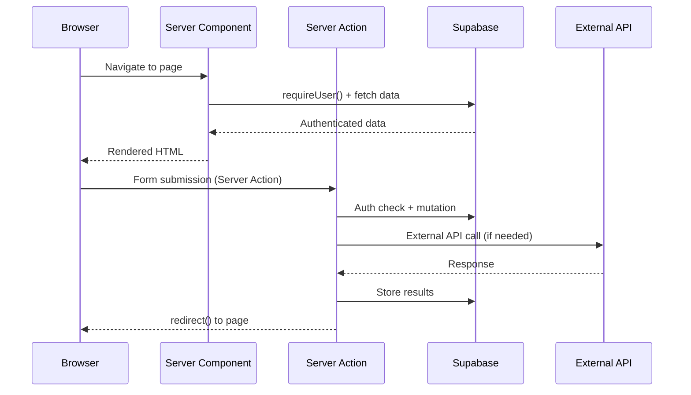
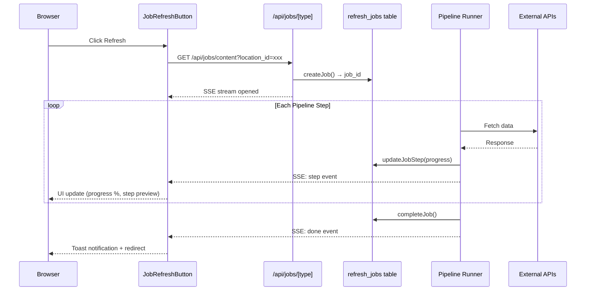
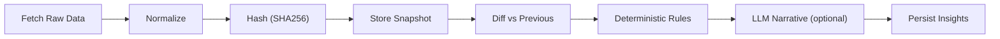
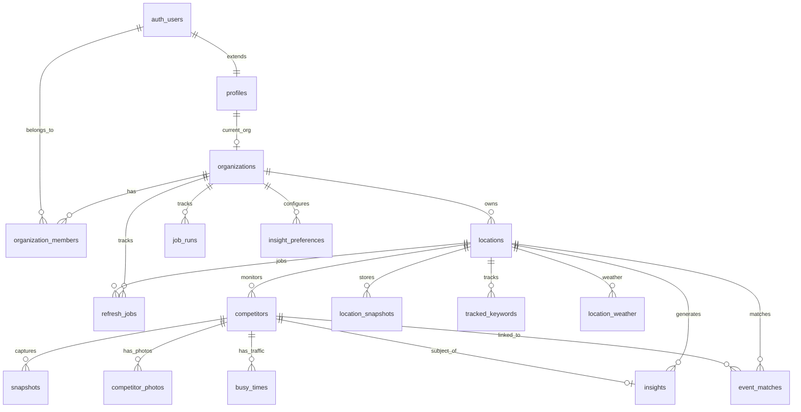

# Prophet -- Codebase Blueprint

> **Author:** Anand, GitHub Username: anandiyerdigital
> **Last updated:** January 31, 2026
> **Branch:** `dev`
> **Purpose:** Complete technical reference for the Prophet codebase. Intended for developers, AI coding tools, and anyone who needs to understand the entire application without reading every source file.

---

## Table of Contents

1. [Executive Summary](#1-executive-summary)
2. [Tech Stack and Dependencies](#2-tech-stack-and-dependencies)
3. [Environment Variables](#3-environment-variables)
4. [Project Structure](#4-project-structure)
5. [Architecture Overview](#5-architecture-overview)
6. [Authentication and Authorization](#6-authentication-and-authorization)
7. [Database Schema](#7-database-schema)
8. [Multi-Tenancy Model](#8-multi-tenancy-model)
9. [Routing and Pages](#9-routing-and-pages)
10. [Server Actions Reference](#10-server-actions-reference)
11. [API Routes Reference](#11-api-routes-reference)
12. [External API Integrations](#12-external-api-integrations)
13. [Provider Architecture](#13-provider-architecture)
14. [Data Pipeline: Snapshots and Insights](#14-data-pipeline-snapshots-and-insights)
15. [Background Job System](#15-background-job-system)
16. [Billing and Tier System](#16-billing-and-tier-system)
17. [UI Component Library](#17-ui-component-library)
18. [Supabase Edge Functions](#18-supabase-edge-functions)
19. [Testing](#19-testing)
20. [Deployment](#20-deployment)
21. [Known Limitations and Future Work](#21-known-limitations-and-future-work)

---

## 1. Executive Summary

**Prophet** is a competitive intelligence platform for local businesses (initially restaurants). It automates competitor discovery, daily monitoring, SEO visibility tracking, local event intelligence, website/menu content analysis, visual intelligence (photos), foot traffic analysis, weather correlation, and actionable insight generation.

### What it does

- **Competitor Discovery:** AI-powered (Gemini with Google Maps grounding) discovery of nearby competitors, enriched with Google Places data.
- **Competitor Monitoring:** Tracks approved competitors with daily snapshots, diffing, and deterministic change detection.
- **SEO Visibility Dashboard:** Semrush-style domain overview via DataForSEO -- organic/paid traffic estimates, keyword rankings, competitor overlap, ranking distribution, top pages, subdomains, historical trends, ad creatives.
- **Comprehensive SEO Enrichment:** On competitor approval, automatically collects Domain Rank Overview, Ranked Keywords, Relevant Pages, Historical Rank, and Domain Intersection data. Produces 13+ deterministic SEO insight types.
- **Local Events Intelligence:** Discovers nearby events via DataForSEO Google Events SERP, matches events to tracked competitors, generates event-driven insights.
- **Content & Menu Intelligence:** Scrapes business websites via Firecrawl to extract menu items, pricing, screenshots, and site feature detection. Combines Firecrawl data with Google menu data via Gemini (Google Search Grounding) for higher accuracy. Classifies menu types (dine-in, catering, banquet, happy hour, kids). Compares menus across competitors with deterministic insight rules.
- **Visual Intelligence (Photos):** Fetches Google Places photos, analyzes via Gemini Vision for quality, ambiance, food presentation, and generates photo-based insights.
- **Foot Traffic Analysis (Busy Times):** Fetches Google Maps Popular Times data via Outscraper, visualizes hourly/daily traffic patterns, peak comparisons, and generates traffic insights.
- **Weather Intelligence:** Fetches historical and forecast weather via OpenWeatherMap, provides weather context for cross-signal insights, and suppresses weather-affected metrics.
- **Insight Engine:** Deterministic rules generate structured insights across all signal sources (competitors, SEO, events, content, photos, traffic, weather). LLM (Gemini) adds priority briefings and narrative summaries. Client-side filtering for instant tab switching.
- **Real-Time Job System:** Background job pipelines with SSE (Server-Sent Events) streaming, step-by-step progress, ambient insight feeds during long-running operations, and toast notifications on completion.
- **Multi-tenant SaaS:** Organizations with roles (owner/admin/member), Stripe billing with tier-based limits, Supabase RLS for data isolation.

### Current state

The application has shipped through most PRD phases:
- Auth, onboarding, organization management (Phase 1)
- Location management with Google Places integration (Phase 2)
- Competitor discovery with Gemini + Google Places enrichment (Phase 3)
- Snapshot pipeline with competitor and location-level snapshots (Phase 4)
- Deterministic insight engine with competitor, SEO, event, content, photo, traffic, and weather insight rules (Phase 5)
- Stripe billing with 4 tiers and limit enforcement (Phase 6)
- Background job pipeline system with SSE streaming, ActiveJobBar, and toast notifications (Phase 7)
- Real-time dashboard home with KPIs, onboarding checklist, and "Refresh All" capability
- Daily cron orchestrator for automated data refresh
- Website URL override for location-specific content/visibility tracking
- Fire-and-forget competitor enrichment on approval (SEO + content)

### What is NOT yet shipped

- Email digests/notifications (Edge Function stub exists)
- Full "Ask Prophet" chat with LLM
- Data retention cleanup policies
- Team management functionality
- Insight like/dislike feedback UI (database schema ready)

---

## 2. Tech Stack and Dependencies

### Runtime

| Technology | Version | Purpose |
|---|---|---|
| Next.js | 16.1.5 | App Router, Server Components, Server Actions, Turbopack |
| React | 19.2.3 | UI framework |
| TypeScript | ^5 | Type safety (strict mode) |
| Node.js | 20+ | Runtime (inferred from tsconfig target ES2017) |

### Database and Auth

| Technology | Version | Purpose |
|---|---|---|
| Supabase JS | ^2.93.1 | Database client, Auth, Realtime |
| Supabase SSR | ^0.8.0 | Server-side cookie-based auth for Next.js |
| PostgreSQL | (Supabase-managed) | Primary database with RLS |

### UI and Styling

| Technology | Version | Purpose |
|---|---|---|
| Tailwind CSS | ^4 | Utility-first CSS (v4, CSS-based config) |
| @tailwindcss/postcss | ^4 | PostCSS plugin for Tailwind v4 |
| Recharts | ^3.7.0 | React charting (bar, area, pie charts) |
| Framer Motion | ^12.29.2 | Animations (fade-in, carousel, overlays) |
| Sonner | ^2.0.7 | Toast notifications |

### Payments

| Technology | Version | Purpose |
|---|---|---|
| Stripe | ^20.2.0 | Subscription billing, webhook handling |

### External API SDKs

| Package | Version | Purpose |
|---|---|---|
| @mendable/firecrawl-js | ^4.12.1 | Firecrawl API SDK for website scraping |

### Testing and Dev Tools

| Technology | Version | Purpose |
|---|---|---|
| Playwright | ^1.58.0 | End-to-end browser testing |
| dotenv | ^17.3.1 | Load `.env.local` in scripts |
| tsx | ^4.21.0 | TypeScript script runner for dev scripts |

### External APIs (not npm packages)

| API | Purpose |
|---|---|
| Google Places API (New) | Location search, place details, reviews, photos |
| Google Maps Embed API | Mini-map iframes |
| Google Weather API | Current conditions for competitor locations |
| Google Gemini API | Competitor discovery (2.5 Flash), insight narratives (3 Pro Preview), photo analysis (2.5 Flash Vision), Google Search Grounding for menu data |
| DataForSEO | SEO data (12 endpoints), local events SERP |
| Firecrawl | Website scraping, menu extraction, screenshots, site mapping |
| Outscraper | Google Maps Popular Times / Busy Times data |
| OpenWeatherMap | Historical weather data, forecasts, severe weather detection |

### Configuration

| File | Purpose |
|---|---|
| `next.config.ts` | Next.js configuration (default, no custom settings) |
| `tsconfig.json` | TypeScript strict mode, `@/*` path alias, excludes `supabase/functions/**` |
| `postcss.config.mjs` | PostCSS with `@tailwindcss/postcss` |
| `eslint.config.mjs` | ESLint with `eslint-config-next` |
| `playwright.config.ts` | E2E test configuration, base URL `http://localhost:3000` |
| `app/globals.css` | Tailwind v4 import + CSS custom properties for background/foreground/fonts |

---

## 3. Environment Variables

All environment variables are stored in `.env.local` (gitignored). Here is the complete list referenced across the codebase:

| Variable | Required | Used In | Purpose |
|---|---|---|---|
| `NEXT_PUBLIC_SUPABASE_URL` | Yes | `lib/supabase/server.ts`, `client.ts`, `admin.ts` | Supabase project URL |
| `NEXT_PUBLIC_SUPABASE_ANON_KEY` | Yes | `lib/supabase/server.ts`, `client.ts` | Supabase anonymous/public key |
| `SUPABASE_SERVICE_ROLE_KEY` | Yes | `lib/supabase/admin.ts`, `lib/jobs/manager.ts` | Supabase service role key (server-only, bypasses RLS) |
| `GOOGLE_MAPS_API_KEY` | Yes | `lib/places/google.ts`, `lib/weather/google.ts`, `components/places/mini-map.tsx` | Google Maps Platform (Places, Embed, Weather) |
| `GOOGLE_AI_API_KEY` | Yes | `lib/providers/gemini.ts`, `lib/ai/gemini.ts`, `lib/providers/photos.ts`, `app/api/ai/quick-tip/route.ts` | Google AI / Gemini API key |
| `DATAFORSEO_LOGIN` | Yes | `lib/providers/dataforseo/client.ts` | DataForSEO API username |
| `DATAFORSEO_PASSWORD` | Yes | `lib/providers/dataforseo/client.ts` | DataForSEO API password |
| `FIRECRAWL_API_KEY` | Yes | `lib/providers/firecrawl.ts` | Firecrawl API key for website scraping and screenshots |
| `OUTSCRAPER_API_KEY` | Yes | `lib/providers/outscraper.ts` | Outscraper API key for Popular Times |
| `OPENWEATHERMAP_API_KEY` | Yes | `lib/providers/openweathermap.ts` | OpenWeatherMap One Call API 3.0 key |
| `STRIPE_SECRET_KEY` | Yes | `app/api/stripe/webhook/route.ts` | Stripe secret key |
| `STRIPE_WEBHOOK_SECRET` | Yes | `app/api/stripe/webhook/route.ts` | Stripe webhook signing secret |
| `STRIPE_PRICE_ID_STARTER` | Yes | `lib/billing/tiers.ts` | Stripe price ID for Starter tier |
| `STRIPE_PRICE_ID_PRO` | Yes | `lib/billing/tiers.ts` | Stripe price ID for Pro tier |
| `STRIPE_PRICE_ID_AGENCY` | Yes | `lib/billing/tiers.ts` | Stripe price ID for Agency tier |
| `NEXT_PUBLIC_APP_URL` | No | `app/(dashboard)/competitors/actions.ts` | App base URL (defaults to `http://localhost:3000`) |
| `CRON_SECRET` | No | `app/api/cron/daily/route.ts` | Secret for authenticating cron job requests |
| `OPENAI_API_KEY` | No | `app/api/ai/chat/route.ts` | OpenAI key (referenced but not actively used) |
| `ANTHROPIC_API_KEY` | No | `app/api/ai/chat/route.ts` | Anthropic key (referenced but not actively used) |

---

## 4. Project Structure

```
prophet/
├── app/                                    # Next.js App Router
│   ├── layout.tsx                          # Root layout (Geist fonts, metadata)
│   ├── page.tsx                            # Landing page (/)
│   ├── globals.css                         # Tailwind v4 + CSS custom properties
│   ├── favicon.ico
│   │
│   ├── (auth)/                             # Auth route group (shared layout)
│   │   ├── layout.tsx                      # Minimal slate background wrapper
│   │   ├── login/
│   │   │   ├── page.tsx                    # Login UI (magic link + Google OAuth)
│   │   │   └── actions.ts                  # sendMagicLinkAction, signInWithGoogleAction
│   │   └── signup/
│   │       ├── page.tsx                    # Signup UI
│   │       └── actions.ts                  # Re-exports login actions
│   │
│   ├── auth/
│   │   └── callback/
│   │       └── route.ts                    # OAuth callback: exchanges code, redirects
│   │
│   ├── onboarding/
│   │   ├── page.tsx                        # First-time setup (org + first location)
│   │   └── actions.ts                      # createOrganizationAction, createLocationAction
│   │
│   ├── (dashboard)/                        # Dashboard route group (auth-gated)
│   │   ├── layout.tsx                      # Sidebar nav, auth guard, org check, ActiveJobBar, Toaster
│   │   ├── actions.ts                      # signOutAction
│   │   ├── home/
│   │   │   └── page.tsx                    # Live dashboard (KPIs, freshness, onboarding checklist, Refresh All)
│   │   ├── competitors/
│   │   │   ├── page.tsx                    # Competitor management (discover/approve/ignore)
│   │   │   └── actions.ts                  # discoverCompetitorsAction, approve (fire-and-forget enrich), ignore
│   │   ├── insights/
│   │   │   ├── page.tsx                    # Insight feed with filters, priority briefing, charts
│   │   │   ├── actions.ts                  # generateInsightsAction, markRead, dismiss, priority briefing
│   │   │   └── priority-briefing-section.tsx  # Suspense-wrapped async server component for briefing
│   │   ├── events/
│   │   │   ├── page.tsx                    # Local events intelligence
│   │   │   └── actions.ts                  # fetchEventsAction
│   │   ├── visibility/
│   │   │   ├── page.tsx                    # SEO visibility dashboard (organic + paid)
│   │   │   └── actions.ts                  # refreshSeoAction (comprehensive, with competitor enrichment)
│   │   ├── content/
│   │   │   ├── page.tsx                    # Content & menu intelligence (hero screenshot, menu viewer, compare)
│   │   │   └── actions.ts                  # refreshContentAction (Firecrawl + Gemini Google menu)
│   │   ├── photos/
│   │   │   ├── page.tsx                    # Visual intelligence (photo grid, KPIs)
│   │   │   └── actions.ts                  # refreshPhotosAction
│   │   ├── traffic/
│   │   │   ├── page.tsx                    # Busy times (heatmap, peak comparison, traffic chart)
│   │   │   └── actions.ts                  # refreshTrafficAction
│   │   ├── weather/
│   │   │   ├── page.tsx                    # Weather intelligence (history, location cards)
│   │   │   └── actions.ts                  # refreshWeatherAction
│   │   ├── locations/
│   │   │   ├── page.tsx                    # Location management CRUD with website URL override
│   │   │   └── actions.ts                  # createLocationFromPlace, update (with website), delete
│   │   └── settings/
│   │       ├── page.tsx                    # Settings index
│   │       ├── billing/
│   │       │   └── page.tsx                # Subscription tier and Stripe status
│   │       └── team/
│   │           └── page.tsx                # Team management (placeholder)
│   │
│   ├── api/                                # API route handlers
│   │   ├── ai/
│   │   │   ├── chat/
│   │   │   │   └── route.ts                # POST: AI chat (LLM integration pending)
│   │   │   └── quick-tip/
│   │   │       └── route.ts                # POST: Lightweight Gemini quick tip
│   │   ├── cron/
│   │   │   └── daily/
│   │   │       └── route.ts                # GET: Daily orchestrator (Vercel Cron / external scheduler)
│   │   ├── jobs/
│   │   │   ├── [type]/
│   │   │   │   └── route.ts                # GET: Starts pipeline job + streams SSE progress
│   │   │   ├── active/
│   │   │   │   └── route.ts                # GET: Returns active running jobs for org
│   │   │   ├── ambient-feed/
│   │   │   │   └── route.ts                # GET: Returns ambient insight cards for a job
│   │   │   └── stream/
│   │   │       └── [jobId]/
│   │   │           └── route.ts            # GET: SSE reconnection stream for existing job
│   │   ├── places/
│   │   │   ├── autocomplete/
│   │   │   │   └── route.ts                # GET: Google Places autocomplete proxy
│   │   │   └── details/
│   │   │       └── route.ts                # GET: Google Places details proxy
│   │   └── stripe/
│   │       └── webhook/
│   │           └── route.ts                # POST: Stripe webhook handler
│   │
│   └── docs/
│       └── PRD.md                          # Master Product Requirements Document
│
├── components/                             # React components
│   ├── competitors/
│   │   └── discover-form.tsx               # Client: Competitor discovery form + RefreshOverlay
│   ├── content/
│   │   ├── menu-viewer.tsx                 # Client: Tabbed menu category viewer with item cards
│   │   └── menu-compare.tsx                # Client: Side-by-side competitor menu comparison
│   ├── events/
│   │   └── events-filters.tsx              # Client: Events page filters
│   ├── filters/
│   │   └── auto-filter-form.tsx            # Client: Auto-navigating filter dropdowns
│   ├── insights/
│   │   ├── insight-feed.tsx                # Client: Client-side filtered insight feed with tabs
│   │   ├── insight-tabs.tsx                # Client: Source tab navigation
│   │   ├── insights-dashboard.tsx          # Client: Charts dashboard (Recharts)
│   │   ├── photo-gallery.tsx               # Client: Photo gallery for insights
│   │   ├── priority-briefing.tsx           # Client: Priority briefing display + skeleton
│   │   ├── traffic-chart.tsx               # Client: Insight-level traffic chart
│   │   └── weather-badge.tsx               # Client: Weather condition badge
│   ├── photos/
│   │   └── photo-grid.tsx                  # Client: Analyzed photo grid with filters and detail panel
│   ├── traffic/
│   │   ├── peak-comparison.tsx             # Client: Side-by-side peak hour comparison
│   │   └── traffic-heatmap.tsx             # Client: 7x18 weekly traffic heatmap
│   ├── weather/
│   │   ├── location-weather-cards.tsx      # Client: Multi-location weather cards
│   │   └── weather-history.tsx             # Client: Multi-day weather history chart
│   ├── insight-card.tsx                    # Server: Insight card with evidence + recommendations
│   ├── motion/
│   │   └── fade-in.tsx                     # Client: Framer Motion fade-in wrapper
│   ├── places/
│   │   ├── location-add-form.tsx           # Client: Add location via Google Places
│   │   ├── location-search.tsx             # Client: Google Places autocomplete search
│   │   └── mini-map.tsx                    # Server: Google Maps Embed iframe
│   ├── ui/                                 # Base UI components
│   │   ├── active-job-bar.tsx              # Client: Global job status bar (polls, navigates with location_id, toast)
│   │   ├── ambient-insight-feed.tsx        # Client: Ambient insight card carousel during jobs
│   │   ├── badge.tsx                       # Server: Badge (default/success/warning)
│   │   ├── button.tsx                      # Server: Button (primary/secondary/ghost)
│   │   ├── card.tsx                        # Server: Card, CardHeader, CardTitle, CardDescription
│   │   ├── input.tsx                       # Server: Input field
│   │   ├── job-pipeline-view.tsx           # Client: Step-by-step pipeline progress visualization
│   │   ├── job-refresh-button.tsx          # Client: Refresh button with SSE streaming + ambient feed
│   │   ├── label.tsx                       # Server: Label
│   │   ├── location-filter.tsx             # Client: Location dropdown (URL param navigation)
│   │   ├── refresh-overlay.tsx             # Client: Legacy animated loading overlay
│   │   └── separator.tsx                   # Server: Horizontal separator
│   └── visibility/
│       ├── intent-serp-panels.tsx          # Client: Keyword intent + SERP feature panels
│       ├── keyword-tabs.tsx                # Client: Tabbed keyword table (All/Improved/etc.)
│       ├── ranking-distribution.tsx        # Client: Bar chart for rank position distribution
│       ├── traffic-chart.tsx               # Client: Area chart for traffic over time
│       ├── visibility-charts.tsx           # Client: Pie chart for share of voice
│       └── visibility-filters.tsx          # Client: Location dropdown + Organic/Paid tabs
│
├── lib/                                    # Shared business logic
│   ├── utils.ts                            # cn() class name merger
│   ├── auth/
│   │   └── server.ts                       # getUser(), requireUser()
│   ├── billing/
│   │   ├── tiers.ts                        # SubscriptionTier, TIER_LIMITS, getTierFromPriceId()
│   │   └── limits.ts                       # Guardrail functions (ensure*Limit, get*Cadence, etc.)
│   ├── supabase/
│   │   ├── server.ts                       # createServerSupabaseClient() (SSR cookies)
│   │   ├── client.ts                       # createBrowserSupabaseClient()
│   │   └── admin.ts                        # createAdminSupabaseClient() (service role)
│   ├── ai/
│   │   ├── gemini.ts                       # generateGeminiJson(), fetchGoogleMenuData() (Search Grounding)
│   │   └── prompts/
│   │       ├── insights.ts                 # buildInsightNarrativePrompt()
│   │       ├── priority-briefing.ts        # buildPriorityBriefingPrompt() with diversity rules
│   │       └── prophet-chat.ts             # buildProphetPrompt()
│   ├── places/
│   │   └── google.ts                       # fetchAutocomplete(), fetchPlaceDetails(), mapPlaceToLocation()
│   ├── weather/
│   │   └── google.ts                       # fetchCurrentConditions() -> WeatherSnapshot
│   ├── providers/                          # External API provider wrappers
│   │   ├── types.ts                        # NormalizedSnapshot, ProviderCandidate, Provider interface
│   │   ├── index.ts                        # getProvider() registry
│   │   ├── scoring.ts                      # scoreCompetitor() relevance scoring
│   │   ├── gemini.ts                       # Gemini provider (competitor discovery)
│   │   ├── dataforseo.ts                   # DataForSEO provider (local finder + snapshots)
│   │   ├── firecrawl.ts                    # Firecrawl wrapper: mapSite(), scrapePage(), scrapeMenuPage(), discoverAllMenuUrls()
│   │   ├── photos.ts                       # Google Places photos + Gemini Vision analysis
│   │   ├── outscraper.ts                   # Outscraper Popular Times fetcher
│   │   ├── openweathermap.ts               # OpenWeatherMap historical + forecast weather
│   │   └── dataforseo/                     # DataForSEO API clients (12 endpoints)
│   │       ├── client.ts                   # postDataForSEO(), extractFirstResult()
│   │       ├── domain-rank-overview.ts     # Labs Domain Rank Overview
│   │       ├── ranked-keywords.ts          # Labs Ranked Keywords
│   │       ├── keywords-for-site.ts        # Labs Keywords For Site
│   │       ├── competitors-domain.ts       # Labs Competitors Domain
│   │       ├── domain-intersection.ts      # Labs Domain Intersection
│   │       ├── relevant-pages.ts           # Labs Relevant Pages
│   │       ├── subdomains.ts               # Labs Subdomains
│   │       ├── historical-rank-overview.ts # Labs Historical Rank Overview
│   │       ├── serp-organic.ts             # SERP Google Organic
│   │       ├── google-events.ts            # SERP Google Events
│   │       ├── ads-search.ts               # Google Ads Search (Transparency Center)
│   │       └── backlinks-summary.ts        # Backlinks Summary (subscription-gated)
│   ├── content/                            # Content & Menu intelligence engine
│   │   ├── types.ts                        # SiteContentSnapshot, MenuSnapshot, MenuItem, MenuCategory, MenuType
│   │   ├── normalize.ts                    # detectFeatures(), normalizeSiteContent(), buildMenuSnapshot(), hash
│   │   ├── menu-parse.ts                   # classifyMenuCategory(), normalizeExtractedMenu(), normalizeGoogleMenuData(), mergeExtractedMenus()
│   │   ├── enrich.ts                       # enrichCompetitorContent() – multi-URL scrape + Gemini Google menu + merge
│   │   ├── insights.ts                     # generateContentInsights() (8 deterministic rules)
│   │   └── storage.ts                      # uploadScreenshot(), getScreenshotUrl(), buildScreenshotPath()
│   ├── insights/                           # Core insight engine
│   │   ├── types.ts                        # SnapshotFieldChange, SnapshotDiff, GeneratedInsight
│   │   ├── index.ts                        # Re-exports all insight functions
│   │   ├── normalize.ts                    # normalizeSnapshot() (canonical format)
│   │   ├── hash.ts                         # computeDiffHash() (SHA256)
│   │   ├── diff.ts                         # diffSnapshots() (compare previous vs current)
│   │   ├── rules.ts                        # buildInsights() (deterministic competitor rules)
│   │   ├── trends.ts                       # buildWeeklyInsights() (T-7 trend analysis)
│   │   ├── scoring.ts                      # Source categories, relevance scoring weights
│   │   ├── briefing-cache.ts               # In-memory TTL cache for Gemini priority briefings
│   │   ├── photo-insights.ts               # generatePhotoInsights() rules
│   │   ├── traffic-insights.ts             # generateTrafficInsights() + competitive opportunity rules
│   │   └── weather-context.ts              # shouldSuppressInsight(), addWeatherContext(), generateWeatherCrossSignals()
│   ├── seo/                                # SEO insight engine
│   │   ├── types.ts                        # DomainRankSnapshot, NormalizedRankedKeyword, SEO_SNAPSHOT_TYPES
│   │   ├── normalize.ts                    # Normalizers for all DataForSEO SEO responses
│   │   ├── hash.ts                         # SEO-specific hashing utilities
│   │   ├── enrich.ts                       # enrichCompetitorSeo() – full pipeline for one competitor domain
│   │   └── insights.ts                     # generateSeoInsights() (13 deterministic rules)
│   ├── events/                             # Events insight engine
│   │   ├── types.ts                        # NormalizedEvent, EventMatchRecord, etc.
│   │   ├── normalize.ts                    # normalizeEventsSnapshot() from DataForSEO
│   │   ├── hash.ts                         # computeEventUid(), computeEventsSnapshotDiffHash()
│   │   ├── match.ts                        # matchEventsToCompetitors() deterministic matching
│   │   └── insights.ts                     # generateEventInsights() (5 insight rules)
│   ├── traffic/
│   │   └── peak-data.ts                    # buildPeakData() – shared utility for server/client peak calculation
│   └── jobs/                               # Background job pipeline system
│       ├── types.ts                        # JobType, JobStatus, JobStep, JobRecord, SSE event types, AmbientCard
│       ├── manager.ts                      # CRUD operations for refresh_jobs table (admin client)
│       ├── pipeline.ts                     # Generic pipeline runner (sequential steps, error isolation, SSE progress)
│       ├── sse.ts                          # SSE stream creation and response helpers
│       ├── auth.ts                         # getJobAuthContext() – validates user + org for job requests
│       ├── triggers.ts                     # triggerInitialLocationData() – fire-and-forget on location creation
│       ├── ambient-data.ts                 # Generates ambient insight cards during job execution
│       ├── use-job-runner.ts               # React hook for client-side job management
│       └── pipelines/                      # Individual pipeline builders
│           ├── content.ts                  # Content pipeline (Firecrawl scrape, Gemini menu, screenshots)
│           ├── visibility.ts               # SEO visibility pipeline (11 DataForSEO API groups)
│           ├── events.ts                   # Events pipeline (DataForSEO Events SERP + matching)
│           ├── insights.ts                 # Insights pipeline (all sources + cross-correlation)
│           ├── photos.ts                   # Photos pipeline (Google Places + Gemini Vision)
│           ├── traffic.ts                  # Traffic pipeline (Outscraper Popular Times)
│           ├── weather.ts                  # Weather pipeline (OpenWeatherMap historical + forecast)
│           └── refresh-all.ts              # Orchestrates all 7 pipelines sequentially
│
├── types/                                  # Shared TypeScript types
│   ├── database.types.ts                   # Auto-generated Supabase database types
│   └── prophet.types.ts                    # ActionResult<T> standard return shape
│
├── supabase/                               # Supabase configuration
│   ├── migrations/                         # SQL migrations (9 files)
│   │   ├── 20260127010101_initial_schema.sql
│   │   ├── 20260127010200_membership_bootstrap.sql
│   │   ├── 20260127010300_fix_org_member_policies.sql
│   │   ├── 20260131010100_visual_intelligence_weather_busy_times.sql
│   │   ├── 20260206010100_events_tables.sql
│   │   ├── 20260207010100_seo_tables.sql
│   │   ├── 20260209010100_refresh_jobs.sql
│   │   ├── 20260211010100_screenshots_bucket.sql
│   │   └── 20260219010100_insight_feedback_and_preferences.sql
│   └── functions/                          # Supabase Edge Functions (Deno)
│       ├── orchestrator_daily/index.ts     # SEO insight generation rules
│       ├── job_worker/index.ts             # SEO normalization utilities
│       └── digest_weekly/index.ts          # Weekly digest (stub)
│
├── scripts/                                # Development/testing scripts
│   ├── refresh-signals.ts                  # End-to-end signal fetch script
│   └── refresh-busy-times.ts              # Outscraper debugging script
│
├── tests/
│   └── auth-onboarding.spec.ts             # Playwright smoke test
│
├── public/                                 # Static assets
│   ├── file.svg, globe.svg, next.svg, vercel.svg, window.svg
│
├── BLUEPRINT.md                            # This file
├── README.md
├── package.json
├── package-lock.json
├── .gitignore
├── eslint.config.mjs
├── playwright.config.ts
├── postcss.config.mjs
└── next.config.ts
```

---

## 5. Architecture Overview

### 5.1 High-Level System Architecture

```mermaid
flowchart TB
    Browser["Browser (React 19)"]
    NextJS["Next.js 16 App Router"]
    SupaAuth["Supabase Auth"]
    SupaDB["Supabase Postgres + RLS"]
    SupaStorage["Supabase Storage"]
    GooglePlaces["Google Places API"]
    GoogleMaps["Google Maps Embed"]
    GoogleWeather["Google Weather API"]
    Gemini["Google Gemini API"]
    DataForSEO["DataForSEO API"]
    Firecrawl["Firecrawl API"]
    Outscraper["Outscraper API"]
    OpenWeatherMap["OpenWeatherMap API"]
    Stripe["Stripe"]
    SSE["SSE Streams"]

    Browser --> NextJS
    Browser <-->|"SSE (job progress)"| SSE
    NextJS -->|"Server Components / Actions"| SupaDB
    NextJS -->|"Screenshots"| SupaStorage
    NextJS -->|"Auth (SSR cookies)"| SupaAuth
    NextJS -->|"Autocomplete, Details, Photos"| GooglePlaces
    NextJS -->|"Current conditions"| GoogleWeather
    NextJS -->|"Discovery, Insights, Vision, Menu"| Gemini
    NextJS -->|"SEO data, Events"| DataForSEO
    NextJS -->|"Website scraping, Menus"| Firecrawl
    NextJS -->|"Popular Times"| Outscraper
    NextJS -->|"Historical weather"| OpenWeatherMap
    NextJS -->|"Webhooks"| Stripe
    Browser -->|"Embed iframe"| GoogleMaps
    NextJS --> SSE
```



### 5.2 Request and Data Flow



### 5.3 Job Pipeline Flow (SSE)



### 5.4 Insight Pipeline



This pipeline applies to all signal sources:
- **Competitor insights:** DataForSEO/Google Places snapshot -> normalize -> diff -> rules (rating change, review velocity, hours change)
- **SEO insights:** DataForSEO Labs/SERP -> normalize -> diff -> rules (13 rule types)
- **Event insights:** DataForSEO Events SERP -> normalize -> match to competitors -> rules (5 rule types)
- **Content insights:** Firecrawl + Gemini menu data -> normalize -> diff -> rules (8 rule types)
- **Photo insights:** Google Places photos + Gemini Vision -> analyze -> rules
- **Traffic insights:** Outscraper Popular Times -> normalize -> rules
- **Weather insights:** OpenWeatherMap -> cross-signal correlation -> context enrichment

---

## 6. Authentication and Authorization

### 6.1 Auth Methods

Two methods are supported via Supabase Auth:

1. **Magic Link** -- email-based passwordless login (`supabase.auth.signInWithOtp()`)
2. **Google OAuth** -- redirect-based OAuth2 (`supabase.auth.signInWithOAuth()`)

Both are implemented in `app/(auth)/login/actions.ts`.

### 6.2 Auth Callback

`app/auth/callback/route.ts` handles the OAuth redirect:
1. Receives `?code=...` query param
2. Exchanges code for session via `supabase.auth.exchangeCodeForSession(code)`
3. Fetches user profile to check `current_organization_id`
4. Redirects to `/home` if org exists, or `/onboarding` if not

### 6.3 Server-Side Auth Pattern

Auth is checked server-side using two functions in `lib/auth/server.ts`:

```typescript
async function getUser(): Promise<User | null>
async function requireUser(): Promise<User>
```

Both use `createServerSupabaseClient()` which reads Supabase auth cookies via Next.js `cookies()`.

### 6.4 Auth Guards

- **Dashboard layout** (`app/(dashboard)/layout.tsx`): Calls `requireUser()`, then checks for `current_organization_id`. Redirects to `/onboarding` if missing.
- **Individual pages**: Also call `requireUser()` as the first operation.
- **Job API routes** (`lib/jobs/auth.ts`): `getJobAuthContext()` validates user session + org membership for job requests.
- **There is no `middleware.ts`**: All auth is enforced at the layout/page level.

### 6.5 Supabase Clients

| Client | File | Auth | Use Case |
|---|---|---|---|
| Server | `lib/supabase/server.ts` | User's session (cookies) | All server components and actions |
| Browser | `lib/supabase/client.ts` | User's session (browser) | Client-side realtime (not actively used) |
| Admin | `lib/supabase/admin.ts` | Service role key (bypasses RLS) | Fallback writes when RLS blocks, job manager |

### 6.6 RLS Helper Functions

Two `SECURITY DEFINER` functions avoid recursive RLS policy evaluation:

```sql
public.is_org_member(org_id uuid) -> boolean
public.is_org_admin(org_id uuid) -> boolean
```

---

## 7. Database Schema

### 7.1 Migrations

| Migration | Purpose |
|---|---|
| `20260127010101_initial_schema.sql` | Core tables, indexes, RLS policies for all base tables |
| `20260127010200_membership_bootstrap.sql` | Policy allowing first org member to self-insert as owner |
| `20260127010300_fix_org_member_policies.sql` | `is_org_member()`/`is_org_admin()` SECURITY DEFINER helpers |
| `20260131010100_visual_intelligence_weather_busy_times.sql` | `competitor_photos`, `busy_times`, `location_weather` tables + RLS + `competitor-photos` storage bucket |
| `20260206010100_events_tables.sql` | `location_snapshots`, `event_matches` tables with RLS |
| `20260207010100_seo_tables.sql` | `website` column on `locations`, `snapshot_type` on `snapshots`, `tracked_keywords` table |
| `20260209010100_refresh_jobs.sql` | `refresh_jobs` table for real-time job progress tracking |
| `20260211010100_screenshots_bucket.sql` | Supabase Storage `screenshots` bucket (private, 5MB, png/jpeg/webp) |
| `20260219010100_insight_feedback_and_preferences.sql` | `user_feedback`/`feedback_at`/`feedback_by` on `insights`, `insight_preferences` table |

### 7.2 Tables

#### `organizations`
| Column | Type | Notes |
|---|---|---|
| `id` | uuid PK | `gen_random_uuid()` |
| `name` | text NOT NULL | |
| `slug` | text UNIQUE NOT NULL | |
| `subscription_tier` | text NOT NULL DEFAULT 'free' | CHECK: free/starter/pro/agency |
| `stripe_customer_id` | text | Nullable |
| `stripe_subscription_id` | text | Nullable |
| `billing_email` | text | Nullable |
| `settings` | jsonb DEFAULT '{}' | |
| `created_at` / `updated_at` | timestamptz | |

#### `profiles`
| Column | Type | Notes |
|---|---|---|
| `id` | uuid PK | References `auth.users(id)` ON DELETE CASCADE |
| `email` | text | |
| `full_name` | text | |
| `avatar_url` | text | |
| `current_organization_id` | uuid | References `organizations(id)` |
| `created_at` / `updated_at` | timestamptz | |

#### `organization_members`
| Column | Type | Notes |
|---|---|---|
| `id` | uuid PK | |
| `organization_id` | uuid NOT NULL | References `organizations(id)` CASCADE |
| `user_id` | uuid NOT NULL | References `auth.users(id)` CASCADE |
| `role` | text NOT NULL DEFAULT 'member' | CHECK: owner/admin/member |
| UNIQUE | `(organization_id, user_id)` | |

#### `locations`
| Column | Type | Notes |
|---|---|---|
| `id` | uuid PK | |
| `organization_id` | uuid NOT NULL | References `organizations(id)` CASCADE |
| `name` | text NOT NULL | |
| `address_line1`, `address_line2`, `city`, `region`, `postal_code`, `country` | text | Address fields |
| `geo_lat` / `geo_lng` | double precision | Coordinates |
| `timezone` | text DEFAULT 'America/New_York' | |
| `primary_place_id` | text | Google Places ID |
| `website` | text | User-overridable URL for content/visibility tracking |
| `settings` | jsonb DEFAULT '{}' | Stores category, types, etc. |
| `created_at` / `updated_at` | timestamptz | |

#### `competitors`
| Column | Type | Notes |
|---|---|---|
| `id` | uuid PK | |
| `location_id` | uuid NOT NULL | References `locations(id)` CASCADE |
| `provider` | text NOT NULL DEFAULT 'dataforseo' | |
| `provider_entity_id` | text NOT NULL | Google Place ID or provider-specific ID |
| `name` | text | |
| `category`, `address`, `phone`, `website` | text | Business details |
| `relevance_score` | numeric | 0-100 weighted score |
| `is_active` | boolean NOT NULL DEFAULT true | false = ignored/removed |
| `metadata` | jsonb DEFAULT '{}' | status, placeDetails, rating, sources, etc. |
| `last_seen_at` | timestamptz | |
| UNIQUE | `(provider, provider_entity_id, location_id)` | |

**metadata.status:** `"pending"` | `"approved"` | `"ignored"` -- tracks approval workflow.

#### `snapshots`
| Column | Type | Notes |
|---|---|---|
| `id` | uuid PK | |
| `competitor_id` | uuid NOT NULL | References `competitors(id)` CASCADE |
| `captured_at` | timestamptz NOT NULL | |
| `date_key` | date NOT NULL | |
| `provider` | text NOT NULL | e.g. `dataforseo`, `firecrawl_menu` |
| `snapshot_type` | text NOT NULL DEFAULT 'listing_daily' | e.g. `web_menu_weekly`, `seo_domain_rank_overview_weekly` |
| `raw_data` | jsonb NOT NULL | Normalized payload |
| `diff_hash` | text NOT NULL | SHA256 for change detection |
| UNIQUE | `(competitor_id, date_key, snapshot_type)` | |

#### `location_snapshots`
| Column | Type | Notes |
|---|---|---|
| `id` | uuid PK | |
| `location_id` | uuid NOT NULL | References `locations(id)` CASCADE |
| `provider` | text NOT NULL | e.g. `dataforseo_google_events`, `firecrawl_site_content`, `firecrawl_menu` |
| `date_key` | date NOT NULL | |
| `captured_at` | timestamptz NOT NULL | |
| `raw_data` | jsonb NOT NULL | |
| `diff_hash` | text NOT NULL | |
| UNIQUE | `(location_id, provider, date_key)` | |

#### `event_matches`
| Column | Type | Notes |
|---|---|---|
| `id` | uuid PK | |
| `location_id` | uuid NOT NULL | References `locations(id)` CASCADE |
| `competitor_id` | uuid | References `competitors(id)` SET NULL |
| `date_key` | date NOT NULL | |
| `event_uid` | text NOT NULL | Stable hash of event |
| `match_type` | text NOT NULL | `venue_name`, `venue_address`, `url_domain` |
| `confidence` | text NOT NULL | CHECK: high/medium/low |
| `evidence` | jsonb DEFAULT '{}' | |
| UNIQUE | `(location_id, competitor_id, date_key, event_uid, match_type)` | |

#### `insights`
| Column | Type | Notes |
|---|---|---|
| `id` | uuid PK | |
| `location_id` | uuid NOT NULL | References `locations(id)` CASCADE |
| `competitor_id` | uuid | References `competitors(id)` SET NULL |
| `date_key` | date NOT NULL | |
| `insight_type` | text NOT NULL | e.g. `rating_change`, `seo_organic_visibility_up`, `menu.price_positioning_shift` |
| `title` | text NOT NULL | |
| `summary` | text NOT NULL | |
| `confidence` | text NOT NULL | CHECK: high/medium/low |
| `severity` | text NOT NULL DEFAULT 'info' | CHECK: info/warning/critical |
| `evidence` | jsonb DEFAULT '{}' | |
| `recommendations` | jsonb DEFAULT '[]' | |
| `status` | text NOT NULL DEFAULT 'new' | CHECK: new/read/dismissed |
| `user_feedback` | text | CHECK: useful/not_useful |
| `feedback_at` | timestamptz | |
| `feedback_by` | uuid | References `auth.users(id)` |
| UNIQUE | `(location_id, competitor_id, date_key, insight_type)` | |

#### `insight_preferences`
| Column | Type | Notes |
|---|---|---|
| `organization_id` | uuid NOT NULL | References `organizations(id)` CASCADE |
| `insight_type` | text NOT NULL | |
| `weight` | numeric NOT NULL DEFAULT 1.0 | Learning loop weight |
| `useful_count` | int NOT NULL DEFAULT 0 | |
| `dismissed_count` | int NOT NULL DEFAULT 0 | |
| `last_feedback_at` | timestamptz | |
| PRIMARY KEY | `(organization_id, insight_type)` | |

#### `tracked_keywords`
| Column | Type | Notes |
|---|---|---|
| `id` | uuid PK | |
| `location_id` | uuid NOT NULL | References `locations(id)` CASCADE |
| `keyword` | text NOT NULL | |
| `source` | text NOT NULL DEFAULT 'auto' | CHECK: auto/manual |
| `is_active` | boolean NOT NULL DEFAULT true | |
| UNIQUE | `(location_id, keyword)` | |

#### `refresh_jobs`
| Column | Type | Notes |
|---|---|---|
| `id` | uuid PK | |
| `organization_id` | uuid NOT NULL | References `organizations(id)` CASCADE |
| `location_id` | uuid NOT NULL | References `locations(id)` CASCADE |
| `job_type` | text NOT NULL | CHECK: content/visibility/events/insights/photos/busy_times/weather |
| `status` | text NOT NULL DEFAULT 'running' | CHECK: running/completed/failed |
| `total_steps` / `current_step` | integer | Progress tracking |
| `steps` | jsonb NOT NULL DEFAULT '[]' | Array of step objects with status/preview |
| `result` | jsonb | Final result payload |
| `created_at` / `updated_at` | timestamptz | |

#### `competitor_photos`
| Column | Type | Notes |
|---|---|---|
| `id` | uuid PK | |
| `snapshot_id` | uuid | |
| `competitor_id` | uuid NOT NULL | References `competitors(id)` CASCADE |
| `place_photo_name` | text NOT NULL | Google Places photo reference |
| `image_hash` | text NOT NULL | SHA-256 for deduplication |
| `image_url`, `width_px`, `height_px` | text/int | Photo metadata |
| `author_attribution` | jsonb | |
| `analysis_result` | jsonb | Gemini Vision analysis output |
| `first_seen_at` / `last_seen_at` | timestamptz | |

#### `busy_times`
| Column | Type | Notes |
|---|---|---|
| `id` | uuid PK | |
| `snapshot_id` | uuid | |
| `competitor_id` | uuid NOT NULL | References `competitors(id)` CASCADE |
| `day_of_week` | integer NOT NULL | 0=Sunday through 6=Saturday |
| `hourly_scores` | integer[] NOT NULL | 24-element array of popularity scores |
| `peak_hour` / `peak_score` | integer | |
| `slow_hours` | integer[] | |
| `typical_time_spent` | text | |
| `current_popularity` | integer | Live popularity percentage |

#### `location_weather`
| Column | Type | Notes |
|---|---|---|
| `id` | uuid PK | |
| `location_id` | uuid NOT NULL | References `locations(id)` CASCADE |
| `date` | date NOT NULL | |
| `temp_high_f` / `temp_low_f` / `feels_like_high_f` | decimal | |
| `humidity_avg` | integer | |
| `wind_speed_max_mph` | decimal | |
| `weather_condition` / `weather_description` / `weather_icon` | text | |
| `precipitation_in` | decimal DEFAULT 0 | |
| `is_severe` | boolean NOT NULL DEFAULT false | |
| UNIQUE | `(location_id, date)` | |

#### `job_runs` (legacy)
| Column | Type | Notes |
|---|---|---|
| `id` | uuid PK | |
| `organization_id` | uuid NOT NULL | References `organizations(id)` CASCADE |
| `job_type` | text NOT NULL | |
| `status` | text NOT NULL DEFAULT 'queued' | CHECK: queued/running/succeeded/failed |
| `attempt` | integer NOT NULL DEFAULT 1 | |
| `trace_id` | uuid | |
| `message`, `metadata` | text/jsonb | |
| `started_at` / `finished_at` | timestamptz | |

### 7.3 Storage Buckets

| Bucket | Access | Limits | Purpose |
|---|---|---|---|
| `screenshots` | Private (signed URLs) | 5MB, png/jpeg/webp | Website and menu page screenshots |
| `competitor-photos` | Private (signed URLs) | — | Competitor Google Places photos |

### 7.4 Entity Relationship Diagram



### 7.5 RLS Policy Summary

Every table has RLS enabled. The general pattern is:

- **SELECT (read):** Allowed if user is a member of the owning organization (join through `organization_members`).
- **INSERT/UPDATE/DELETE (write):** Allowed if user is an owner or admin of the owning organization.
- **profiles:** Users can only read/insert/update their own profile.
- **organizations:** Any authenticated user can create; only members can read; only owner/admin can update.
- **organization_members:** Bootstrap policy allows first user to insert themselves as owner when org has zero members.
- **refresh_jobs:** Readable by org members; writable by admins/owners. Job manager uses admin client to bypass RLS for pipeline progress writes.

---

## 8. Multi-Tenancy Model

### 8.1 Hierarchy

```
Organization
  ├── Members (users with roles: owner/admin/member)
  ├── Insight Preferences (learned weights per insight type)
  ├── Refresh Jobs (real-time pipeline progress)
  ├── Locations
  │     ├── Competitors (discovered, approved/ignored)
  │     │     ├── Snapshots (daily data captures + SEO + menu)
  │     │     ├── Photos (Gemini Vision analyzed)
  │     │     └── Busy Times (Popular Times data)
  │     ├── Location Snapshots (events, SEO domain data, site content, menus)
  │     ├── Location Weather (daily weather records)
  │     ├── Event Matches (event-competitor links)
  │     ├── Tracked Keywords (SEO keywords)
  │     └── Insights (generated findings with feedback)
  └── Job Runs (legacy background processing)
```

### 8.2 Organization Context

A user's "active" organization is stored in `profiles.current_organization_id`. All dashboard pages:

1. Call `requireUser()` to get the authenticated user
2. Query `profiles` for `current_organization_id`
3. Query `locations` scoped to that organization
4. All further queries scope through location IDs

### 8.3 Onboarding Flow

1. User signs up (magic link or Google OAuth)
2. OAuth callback checks for `current_organization_id` -- none found, redirects to `/onboarding`
3. Onboarding page collects: organization name, slug, and first location (via Google Places search)
4. `createOrganizationAction`: creates org, inserts `organization_members` (role: owner), upserts profile with `current_organization_id`, creates first location
5. **Automatic data trigger:** `triggerInitialLocationData()` fires in the background to scrape website content and fetch weather for the new location
6. Redirects to `/competitors?location_id=xxx&onboarding=true` with onboarding guidance banner

---

## 9. Routing and Pages

### 9.1 Route Groups

- **`(auth)`:** Login and signup pages. Shares a minimal layout.
- **`(dashboard)`:** All main app pages. Shares a sidebar layout with auth guard, ActiveJobBar, and Sonner Toaster.

### 9.2 Layout Hierarchy

```
Root Layout (app/layout.tsx)
  ├── (auth) Layout -- minimal, slate background
  │     ├── /login
  │     └── /signup
  ├── (dashboard) Layout -- sidebar + auth guard + ActiveJobBar + Toaster
  │     ├── /home
  │     ├── /insights
  │     ├── /competitors
  │     ├── /events
  │     ├── /visibility
  │     ├── /content
  │     ├── /photos
  │     ├── /traffic
  │     ├── /weather
  │     ├── /locations
  │     └── /settings (+ /settings/billing, /settings/team)
  ├── /onboarding
  └── / (landing page)
```

### 9.3 Sidebar Navigation

The dashboard sidebar includes 10 navigation links: Home, Insights, Competitors, Events, Visibility, Content, Photos, Busy Times, Weather, Locations, Settings.

### 9.4 Page Details

#### `/home` (Dashboard)
- Live KPIs: locations count, approved competitors, total insights, data freshness
- Onboarding checklist for new users (add location, discover competitors, run first refresh)
- "Refresh All Data" button triggers `refresh_all` pipeline
- Recent insights feed with quick navigation

#### `/competitors`
- **Location filter:** Dropdown scopes competitors to selected location
- **Discover form:** Select location, optional keyword, triggers `discoverCompetitorsAction`
- **Candidates list:** Pending competitors with approve/ignore buttons (approval is instant, enrichment runs in background)
- **Approved table:** Full table with rating, reviews, distance, address, phone, website, maps, weather, remove button
- **Success/onboarding banners:** Shows guidance for new users and approval success messages

#### `/insights`
- **Filters:** Location, date range, confidence, severity, source (competitors/events/SEO/content/photos/traffic)
- **Priority briefing:** Gemini-generated top 5 priorities with diversity rules (Suspense-streamed with skeleton fallback)
- **Charts dashboard:** Rating comparison, review count, sentiment distribution
- **Insight feed:** Client-side tab filtering for instant switching, grouped by date
- **Insight cards:** Title, summary, badges, evidence accordion, recommendations, mark-read/dismiss

#### `/events`
- **Controls:** Location selector, period (week/weekend), venue filter, matched-only toggle
- **KPIs:** Total events, competitor matches, unique venues, active days
- **Event list:** Cards with title, date, venue, description, competitor match badges

#### `/visibility`
- **Tabs:** Organic and Paid
- **Organic tab:** KPI strip, traffic trends chart (12 months), keyword tables (All/Improved/Decreased/New/Lost), competitor overlap, intent + SERP features, ranking distribution, top pages, subdomains, keyword gap, featured snippets
- **Paid tab:** Paid KPIs, paid keyword overlap, competitor ad creatives
- **Comprehensive competitor SEO:** On refresh, also enriches all approved competitors

#### `/content`
- **Hero panel:** Website screenshot, location name, website link, tracking URL display, last refresh timestamp
- **Site features:** Detected website features as badge chips
- **Menu viewer:** Tabbed categories with item cards (name, description, price, tags), source badges (Firecrawl/Google), menu type filter (Dine-In/Catering)
- **Competitor menu compare:** Side-by-side price comparison, category gaps, unique items
- **Multi-source data:** Combines Firecrawl scraping with Gemini Google Search Grounding for menu accuracy

#### `/photos`
- **KPIs:** Total photos, analyzed count, competitor count
- **Photo grid:** Filterable by competitor, with detail panel showing Gemini Vision analysis (quality, ambiance, food presentation)
- **Refresh button:** Triggers `photos` pipeline

#### `/traffic` (Busy Times)
- **KPIs:** Most popular day, peak traffic competitor, average peak score
- **Traffic heatmap:** 7x18 grid showing hourly traffic patterns by day of week
- **Peak comparison:** Side-by-side bars comparing peak scores across competitors
- **Traffic chart:** Hourly breakdown for selected day

#### `/weather`
- **KPIs:** Current conditions summary
- **Weather history:** Multi-day chart with temperature, precipitation
- **Location weather cards:** Side-by-side cards for all locations

#### `/locations`
- Location cards with edit/delete, weather, mini-map, Google Places details
- **Website URL override:** Users can manually set the website URL for content/visibility tracking (for branch-specific URLs)
- **Screenshot thumbnail:** From Firecrawl, menu badge, item count, last scraped date
- Add location form with Google Places autocomplete

---

## 10. Server Actions Reference

| File | Function | What It Does | Redirect |
|---|---|---|---|
| `(auth)/login/actions.ts` | `sendMagicLinkAction` | Sends Supabase magic link email | None |
| `(auth)/login/actions.ts` | `signInWithGoogleAction` | Initiates Google OAuth redirect | External |
| `onboarding/actions.ts` | `createOrganizationAction` | Creates org + member + profile + location + triggers initial data | `/competitors` |
| `onboarding/actions.ts` | `createLocationAction` | Adds a location + triggers initial data | `/competitors` |
| `(dashboard)/actions.ts` | `signOutAction` | Signs out user | `/login` |
| `competitors/actions.ts` | `discoverCompetitorsAction` | Gemini discovery + Places enrichment | `/competitors` |
| `competitors/actions.ts` | `approveCompetitorAction` | Sets approved, fire-and-forget SEO + content enrichment | `/competitors` |
| `competitors/actions.ts` | `ignoreCompetitorAction` | Sets ignored, is_active=false | `/competitors` |
| `insights/actions.ts` | `generateInsightsAction` | Runs all insight pipelines + cross-source correlation | `/insights` |
| `insights/actions.ts` | `markInsightReadAction` | Sets insight status=read | `/insights` |
| `insights/actions.ts` | `dismissInsightAction` | Sets insight status=dismissed | `/insights` |
| `insights/actions.ts` | `generatePriorityBriefing` | Gemini priority briefing with TTL cache | None (returns data) |
| `events/actions.ts` | `fetchEventsAction` | DataForSEO events, matching, insights | `/events` |
| `content/actions.ts` | `refreshContentAction` | Firecrawl + Gemini menu, screenshots, insights | `/content` |
| `visibility/actions.ts` | `refreshSeoAction` | 11 SEO API groups + competitor enrichment + insights | `/visibility` |
| `locations/actions.ts` | `createLocationFromPlaceAction` | Creates location + triggers initial content/weather | `/locations` |
| `locations/actions.ts` | `updateLocationAction` | Updates location fields including website URL | `/locations` |
| `locations/actions.ts` | `deleteLocationAction` | Deletes location | `/locations` |

---

## 11. API Routes Reference

### `GET /api/jobs/[type]?location_id=xxx`
- **Auth:** Supabase user session via `getJobAuthContext()`
- **Valid types:** content, visibility, events, insights, photos, busy_times, weather, refresh_all
- **Logic:** Builds pipeline context + steps for the given type, creates job record, runs pipeline with SSE streaming
- **Output:** SSE stream with step events and done event (includes redirect URL)
- **Max duration:** 300 seconds

### `GET /api/jobs/active`
- **Auth:** Supabase user session
- **Logic:** Returns all `running` jobs for the user's organization
- **Output:** `{ jobs: JobRecord[] }`

### `GET /api/jobs/stream/[jobId]`
- **Auth:** Supabase user session
- **Logic:** Reconnects to an existing running job's SSE stream
- **Output:** SSE stream (replays current state + continues)

### `GET /api/jobs/ambient-feed?jobId=xxx`
- **Auth:** Supabase user session
- **Logic:** Returns ambient insight cards for display during long-running jobs
- **Output:** `{ cards: AmbientCard[] }`

### `GET /api/cron/daily`
- **Auth:** `CRON_SECRET` bearer token
- **Logic:** Iterates all locations, checks org tier and cadence, triggers `refresh_all` jobs for eligible locations
- **Output:** `{ processed: number, skipped: number, errors: string[] }`

### `POST /api/ai/chat`
- **Auth:** Supabase user session
- **Input:** `{ question: string }`
- **Output:** `{ ok, message, data: { prompt, insightsCount } }` (LLM call not yet wired)

### `POST /api/ai/quick-tip`
- **Input:** `{ context: string }`
- **Output:** `{ tip: string | null }` (Gemini 2.5 Flash)

### `GET /api/places/autocomplete`
- **Input:** `?input=search+text`
- **Output:** Array of `{ place_id, description }` suggestions

### `GET /api/places/details`
- **Input:** `?place_id=ChIJ...`
- **Output:** Full place details object

### `POST /api/stripe/webhook`
- **Auth:** Stripe signature verification
- **Events:** `customer.subscription.created/updated/deleted`
- **Output:** `{ received: true }`

---

## 12. External API Integrations

### 12.1 Google Places API (New)
**File:** `lib/places/google.ts`

| Function | Purpose |
|---|---|
| `fetchAutocomplete(input)` | Search suggestions for location/competitor lookup |
| `fetchPlaceDetails(placeId)` | Full business details with comprehensive field mask |
| `mapPlaceToLocation(place)` | Maps Google Places response to the `locations` table schema |

### 12.2 Google Gemini API
Used in five contexts:

| Use Case | Model | File | Purpose |
|---|---|---|---|
| Competitor discovery | gemini-2.5-flash | `lib/providers/gemini.ts` | AI-powered competitor search with Maps + Search grounding |
| Insight narratives | gemini-3-pro-preview | `lib/ai/gemini.ts` | Structured JSON summaries and recommendations |
| Priority briefing | gemini-3-pro-preview | `insights/actions.ts` | Top 5 priorities with diversity rules (cached with TTL) |
| Photo analysis | gemini-2.5-flash | `lib/providers/photos.ts` | Gemini Vision for quality, ambiance, food presentation |
| Google menu data | gemini-3-pro-preview | `lib/ai/gemini.ts` | Google Search Grounding to fetch structured menu data |

### 12.3 DataForSEO APIs
**Client:** `lib/providers/dataforseo/client.ts`

12 endpoint-specific clients covering: Domain Rank Overview, Ranked Keywords, Keywords For Site, Competitors Domain, Domain Intersection, Relevant Pages, Subdomains, Historical Rank Overview, SERP Organic, Google Events, Ads Search, Backlinks Summary.

### 12.4 Firecrawl API
**File:** `lib/providers/firecrawl.ts` (SDK: `@mendable/firecrawl-js`)

| Function | Purpose |
|---|---|
| `mapSite(url, search, limit)` | Discover pages by search term (e.g. "menu") |
| `scrapePage(url, options)` | Scrape URL for markdown, links, full-page screenshot |
| `scrapeMenuPage(url)` | Structured menu extraction via Firecrawl's LLM extraction with JSON schema. Falls back gracefully if browser actions not supported. |
| `discoverAllMenuUrls(url, limit)` | Multi-term site mapping to find all menu-related URLs |

**Cost controls:** Location run: 2-4 pages max. Competitor run: 1-2 pages max. Tier-based `contentPagesPerRun` limit.

**Actions fallback:** `scrapeMenuPage` attempts browser actions (tab-clicking, accordion-revealing) first; if the Firecrawl plan doesn't support Fire Engine, retries without actions automatically.

### 12.5 Outscraper API
**File:** `lib/providers/outscraper.ts`

| Function | Purpose |
|---|---|
| `fetchBusyTimes(placeId, competitorId)` | Google Maps Popular Times data with async polling |

### 12.6 OpenWeatherMap API
**File:** `lib/providers/openweathermap.ts`

| Function | Purpose |
|---|---|
| `fetchHistoricalWeather(lat, lon, date)` | Historical daily weather aggregation |
| `fetchForecast(lat, lon)` | Forecast with severe weather detection |

### 12.7 Stripe
Handles subscription lifecycle events via webhook. Maps Stripe price IDs to tiers.

---

## 13. Provider Architecture

### 13.1 Provider Interface
Defined in `lib/providers/types.ts`:

```typescript
interface Provider {
  name: string
  fetchCompetitorsNear(input: { lat; lng; radiusMeters; query? }): Promise<ProviderCandidate[]>
  fetchSnapshot(input: { providerEntityId }): Promise<unknown>
  normalizeSnapshot(raw: unknown): NormalizedSnapshot
}
```

### 13.2 Provider Registry
- `"gemini"` -> competitor discovery (Gemini 2.5 Flash with Maps grounding)
- `"dataforseo"` -> snapshots + local finder (DataForSEO APIs)

### 13.3 Competitor Scoring
`lib/providers/scoring.ts`: Weighted algorithm (distance 40%, category 30%, rating 15%, reviews 15%).

---

## 14. Data Pipeline: Snapshots and Insights

### 14.1 Competitor Insights Pipeline
**Modules:** `lib/insights/`

Rules: `rating_change`, `review_velocity`, `hours_change`, `weekly_rating_trend`, `weekly_review_trend`

### 14.2 SEO Insights Pipeline
**Modules:** `lib/seo/`

**13 SEO Insight Types:**

| Type | Trigger |
|---|---|
| `seo_organic_visibility_up/down` | ETV or keyword count change >= 10% |
| `seo_keyword_opportunity_gap` | >= 3 competitor-only keywords |
| `seo_keyword_win` | New keywords entering top 3/10 |
| `seo_competitor_overtake` | Competitor gains more organic keywords |
| `seo_paid_visibility_change` | Paid ETV delta >= 20% |
| `seo_new_competitor_ads_detected` | New ad creatives detected |
| `seo_paid_keyword_overlap_spike` | Shared paid keywords increase >= 50% |
| `seo_top_page_traffic_shift` | Top page traffic share change >= 5% |
| `seo_historical_traffic_trend` | 3-month organic traffic trend |
| `seo_competitor_keyword_portfolio` | Competitor keyword portfolio analysis |
| `seo_competitor_top_page_threat` | Competitor top page threats |
| `seo_competitor_growth_trend` | Competitor growth trajectory |

### 14.3 Events Intelligence Pipeline
**Modules:** `lib/events/`

5 event insight types: weekend density spike, upcoming dense day, high-signal event, competitor hosting event, competitor event cadence up.

### 14.4 Content & Menu Intelligence Pipeline
**Modules:** `lib/content/`

**Multi-source menu extraction:**
1. **Firecrawl scraping:** Multi-URL discovery (up to 8 search terms), structured JSON extraction with schema, PDF support
2. **Gemini Google Search Grounding:** `fetchGoogleMenuData()` retrieves Google's own menu data for a business
3. **Merge:** `mergeExtractedMenus()` deduplicates, preserves sources, maintains category classification

**Menu type classification:** `classifyMenuCategory()` detects: dine_in, catering, banquet, happy_hour, kids, other.

**8 Content Insight Types:**

| Type | Trigger |
|---|---|
| `menu.price_positioning_shift` | Avg price differs >= 15% from competitor |
| `menu.category_gap` | Competitor has categories location lacks |
| `menu.signature_item_missing` | Competitor has >= 3 unique items |
| `menu.promo_signal_detected` | Promotional keywords in competitor menu |
| `menu.menu_change_detected` | Item count changed >= 3 vs previous |
| `menu.catering_pricing_gap` | Catering vs dine-in pricing comparison |
| `content.conversion_feature_gap` | Competitor has features location lacks |
| `content.delivery_platform_gap` | Competitor on platforms location isn't |

### 14.5 Photo Insights Pipeline
**Modules:** `lib/insights/photo-insights.ts`, `lib/providers/photos.ts`

Flow: Fetch Google Places photo references -> Download photos -> SHA-256 hash for dedup -> Gemini Vision analysis -> Generate photo insights.

### 14.6 Traffic Insights Pipeline
**Modules:** `lib/insights/traffic-insights.ts`, `lib/providers/outscraper.ts`

Flow: Fetch Outscraper Popular Times -> Normalize day/hour data -> Generate traffic insights + competitive opportunity insights.

### 14.7 Weather Context Pipeline
**Modules:** `lib/insights/weather-context.ts`, `lib/providers/openweathermap.ts`

Flow: Fetch OpenWeatherMap data -> Detect severe weather -> Suppress weather-affected insights -> Generate cross-signal weather insights.

### 14.8 Cross-Source Correlation
`generateInsightsAction` runs all pipelines then generates cross-source insights:
- Event + SEO traffic opportunity
- Domain authority risk
- Competitor momentum detection

### 14.9 Priority Briefing
Gemini 3 Pro Preview generates a top-5 priority briefing with diversity rules (must cover >= 3 source categories, max 2 from same category). Results are cached in an in-memory TTL cache (`lib/insights/briefing-cache.ts`).

### 14.10 Competitor Enrichment on Approval
When a competitor is approved (`approveCompetitorAction`):
1. Competitor row is updated immediately (instant redirect)
2. Background fire-and-forget enrichment runs:
   - **SEO enrichment** (`lib/seo/enrich.ts`): Domain Rank Overview, Ranked Keywords, Relevant Pages, Historical Rank, Domain Intersection
   - **Content enrichment** (`lib/content/enrich.ts`): Multi-URL menu scrape, Gemini Google menu, merge, screenshot upload

---

## 15. Background Job System

### 15.1 Architecture

The job system provides real-time progress tracking for long-running data refresh operations.

**Components:**
- `lib/jobs/types.ts` – Shared types: `JobType` (8 types), `JobStatus`, `JobStep`, `JobRecord`, `SSEStepEvent`, `SSEDoneEvent`, `AmbientCard`
- `lib/jobs/manager.ts` – CRUD for `refresh_jobs` table using admin Supabase client
- `lib/jobs/pipeline.ts` – Generic sequential pipeline runner with error isolation
- `lib/jobs/sse.ts` – SSE stream creation utilities
- `lib/jobs/auth.ts` – Authentication context for job API routes
- `lib/jobs/triggers.ts` – Fire-and-forget triggers for automatic data collection
- `lib/jobs/ambient-data.ts` – Ambient insight card generation during job execution
- `lib/jobs/use-job-runner.ts` – React hook for client-side job management

### 15.2 Job Types

| Type | Pipeline | Steps |
|---|---|---|
| `content` | Content & Menus | Firecrawl scrape + Gemini menu + screenshot upload |
| `visibility` | SEO & Visibility | 11 DataForSEO API groups + competitor enrichment |
| `events` | Local Events | DataForSEO Events SERP + matching |
| `insights` | Insight Generation | All source pipelines + cross-correlation |
| `photos` | Photo Analysis | Google Places photos + Gemini Vision |
| `busy_times` | Busy Times | Outscraper Popular Times |
| `weather` | Weather | OpenWeatherMap historical + forecast |
| `refresh_all` | Full Refresh | Orchestrates all 7 pipelines sequentially |

### 15.3 UI Components

- **`JobRefreshButton`** (`components/ui/job-refresh-button.tsx`): Per-page refresh button. Connects to SSE stream, shows pipeline step progress with `JobPipelineView`, displays `AmbientInsightFeed` during execution, shows toast on completion. Re-checks for active jobs when location changes.
- **`ActiveJobBar`** (`components/ui/active-job-bar.tsx`): Global top bar that polls `/api/jobs/active` to show running jobs across all pages. Navigates with `location_id` preserved. Shows toast notifications when jobs complete. Stores job metadata (type + locationId) for proper navigation.
- **`JobPipelineView`** (`components/ui/job-pipeline-view.tsx`): Step-by-step progress visualization with status icons and preview data.
- **`AmbientInsightFeed`** (`components/ui/ambient-insight-feed.tsx`): Carousel of insight cards during long-running operations.

### 15.4 SSE Protocol

Events sent during pipeline execution:
- `step` – Step progress update with preview data
- `done` – Pipeline complete with status, warnings, and redirect URL

### 15.5 Daily Cron Orchestrator

`app/api/cron/daily/route.ts`: Iterates all locations, checks org subscription tier and cadence rules, triggers `refresh_all` pipeline for eligible locations. Designed for Vercel Cron or external scheduler.

---

## 16. Billing and Tier System

### 16.1 Tiers

| Tier | Locations | Competitors/Loc | Retention | Events | SEO Keywords | SEO Cadence | Content Pages/Run |
|---|---|---|---|---|---|---|---|
| Free | 1 | 5 | 30 days | Weekly, 1 query | 10 tracked, 50 ranked | Weekly | 2 |
| Starter | 3 | 15 | 90 days | Daily, 2 queries | 25 tracked, 50 ranked | Weekly | 3 |
| Pro | 10 | 50 | 180 days | Daily, 2 queries | 50 tracked, 100 ranked | Labs weekly, SERP daily | 5 |
| Agency | 50 | 200 | 365 days | Daily, 2 queries | 200 tracked, 500 ranked | Daily | 8 |

### 16.2 Guardrail Functions

`lib/billing/limits.ts` provides:
- `ensureLocationLimit`, `ensureCompetitorLimit`, `ensureEventQueryLimit`, `ensureTrackedKeywordLimit`
- `getEventsCadence`, `getEventsQueriesPerRun`, `getEventsMaxDepth`
- `getSeoTrackedKeywordsLimit`, `getSeoLabsCadence`, `getSeoSerpCadence`, `getSeoRankedKeywordsLimit`, `getSeoIntersectionLimit`
- `isSeoIntersectionEnabled`, `isSeoAdsEnabled`
- `getContentMaxPages`, `getContentCadence`

---

## 17. UI Component Library

### 17.1 Base UI Components

| Component | File | Type | Description |
|---|---|---|---|
| Badge | `components/ui/badge.tsx` | Server | Colored badge (default/success/warning) |
| Button | `components/ui/button.tsx` | Server | Button (primary/secondary/ghost, sm/md/lg) |
| Card | `components/ui/card.tsx` | Server | Card container with sub-components |
| Input | `components/ui/input.tsx` | Server | Styled text input |
| Label | `components/ui/label.tsx` | Server | Form label |
| Separator | `components/ui/separator.tsx` | Server | Horizontal rule |

### 17.2 Interactive Components

| Component | File | Type | Description |
|---|---|---|---|
| LocationFilter | `components/ui/location-filter.tsx` | Client | Dropdown navigating via URL params |
| RefreshOverlay | `components/ui/refresh-overlay.tsx` | Client | Legacy animated loading overlay |
| JobRefreshButton | `components/ui/job-refresh-button.tsx` | Client | SSE-connected refresh with pipeline view |
| ActiveJobBar | `components/ui/active-job-bar.tsx` | Client | Global job status bar with polling and toast |
| JobPipelineView | `components/ui/job-pipeline-view.tsx` | Client | Step-by-step progress visualization |
| AmbientInsightFeed | `components/ui/ambient-insight-feed.tsx` | Client | Insight card carousel during jobs |
| AutoFilterForm | `components/filters/auto-filter-form.tsx` | Client | Auto-navigating filter selects |
| FadeIn | `components/motion/fade-in.tsx` | Client | Framer Motion fade-in wrapper |

### 17.3 Feature Components

| Component | File | Description |
|---|---|---|
| DiscoverForm | `competitors/discover-form.tsx` | Competitor discovery + RefreshOverlay |
| InsightCard | `insight-card.tsx` | Rich insight card with evidence, recommendations |
| InsightFeed | `insights/insight-feed.tsx` | Client-side filtered insight feed with tabs |
| InsightsDashboard | `insights/insights-dashboard.tsx` | Recharts charts dashboard |
| PriorityBriefing | `insights/priority-briefing.tsx` | Priority briefing display + skeleton |
| MenuViewer | `content/menu-viewer.tsx` | Tabbed menu viewer with item cards |
| MenuCompare | `content/menu-compare.tsx` | Side-by-side competitor menu comparison |
| PhotoGrid | `photos/photo-grid.tsx` | Analyzed photo grid with filters |
| TrafficHeatmap | `traffic/traffic-heatmap.tsx` | 7x18 weekly traffic heatmap |
| PeakComparison | `traffic/peak-comparison.tsx` | Side-by-side peak hour comparison |
| WeatherHistory | `weather/weather-history.tsx` | Multi-day weather chart |
| LocationWeatherCards | `weather/location-weather-cards.tsx` | Multi-location weather cards |
| EventsFilters | `events/events-filters.tsx` | Events page filters |

### 17.4 Visibility Components

VisibilityFilters, TrafficChart, RankingDistribution, KeywordTabs, IntentSerpPanels, VisibilityCharts – all in `components/visibility/`.

---

## 18. Supabase Edge Functions

Three Edge Functions exist in `supabase/functions/` (scaffolded, not deployed):

- **`orchestrator_daily`:** Contains SEO insight generation rules (duplicated from `lib/seo/`)
- **`job_worker`:** Contains SEO normalization utilities (duplicated from `lib/seo/`)
- **`digest_weekly`:** Stub for weekly email digest generation

**Note:** The primary daily orchestration is now handled by `app/api/cron/daily/route.ts` within the Next.js app, not the Edge Functions.

---

## 19. Testing

### 19.1 Existing Tests

`tests/auth-onboarding.spec.ts`: Playwright smoke test covering `/login`, `/signup`, and `/onboarding` redirect behavior.

### 19.2 Development Scripts

- `scripts/refresh-signals.ts` – End-to-end signal fetch for weather, photos, busy times
- `scripts/refresh-busy-times.ts` – Outscraper debugging script

---

## 20. Deployment

### 20.1 Hosting

The app is deployed on **Vercel**. Vercel provides automatic deployments on push, preview deployments for PRs, and environment variable management.

### 20.2 Git Workflow

- **`dev` branch:** Primary development branch
- **`main` branch:** Production branch
- Flow: develop on `dev` -> create PR -> merge to `main` -> Vercel auto-deploys

### 20.3 Build and Lint

```bash
npm run dev      # Development server (Turbopack)
npm run build    # Production build
npm run start    # Start production server
npm run lint     # ESLint
npm run test:e2e # Playwright E2E tests
```

---

## 21. Known Limitations and Future Work

### Current Limitations

1. **Backlinks API:** Requires separate DataForSEO subscription. API client exists but removed from UI.
2. **Chat endpoint incomplete:** `POST /api/ai/chat` scaffolds prompt building but does not call an LLM.
3. **Weekly digest is a stub:** `supabase/functions/digest_weekly/index.ts` returns mock data.
4. **No middleware.ts:** Auth enforced at layout/page level.
5. **Edge Function code duplication:** SEO logic in `supabase/functions/` duplicates `lib/seo/`.
6. **No data retention cleanup:** Defined in tier limits but no cleanup job exists.
7. **Team management placeholder:** `/settings/team` has no functionality.
8. **Insight feedback UI not built:** Database schema supports `user_feedback` on insights and `insight_preferences` table, but the like/dislike UI is not yet implemented.
9. **Firecrawl actions limitation:** Browser actions (tab-clicking, accordion-revealing) require Fire Engine which may not be available on all Firecrawl plans. The code falls back gracefully to plain scraping.
10. **DataForSEO ETV estimates:** For small/local businesses, estimated traffic volume can be approximate.

### Future Work

- "Ask Prophet" natural language chat grounded in stored data
- Email alerts and weekly digests
- Insight like/dislike feedback UI with learning loop
- Events page layout redesign
- Additional providers (Yelp, SerpApi)
- Real-time monitoring capabilities
- Data retention enforcement
- Team invite and role management

---

*This document was generated from a complete analysis of the Prophet codebase as of January 31, 2026.*
