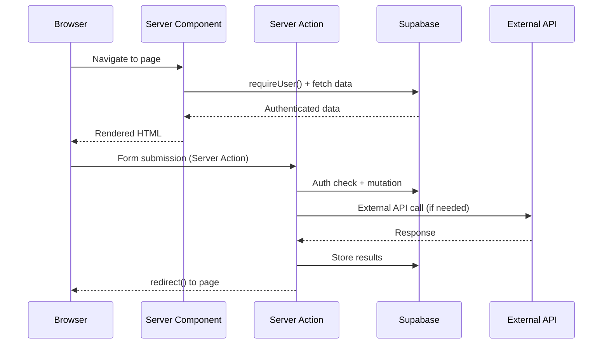
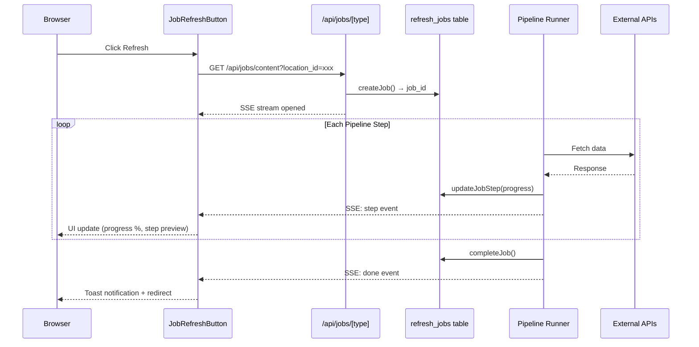
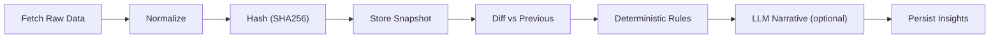
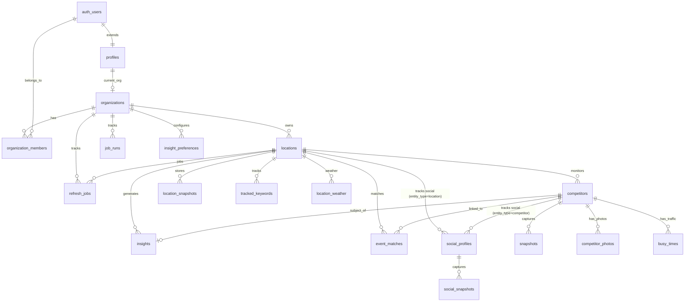

# Prophet -- Codebase Blueprint

> **Author:** Anand, GitHub Username: anandiyerdigital
> **Last updated:** April 11, 2026 (brand theming update)
> **Branch:** `feature-anand` (merges into `dev` -> `main`)
> **Purpose:** Complete technical reference for the Prophet codebase. Intended for developers, AI coding tools, and anyone who needs to understand the entire application without reading every source file.

---

## Table of Contents

1. [Executive Summary](#1-executive-summary)
2. [Tech Stack and Dependencies](#2-tech-stack-and-dependencies)
3. [Environment Variables](#3-environment-variables)
4. [Project Structure](#4-project-structure)
5. [Architecture Overview](#5-architecture-overview)
6. [Authentication and Authorization](#6-authentication-and-authorization)
7. [Database Schema](#7-database-schema)
8. [Multi-Tenancy Model](#8-multi-tenancy-model)
9. [Routing and Pages](#9-routing-and-pages)
10. [Server Actions Reference](#10-server-actions-reference)
11. [API Routes Reference](#11-api-routes-reference)
12. [External API Integrations](#12-external-api-integrations)
13. [Provider Architecture](#13-provider-architecture)
14. [Data Pipeline: Snapshots and Insights](#14-data-pipeline-snapshots-and-insights)
15. [Background Job System](#15-background-job-system)
16. [Billing and Tier System](#16-billing-and-tier-system)
17. [UI Component Library](#17-ui-component-library)
18. [Supabase Edge Functions](#18-supabase-edge-functions)
19. [Testing](#19-testing)
20. [Deployment](#20-deployment)
21. [Known Limitations and Future Work](#21-known-limitations-and-future-work)

---

## 1. Executive Summary

**Prophet** is the internal codename for the **Ticket** product — a competitive intelligence platform for local businesses (initially restaurants, expanding via verticalization to liquor stores and beyond). It automates competitor discovery, daily monitoring, SEO visibility tracking, local event intelligence, website/menu content analysis, visual intelligence (photos), foot traffic analysis, weather correlation, and actionable insight generation. The platform supports **industry verticals** through a configurable `VerticalConfig` system gated by the `VERTICALIZATION_ENABLED` feature flag. Each vertical has a **brand theme** — restaurant uses "Ticket" and liquor store uses "Neat" — applied via CSS `data-brand` attribute scoping with dynamic font loading and chart color resolution.

**Brand posture (post-WS3 rebrand, April 2026):** The customer-facing product is **Ticket** — all UI copy, emails, landing page, auth pages, onboarding, and LLM self-identification use "Ticket." Production sets `<html data-brand="ticket">` at SSR in `app/layout.tsx`, so the Ticket theme is the default render path (no Vatic→Ticket flash on first paint). **Vatic** remains as the engine/internal brand: the platform codebase (`Prophet`/`vatic-core`), Tailwind design tokens (`text-vatic-indigo`, `.vatic-gradient`), CSS variable names (`--vatic-indigo`), code-level identifiers (`buildVaticPrompt`), and footer attribution ("Ticket is powered by Vatic — competitive intelligence by Alive Labs"). Corporate parent is **Alive Labs** (matches `getticket.ai` attribution).

### What it does

- **Competitor Discovery:** AI-powered (Gemini with Google Maps grounding) discovery of nearby competitors, enriched with Google Places data.
- **Competitor Monitoring:** Tracks approved competitors with daily snapshots, diffing, and deterministic change detection.
- **SEO Visibility Dashboard:** Semrush-style domain overview via DataForSEO -- organic/paid traffic estimates, keyword rankings, competitor overlap, ranking distribution, top pages, subdomains, historical trends, ad creatives.
- **Comprehensive SEO Enrichment:** On competitor approval, automatically collects Domain Rank Overview, Ranked Keywords, Relevant Pages, Historical Rank, and Domain Intersection data. Produces 13+ deterministic SEO insight types.
- **Local Events Intelligence:** Discovers nearby events via DataForSEO Google Events SERP, matches events to tracked competitors, generates event-driven insights.
- **Content & Menu Intelligence:** Scrapes business websites via Firecrawl to extract menu items, pricing, screenshots, and site feature detection. Combines Firecrawl data with Google menu data via Gemini (Google Search Grounding) for higher accuracy. Classifies menu types (dine-in, catering, banquet, happy hour, kids). Compares menus across competitors with deterministic insight rules.
- **Visual Intelligence (Photos):** Fetches Google Places photos, analyzes via Gemini Vision for quality, ambiance, food presentation, and generates photo-based insights.
- **Foot Traffic Analysis (Busy Times):** Fetches Google Maps Popular Times data via Outscraper, visualizes hourly/daily traffic patterns, peak comparisons, and generates traffic insights.
- **Weather Intelligence:** Fetches historical and forecast weather via OpenWeatherMap, provides weather context for cross-signal insights, and suppresses weather-affected metrics.
- **Social Media Intelligence:** Tracks Instagram, Facebook, and TikTok profiles for locations and competitors via Data365 API. Discovers handles via Firecrawl website scraping and Data365 profile search (parallelized). Collects posts with engagement metrics and images. Persists social post images to Supabase Storage (replacing expiring CDN URLs). Generates 15 deterministic social insight rules (10 comparative + 5 location-only) + 8 cross-signal rules (4 social + 4 visual-aware). Platform-tabbed posts grid with entity filtering.
- **Social Media Visual Intelligence:** Analyzes social post images via Gemini Vision to extract content categories, food presentation quality, visual quality, brand signals, atmosphere signals, and promotional content. Aggregates per-entity visual profiles and generates 16 visual insight rules (12 comparative + 4 location-only) covering content strategy, competitive intelligence, and visual opportunity detection.
- **Insight Engine:** Deterministic rules generate structured insights across all signal sources (competitors, SEO, events, content, photos, traffic, weather, social, visual). LLM (Gemini) adds priority briefings and narrative summaries. Actionable insight card system with kebab menu (Mark as Read, To-Do, Done, Snooze, Dismiss). Dual-view display: category-grouped feed (default) and Kanban board (Inbox/To-Do/Done columns). Optimistic UI updates with `useTransition` and `router.refresh()`. Client-side filtering for instant tab switching.
- **Real-Time Job System:** Background job pipelines with SSE (Server-Sent Events) streaming, step-by-step progress, ambient insight feeds during long-running operations, and toast notifications on completion.
- **Server-Side Caching:** All dashboard pages use the Next.js 16 `'use cache'` directive with `cacheTag()` and `cacheLife()` for 7-day TTL tag-based revalidation. Cache tags are invalidated automatically when pipeline jobs complete via `revalidateTag(tag, { expire: 0 })` with `revalidatePath` as a backup.
- **Multi-tenant SaaS:** Organizations with roles (owner/admin/member), Stripe billing with tier-based limits, Supabase RLS for data isolation. Multi-org support with org switcher in sidebar, allowing users to create and switch between organizations.
- **Organization Switcher:** Sidebar popover listing all orgs the user belongs to with tier badges, switch action via `profiles.current_organization_id`, and "New organization" link that re-uses the full onboarding wizard.
- **Marketing Landing Page:** Editorial luxury landing page at `/` with 9 sections (hero with animated SVG dashboard, problem statement with noise-to-signal visualization, how-it-works with animated SVG icons, 6-feature bento grid with inline charts/infographics, trust counters, pricing tiers, waitlist form, footer). Full dark/light mode support. Animated SVG visualizations include competitor radar, SEO area chart, menu price bars, social engagement rings, photo grid with AI scan line, and traffic heatmap. All animations via Framer Motion and CSS keyframes with `prefers-reduced-motion` support. Waitlist signups go into a `pending` queue for admin review -- no auth account is created until approved.
- **Admin Dashboard:** Full platform administration suite at `/admin` with six sections: (1) Analytics overview with real-time metrics, recent admin activity log; (2) Waitlist management at `/admin/waitlist` with status filtering, batch operations, and "Resend Invite" for approved users; (3) User management at `/admin/users` with list/search/filter, invite new users, per-user detail pages with edit profile, send magic link, impersonate, deactivate/activate, **permanently delete user** (cascade deletes sole-owner orgs + all child data, resets waitlist for reapply), send custom email, organization memberships, and admin activity history; (4) Organization management at `/admin/organizations` with list/search/filter by tier, per-org detail pages with change tier, extend/reset trial, suspend/activate, edit info, members table, locations table, and admin activity history; (5) Admin settings at `/admin/settings` to view, invite, and remove platform admins; (6) CSV export API routes for users, organizations, and waitlist data. All admin actions are logged to `admin_activity_log` table. Gated by `platform_admins` table.
- **Waitlist Approval Flow:** Admin-gated waitlist: homepage form inserts `pending` row (no auth user), sends confirmation email to user + admin notification to `chris@alivelabs.io`. Admin approves to create Supabase auth user + organization with 14-day trial + sends invitation email with magic link, or declines with polite email. Declined users can reapply. Deleted users (whose auth account was removed) can also reapply.
- **Transactional Email System:** Resend SDK integration with React Email templates for waitlist confirmation, admin notification (new signup), waitlist invitation (with magic link CTA), waitlist decline, onboarding welcome, trial expiry reminders (3-day, 1-day), and trial expired notifications. Critical emails are awaited with delivery status surfaced to admin UI; supplementary emails (admin notification) are fire-and-forget.
- **Trial Period System:** 14-day free trial on organization creation. Dashboard layout-level gate blocks access when trial expires (shows TrialExpiredGate with Stripe upgrade CTAs). TrialBanner shown during last 7 days. Daily cron skips expired trial orgs. Trial reminder cron sends emails at 3 days, 1 day, and expiry.
- **Stripe Checkout:** `/api/stripe/checkout` POST route creates Stripe checkout sessions for Starter/Pro/Agency tier upgrades. Handles customer creation, session creation, and redirects.

### Current state

The application has shipped through most PRD phases:
- Auth, onboarding, organization management (Phase 1)
- Location management with Google Places integration (Phase 2)
- Competitor discovery with Gemini + Google Places enrichment (Phase 3)
- Snapshot pipeline with competitor and location-level snapshots (Phase 4)
- Deterministic insight engine with competitor, SEO, event, content, photo, traffic, and weather insight rules (Phase 5)
- Stripe billing with 4 tiers and limit enforcement (Phase 6)
- Background job pipeline system with SSE streaming, ActiveJobBar, and toast notifications (Phase 7)
- Real-time dashboard home with KPIs, onboarding checklist, and "Refresh All" capability
- Daily cron orchestrator for automated data refresh
- Website URL override for location-specific content/visibility tracking
- Fire-and-forget competitor enrichment on approval (SEO + content)
- Social media intelligence with Data365 (Instagram, Facebook, TikTok) (Phase 8)
- Social post image persistence to Supabase Storage
- Social media visual intelligence via Gemini Vision (content categorization, quality analysis, brand signals) (Phase 9)
- Actionable insight card system with expanded status workflow (new/read/todo/actioned/snoozed/dismissed) (Phase 10)
- Category-grouped feed and Kanban board views for insights
- Server-side caching with `'use cache'` + `cacheTag` + `cacheLife` (migrated from deprecated `unstable_cache`) and automatic revalidation after job completion
- Parallelized social handle discovery and data collection
- Multi-step onboarding wizard with animated transitions (Framer Motion), Google Places integration, AI competitor discovery, and configurable monitoring preferences
- Marketing landing page with animated SVG visualizations, Recharts mini-charts, bento grid feature showcase, dark/light mode, and waitlist-to-instant-account creation
- Resend email integration with 5 React Email templates (waitlist, welcome, trial-3day, trial-1day, trial-expired)
- 14-day trial period with billing gate, trial banner, and Stripe checkout flow
- Vercel cron configuration for daily data refresh (6am UTC) and trial reminders (9am UTC)
- Multi-org support with org switcher in sidebar, "New Organization" wizard, org settings page
- Tier enforcement: `maxLocations` enforced on location creation, `maxCompetitorsPerLocation` capped during onboarding
- Fixed critical `getTierFromPriceId` misuse in 5 files (paid users were silently getting free-tier limits)
- Comprehensive security audit: org-scoped data isolation on all dashboard pages, IDOR prevention, admin client access hardening, cron endpoint auth
- Admin-gated waitlist approval flow: signups stay `pending`, admin approves/declines, auth user + org created on approval
- Platform admin dashboard (`/admin`) with analytics, waitlist management, and admin settings
- `platform_admins` table for platform-level admin access control
- Login and signup pages refreshed with editorial luxury branding (ambient orbs, glass panels, vatic-gradient CTAs)

### What is NOT yet shipped

- Full "Ask Prophet" chat with LLM
- Data retention cleanup policies
- Team management functionality (invites, role assignment)

---

## 2. Tech Stack and Dependencies

### Runtime

| Technology | Version | Purpose |
|---|---|---|
| Next.js | 16.1.5 | App Router, Server Components, Server Actions, Turbopack |
| React | 19.2.3 | UI framework |
| TypeScript | ^5 | Type safety (strict mode) |
| Node.js | 20+ | Runtime (inferred from tsconfig target ES2017) |

### Database and Auth

| Technology | Version | Purpose |
|---|---|---|
| Supabase JS | ^2.93.1 | Database client, Auth, Realtime |
| Supabase SSR | ^0.8.0 | Server-side cookie-based auth for Next.js |
| PostgreSQL | (Supabase-managed) | Primary database with RLS |

### UI and Styling

| Technology | Version | Purpose |
|---|---|---|
| Tailwind CSS | ^4 | Utility-first CSS (v4, CSS-based config) |
| @tailwindcss/postcss | ^4 | PostCSS plugin for Tailwind v4 |
| Recharts | ^3.7.0 | React charting (bar, area, pie charts) |
| Framer Motion | ^12.29.2 | Animations (fade-in, carousel, overlays) |
| Sonner | ^2.0.7 | Toast notifications |

### Payments

| Technology | Version | Purpose |
|---|---|---|
| Stripe | ^20.2.0 | Subscription billing, webhook handling |

### External API SDKs

| Package | Version | Purpose |
|---|---|---|
| @mendable/firecrawl-js | ^4.12.1 | Firecrawl API SDK for website scraping |

### Testing and Dev Tools

| Technology | Version | Purpose |
|---|---|---|
| Playwright | ^1.58.0 | End-to-end browser testing |
| dotenv | ^17.3.1 | Load `.env.local` in scripts |
| tsx | ^4.21.0 | TypeScript script runner for dev scripts |

### External APIs (not npm packages)

| API | Purpose |
|---|---|
| Google Places API (New) | Location search, place details, reviews, photos |
| Google Maps Embed API | Mini-map iframes |
| Google Weather API | Current conditions for competitor locations |
| Google Gemini API | Competitor discovery (2.5 Flash), insight narratives (3 Pro Preview), photo analysis (2.5 Flash Vision), Google Search Grounding for menu data |
| Data365 Social Media API | Instagram, Facebook, TikTok profile data and post collection (async POST-poll-GET pattern) |
| DataForSEO | SEO data (12 endpoints), local events SERP |
| Firecrawl | Website scraping, menu extraction, screenshots, site mapping, social handle discovery |
| Outscraper | Google Maps Popular Times / Busy Times data |
| OpenWeatherMap | Historical weather data, forecasts, severe weather detection |

### Configuration

| File | Purpose |
|---|---|
| `next.config.ts` | Next.js configuration (`cacheComponents: true` for `'use cache'` directive support) |
| `tsconfig.json` | TypeScript strict mode, `@/*` path alias, excludes `supabase/functions/**` |
| `postcss.config.mjs` | PostCSS with `@tailwindcss/postcss` |
| `eslint.config.mjs` | ESLint with `eslint-config-next` |
| `playwright.config.ts` | E2E test configuration, base URL `http://localhost:3000` |
| `app/globals.css` | Tailwind v4 import + **Forge / Alive Labs** CSS custom properties (semantic shadcn tokens, extended palette, legacy Tailwind color aliases). Reference: `app/docs/vatic-alive-rebrand/vatic-forge-token-map.json` |

---

## 3. Environment Variables

All environment variables are stored in `.env.local` (gitignored). Here is the complete list referenced across the codebase:

| Variable | Required | Used In | Purpose |
|---|---|---|---|
| `NEXT_PUBLIC_SUPABASE_URL` | Yes | `lib/supabase/server.ts`, `client.ts`, `admin.ts` | Supabase project URL |
| `NEXT_PUBLIC_SUPABASE_ANON_KEY` | Yes | `lib/supabase/server.ts`, `client.ts` | Supabase anonymous/public key |
| `SUPABASE_SERVICE_ROLE_KEY` | Yes | `lib/supabase/admin.ts`, `lib/jobs/manager.ts` | Supabase service role key (server-only, bypasses RLS) |
| `GOOGLE_MAPS_API_KEY` | Yes | `lib/places/google.ts`, `lib/weather/google.ts`, `components/places/mini-map.tsx` | Google Maps Platform (Places, Embed, Weather) |
| `GOOGLE_AI_API_KEY` | Yes | `lib/providers/gemini.ts`, `lib/ai/gemini.ts`, `lib/providers/photos.ts`, `app/api/ai/quick-tip/route.ts` | Google AI / Gemini API key |
| `DATAFORSEO_LOGIN` | Yes | `lib/providers/dataforseo/client.ts` | DataForSEO API username |
| `DATAFORSEO_PASSWORD` | Yes | `lib/providers/dataforseo/client.ts` | DataForSEO API password |
| `FIRECRAWL_API_KEY` | Yes | `lib/providers/firecrawl.ts` | Firecrawl API key for website scraping and screenshots |
| `OUTSCRAPER_API_KEY` | Yes | `lib/providers/outscraper.ts` | Outscraper API key for Popular Times |
| `OPENWEATHERMAP_API_KEY` | Yes | `lib/providers/openweathermap.ts` | OpenWeatherMap One Call API 3.0 key |
| `STRIPE_SECRET_KEY` | Yes | `app/api/stripe/webhook/route.ts` | Stripe secret key |
| `STRIPE_WEBHOOK_SECRET` | Yes | `app/api/stripe/webhook/route.ts` | Stripe webhook signing secret |
| `STRIPE_PRICE_ID_STARTER` | Yes | `lib/billing/tiers.ts` | Stripe price ID for Starter tier |
| `STRIPE_PRICE_ID_PRO` | Yes | `lib/billing/tiers.ts` | Stripe price ID for Pro tier |
| `STRIPE_PRICE_ID_AGENCY` | Yes | `lib/billing/tiers.ts` | Stripe price ID for Agency tier |
| `RESEND_API_KEY` | Yes | `lib/email/client.ts` | Resend API key for transactional emails |
| `NEXT_PUBLIC_APP_URL` | No | `app/(dashboard)/competitors/actions.ts` | App base URL (defaults to `http://localhost:3000`) |
| `CRON_SECRET` | No | `app/api/cron/daily/route.ts` | Secret for authenticating cron job requests |
| `DATA365_ACCESS_TOKEN` | Yes | `lib/providers/data365/client.ts` | Data365 Social Media API access token |
| `OPENAI_API_KEY` | No | `app/api/ai/chat/route.ts` | OpenAI key (referenced but not actively used) |
| `ANTHROPIC_API_KEY` | No | `app/api/ai/chat/route.ts` | Anthropic key (referenced but not actively used) |
| `VERTICALIZATION_ENABLED` | No | `lib/verticals/`, `lib/jobs/pipelines/content.ts`, `app/onboarding/actions.ts`, AI prompt builders | Feature flag enabling vertical-aware behavior (`"true"` to activate). Defaults to disabled. |
| `CLIENT_EMAILS_ENABLED` | No | `lib/email/send.ts` | Gates client-facing transactional emails at the `sendEmail()` gateway. Set to `"true"` to enable platform-side client emails (waitlist confirmation, welcome, trial reminders). Defaults to disabled, which means passive client emails are paused while admin-initiated flows (waitlist approve/decline, admin custom emails, admin magic link) and user-initiated auth (self-service magic link) still send via `overrideClientEmailPause: true`. Production: `false` (Chris's Resend drip handles marketing). Dev / preview: `true`. |

---

## 4. Project Structure

```
prophet/
├── app/                                    # Next.js App Router
│   ├── layout.tsx                          # Root layout (Space Grotesk, Inter, Space Mono, Barlow Condensed, Instrument Serif, Fraunces via `next/font`, metadata, imports theme CSS)
│   ├── page.tsx                            # Marketing landing page (/) with waitlist
│   ├── landing.css                         # Landing page: utility classes (vatic-gradient, glass-panel, editorial-shadow), animation keyframes (float, draw-line, radar-sweep, glow-pulse, scan-line, orb-drift), dark/light overrides
│   ├── globals.css                         # Tailwind v4 + Forge design tokens (`@theme inline`)
│   ├── ticket-theme.css                    # Ticket brand overrides: [data-brand="ticket"] CSS custom properties (light, dark, landing, typography)
│   ├── neat-theme.css                      # Neat brand overrides: [data-brand="neat"] CSS custom properties (light, dark, landing, typography)
│   ├── favicon.ico
│   │
│   ├── (auth)/                             # Auth route group (shared layout)
│   │   ├── layout.tsx                      # Suspense wrapper with auth skeleton
│   │   ├── login/
│   │   │   ├── page.tsx                    # Login UI (magic link + Google OAuth)
│   │   │   └── actions.ts                  # sendMagicLinkAction, signInWithGoogleAction
│   │   └── signup/
│   │       ├── page.tsx                    # Signup UI
│   │       └── actions.ts                  # Re-exports login actions
│   │
│   ├── auth/
│   │   └── callback/
│   │       └── route.ts                    # OAuth callback: exchanges code, redirects
│   │
│   ├── onboarding/
│   │   ├── layout.tsx                      # Suspense wrapper with loading spinner
│   │   ├── page.tsx                        # First-time setup (detects resume state, renders wizard)
│   │   ├── actions.ts                      # createOrgAndLocationAction (sets trial dates), discoverCompetitorsForLocation, completeOnboardingAction (sends welcome email)
│   │   ├── onboarding-wizard.tsx           # Client: Multi-step wizard with Framer Motion transitions
│   │   ├── onboarding.css                  # Ambient gradients, starfield, slide animations
│   │   └── steps/                          # Individual wizard step components
│   │       ├── splash.tsx                  # Step 0: Branded welcome screen (vertical-aware)
│   │       ├── business-info.tsx           # Step 1: Name, address (Google Places), category (vertical-aware)
│   │       ├── competitor-selection.tsx     # Step 2: AI-discovered competitors (select up to 5)
│   │       ├── intelligence-settings.tsx   # Step 3: Monitoring preference toggles
│   │       └── loading-brief.tsx           # Step 4: Phased loading + mini-brief + dashboard CTA
│   │
│   ├── organizations/
│   │   └── new/
│   │       ├── layout.tsx                  # Suspense wrapper for new org wizard
│   │       └── page.tsx                    # Re-uses OnboardingWizard for creating additional orgs
│   │
│   ├── admin/                              # Platform admin dashboard (gated by platform_admins table)
│   │   ├── layout.tsx                      # Admin auth gate (requirePlatformAdmin), admin shell with sidebar nav (Overview, Waitlist, Users, Organizations, Settings)
│   │   ├── page.tsx                        # Analytics overview + recent admin activity log
│   │   ├── waitlist/
│   │   │   ├── page.tsx                    # Waitlist management: stats cards, filterable data table, approve/decline
│   │   │   └── components/
│   │   │       ├── stats-cards.tsx         # Total/pending/approved/declined summary cards
│   │   │       └── waitlist-table.tsx      # Client: search, status filter, checkboxes, batch ops, confirmation dialogs
│   │   ├── users/
│   │   │   ├── page.tsx                    # User list: stats row, search/filter, invite user, export CSV
│   │   │   ├── components/
│   │   │   │   └── users-table.tsx         # Client: search, filter, invite panel, activate/deactivate toggle
│   │   │   └── [id]/
│   │   │       ├── page.tsx               # User detail: server-side fetch of auth user + profile + orgs + activity
│   │   │       └── user-detail-client.tsx  # Client: edit profile, send magic link, impersonate, deactivate/activate, send email, org list, activity log
│   │   ├── organizations/
│   │   │   ├── page.tsx                    # Org list: stats row, search/filter by tier, export CSV
│   │   │   ├── components/
│   │   │   │   └── orgs-table.tsx          # Client: search, tier filter, trial status badges
│   │   │   └── [id]/
│   │   │       ├── page.tsx               # Org detail: server-side fetch of org + members + locations + competitors + activity
│   │   │       └── org-detail-client.tsx   # Client: change tier, extend/reset trial, suspend/activate, edit info, members table, locations table, activity log
│   │   └── settings/
│   │       ├── page.tsx                    # Admin management: list admins, invite, remove
│   │       └── components/
│   │           ├── admin-list.tsx          # Client: admin table with remove + confirm
│   │           └── invite-admin.tsx        # Client: invite form with email input
│   │
│   ├── actions/
│   │   ├── waitlist.ts                     # approveWaitlistSignup, declineWaitlistSignup, batch variants (with activity logging)
│   │   ├── admin-management.ts            # invitePlatformAdmin, removePlatformAdmin (with activity logging)
│   │   ├── user-management.ts             # listPlatformUsers, inviteNewUser, updateUserProfile, deactivateUser, activateUser, sendUserMagicLink, impersonateUser
│   │   ├── org-management.ts              # updateOrgTier, extendOrgTrial, resetOrgTrial, deactivateOrg, activateOrg, updateOrgInfo
│   │   └── admin-email.ts                 # sendCustomEmail, broadcastEmail
│   │
│   ├── (dashboard)/                        # Dashboard route group (auth-gated)
│   │   ├── layout.tsx                      # Sidebar nav, auth guard, org check, trial gate/banner, ActiveJobBar, Toaster
│   │   ├── actions.ts                      # signOutAction, switchOrganizationAction
│   │   ├── home/
│   │   │   ├── page.tsx                    # Live dashboard (KPIs, freshness, onboarding checklist, Refresh All)
│   │   │   └── home-charts-section.tsx     # Client: Home page charts (rating comparison, review trends)
│   │   ├── competitors/
│   │   │   ├── page.tsx                    # Competitor management (discover/approve/ignore)
│   │   │   └── actions.ts                  # discoverCompetitorsAction, approve (fire-and-forget enrich), ignore
│   │   ├── insights/
│   │   │   ├── page.tsx                    # Insight feed with filters, priority briefing, charts
│   │   │   ├── actions.ts                  # generateInsightsAction, markRead, dismiss, priority briefing
│   │   │   ├── social-actions.ts           # Social profile CRUD, discovery, dashboard data, social insight generation
│   │   │   └── priority-briefing-section.tsx  # Suspense-wrapped async server component for briefing
│   │   ├── social/
│   │   │   ├── page.tsx                    # Social intelligence (KPIs, handle management, posts grid, insights)
│   │   │   ├── actions.ts                  # Server action re-exports for social page
│   │   │   └── handle-section.tsx          # Client: Social handle management (discover, verify, delete)
│   │   ├── events/
│   │   │   ├── page.tsx                    # Local events intelligence
│   │   │   └── actions.ts                  # fetchEventsAction
│   │   ├── visibility/
│   │   │   ├── page.tsx                    # SEO visibility dashboard (organic + paid)
│   │   │   └── actions.ts                  # refreshSeoAction (comprehensive, with competitor enrichment)
│   │   ├── content/
│   │   │   ├── page.tsx                    # Content & menu intelligence (hero screenshot, menu viewer, compare)
│   │   │   └── actions.ts                  # refreshContentAction (Firecrawl + Gemini Google menu)
│   │   ├── photos/
│   │   │   ├── page.tsx                    # Visual intelligence (photo grid, KPIs)
│   │   │   └── actions.ts                  # refreshPhotosAction
│   │   ├── traffic/
│   │   │   ├── page.tsx                    # Busy times (heatmap, peak comparison, traffic chart)
│   │   │   └── actions.ts                  # refreshTrafficAction
│   │   ├── weather/
│   │   │   ├── page.tsx                    # Weather intelligence (history, location cards)
│   │   │   └── actions.ts                  # refreshWeatherAction
│   │   ├── locations/
│   │   │   ├── page.tsx                    # Location management CRUD with website URL override
│   │   │   └── actions.ts                  # createLocationFromPlace (with location limit), update, delete
│   │   └── settings/
│   │       ├── page.tsx                    # Settings index (Organization, Billing, Team)
│   │       ├── organization/
│   │       │   ├── page.tsx                # Org settings (rename, billing email, details)
│   │       │   ├── org-settings-form.tsx   # Client: form for org name/billing email
│   │       │   └── actions.ts              # updateOrganizationAction
│   │       ├── billing/
│   │       │   ├── page.tsx                # Subscription tier, trial status, upgrade UI
│   │       │   ├── upgrade-buttons.tsx     # Client: Stripe checkout tier buttons
│   │       │   └── upgrade-success.tsx     # Client: Success toast on ?upgraded=true
│   │       └── team/
│   │           └── page.tsx                # Team management (placeholder)
│   │
│   ├── api/                                # API route handlers
│   │   ├── ai/
│   │   │   ├── chat/
│   │   │   │   └── route.ts                # POST: AI chat (LLM integration pending)
│   │   │   └── quick-tip/
│   │   │       └── route.ts                # POST: Lightweight Gemini quick tip
│   │   ├── cron/
│   │   │   ├── daily/
│   │   │   │   └── route.ts                # GET: Daily orchestrator (skips expired trials)
│   │   │   └── trial-reminders/
│   │   │       └── route.ts                # GET: Trial reminder emails (3-day, 1-day, expired)
│   │   ├── jobs/
│   │   │   ├── [type]/
│   │   │   │   └── route.ts                # GET: Starts pipeline job + streams SSE progress
│   │   │   ├── active/
│   │   │   │   └── route.ts                # GET: Returns active running jobs for org
│   │   │   ├── ambient-feed/
│   │   │   │   └── route.ts                # GET: Returns ambient insight cards for a job
│   │   │   └── stream/
│   │   │       └── [jobId]/
│   │   │           └── route.ts            # GET: SSE reconnection stream for existing job
│   │   ├── places/
│   │   │   ├── autocomplete/
│   │   │   │   └── route.ts                # GET: Google Places autocomplete proxy
│   │   │   └── details/
│   │   │       └── route.ts                # GET: Google Places details proxy
│   │   ├── stripe/
│   │   │   ├── checkout/
│   │   │   │   └── route.ts                # POST: Creates Stripe checkout session for tier upgrade
│   │   │   └── webhook/
│   │   │       └── route.ts                # POST: Stripe webhook handler
│   │   └── waitlist/
│   │       └── route.ts                    # POST: Waitlist signup (admin client, sends confirmation email)
│   │
│   └── docs/
│       └── PRD.md                          # Master Product Requirements Document
│
├── components/                             # React components
│   ├── brand-provider.tsx                  # Client: Sets `data-brand` on <html> via useEffect; wraps dashboard/onboarding for brand theming
│   ├── billing/
│   │   ├── trial-expired-gate.tsx          # Client: Full-page overlay when trial expires (upgrade CTAs, brand-aware)
│   │   └── trial-banner.tsx                # Client: Dismissible top banner during last 7 trial days
│   ├── landing/
│   │   ├── landing-nav.tsx                 # Client: Glass nav (h-20), Ticket wordmark, editorial links, vatic-gradient CTA, animated mobile menu
│   │   ├── hero-section.tsx                # Client: Two-column hero — left copy with counting KPIs, right animated SVG dashboard mockup (draw-on chart, live signals), floating signal card
│   │   ├── problem-section.tsx             # Client: Noise-to-signal visualization (animated bars with gold signal highlight), floating prescient-action card
│   │   ├── how-it-works-section.tsx        # Client: 3 steps with animated SVG icons (radar sweep, prism draw-on, lightning flash)
│   │   ├── features-section.tsx            # Client: 12-col bento grid — 6 feature cards with inline animated SVGs (competitor radar, SEO area chart, menu price bars, social engagement rings, photo grid scan-line, traffic heatmap)
│   │   ├── trust-section.tsx               # Client: Animated counter infographic (4 metrics count up on scroll via framer-motion)
│   │   ├── pricing-section.tsx             # Client: 3 editorial tier cards, Pro with glow-pulse animation + Recommended badge
│   │   ├── waitlist-form.tsx               # Client: Waitlist signup form (first name, last name, email → instant account creation)
│   │   └── waitlist-section.tsx            # Client: "Join the cohort" CTA section + editorial footer with brand links
│   ├── competitors/
│   │   └── discover-form.tsx               # Client: Competitor discovery form + RefreshOverlay
│   ├── content/
│   │   ├── menu-viewer.tsx                 # Client: Tabbed menu category viewer with item cards
│   │   └── menu-compare.tsx                # Client: Side-by-side competitor menu comparison
│   ├── events/
│   │   └── events-filters.tsx              # Client: Events page filters
│   ├── filters/
│   │   └── auto-filter-form.tsx            # Client: Auto-navigating filter dropdowns
│   ├── home/
│   │   └── home-charts.tsx                 # Client: Home page charts (rating comparison, review trends, insights by source)
│   ├── insights/
│   │   ├── insight-feed.tsx                # Client: Category-grouped feed + Kanban board with optimistic updates
│   │   ├── insight-tabs.tsx                # Client: Source tab navigation
│   │   ├── insights-dashboard.tsx          # Client: Charts dashboard (Recharts)
│   │   ├── kebab-menu.tsx                  # Client: Actionable status menu (Read/To-Do/Done/Snooze/Dismiss)
│   │   ├── photo-gallery.tsx               # Client: Photo gallery for insights
│   │   ├── priority-briefing.tsx           # Client: Priority briefing display + skeleton
│   │   ├── social-dashboard.tsx            # Client: Social metrics dashboard (presence matrix, follower/engagement charts)
│   │   ├── social-posts-grid.tsx           # Client: Filterable social posts grid with platform tabs + entity filter
│   │   ├── traffic-chart.tsx               # Client: Insight-level traffic chart
│   │   └── weather-badge.tsx               # Client: Weather condition badge
│   ├── photos/
│   │   └── photo-grid.tsx                  # Client: Analyzed photo grid with filters and detail panel
│   ├── traffic/
│   │   ├── peak-comparison.tsx             # Client: Side-by-side peak hour comparison
│   │   └── traffic-heatmap.tsx             # Client: 7x18 weekly traffic heatmap
│   ├── weather/
│   │   ├── location-weather-cards.tsx      # Client: Multi-location weather cards
│   │   └── weather-history.tsx             # Client: Multi-day weather history chart
│   ├── insight-card.tsx                    # Insight card with kebab menu, evidence + recommendations
│   ├── motion/
│   │   └── fade-in.tsx                     # Client: Framer Motion fade-in wrapper
│   ├── places/
│   │   ├── location-add-form.tsx           # Client: Add location via Google Places
│   │   ├── location-search.tsx             # Client: Google Places autocomplete search
│   │   └── mini-map.tsx                    # Server: Google Maps Embed iframe
│   ├── ui/                                 # Base UI components
│   │   ├── active-job-bar.tsx              # Client: Global job status bar (polls, navigates with location_id, toast)
│   │   ├── ambient-insight-feed.tsx        # Client: Ambient insight card carousel during jobs
│   │   ├── badge.tsx                       # Server: Badge (default/success/warning)
│   │   ├── button.tsx                      # Server: Button (primary/secondary/ghost)
│   │   ├── card.tsx                        # Server: Card, CardHeader, CardTitle, CardDescription
│   │   ├── input.tsx                       # Server: Input field
│   │   ├── job-pipeline-view.tsx           # Client: Step-by-step pipeline progress visualization
│   │   ├── job-refresh-button.tsx          # Client: Refresh button with SSE streaming + ambient feed
│   │   ├── label.tsx                       # Server: Label
│   │   ├── location-filter.tsx             # Client: Location dropdown (URL param navigation)
│   │   ├── refresh-overlay.tsx             # Client: Legacy animated loading overlay
│   │   └── separator.tsx                   # Server: Horizontal separator
│   └── visibility/
│       ├── intent-serp-panels.tsx          # Client: Keyword intent + SERP feature panels
│       ├── keyword-tabs.tsx                # Client: Tabbed keyword table (All/Improved/etc.)
│       ├── ranking-distribution.tsx        # Client: Bar chart for rank position distribution
│       ├── traffic-chart.tsx               # Client: Area chart for traffic over time
│       ├── visibility-charts.tsx           # Client: Pie chart for share of voice
│       └── visibility-filters.tsx          # Client: Location dropdown + Organic/Paid tabs
│
├── lib/                                    # Shared business logic
│   ├── utils.ts                            # cn() class name merger
│   ├── hooks/
│   │   └── use-chart-colors.ts            # Client: useChartColors() hook — reads CSS custom properties for Recharts, watches data-brand/class changes via MutationObserver
│   ├── auth/
│   │   └── server.ts                       # getUser(), requireUser()
│   ├── billing/
│   │   ├── tiers.ts                        # SubscriptionTier, TIER_LIMITS, getTierFromPriceId()
│   │   ├── trial.ts                        # TRIAL_DURATION_DAYS, isTrialActive(), getTrialDaysRemaining(), isTrialExpiringSoon()
│   │   └── limits.ts                       # Guardrail functions (ensure*Limit, get*Cadence, etc.)
│   ├── email/
│   │   ├── client.ts                       # Resend instance (graceful if RESEND_API_KEY missing)
│   │   ├── send.ts                         # sendEmail({ to, subject, react }) wrapper
│   │   └── templates/
│   │       ├── layout.tsx                  # Shared email layout (dark bg, Ticket wordmark header, "powered by Vatic" footer)
│   │       ├── waitlist-confirmation.tsx   # "You're on the Ticket waitlist"
│   │       ├── waitlist-invitation.tsx    # "You're in! Your Ticket dashboard is ready" (magic link CTA)
│   │       ├── waitlist-decline.tsx       # "Update on your Ticket waitlist request"
│   │       ├── waitlist-admin-notification.tsx # Admin notification: "New waitlist signup" (sent to chris@alivelabs.io)
│   │       ├── admin-custom.tsx           # Admin custom email wrapper (used by sendCustomEmail + broadcastEmail)
│   │       ├── welcome.tsx                # "Welcome to Ticket — your feed is live"
│   │       ├── trial-expiring.tsx         # "Your Ticket trial ends in X days"
│   │       └── trial-expired.tsx          # "Your Ticket trial has ended"
│   ├── admin/
│   │   └── activity-log.ts                 # logAdminAction() — audit trail for all admin operations
│   ├── supabase/
│   │   ├── server.ts                       # createServerSupabaseClient() (SSR cookies)
│   │   ├── client.ts                       # createBrowserSupabaseClient()
│   │   └── admin.ts                        # createAdminSupabaseClient() (service role)
│   ├── ai/
│   │   ├── gemini.ts                       # generateGeminiJson(), fetchGoogleMenuData() (Search Grounding)
│   │   └── prompts/
│   │       ├── insights.ts                 # buildInsightNarrativePrompt()
│   │       ├── priority-briefing.ts        # buildPriorityBriefingPrompt() with diversity rules
│   │       └── prophet-chat.ts             # buildProphetPrompt()
│   ├── places/
│   │   └── google.ts                       # fetchAutocomplete(), fetchPlaceDetails(), mapPlaceToLocation()
│   ├── weather/
│   │   └── google.ts                       # fetchCurrentConditions() -> WeatherSnapshot
│   ├── providers/                          # External API provider wrappers
│   │   ├── types.ts                        # NormalizedSnapshot, ProviderCandidate, Provider interface
│   │   ├── index.ts                        # getProvider() registry
│   │   ├── scoring.ts                      # scoreCompetitor() relevance scoring
│   │   ├── gemini.ts                       # Gemini provider (competitor discovery)
│   │   ├── dataforseo.ts                   # DataForSEO provider (local finder + snapshots)
│   │   ├── firecrawl.ts                    # Firecrawl wrapper: mapSite(), scrapePage(), scrapeMenuPage(), discoverAllMenuUrls()
│   │   ├── photos.ts                       # Google Places photos + Gemini Vision analysis
│   │   ├── outscraper.ts                   # Outscraper Popular Times fetcher
│   │   ├── openweathermap.ts               # OpenWeatherMap historical + forecast weather
│   │   ├── data365/                        # Data365 Social Media API clients
│   │   │   ├── client.ts                   # Core client: POST→poll→GET flow, profile search, error handling
│   │   │   ├── instagram.ts               # Instagram adapter: profile + posts fetch/types
│   │   │   ├── facebook.ts                # Facebook adapter: profile + posts fetch/types
│   │   │   ├── tiktok.ts                  # TikTok adapter: profile + posts fetch/types
│   │   │   └── index.ts                   # Barrel file
│   │   └── dataforseo/                     # DataForSEO API clients (12 endpoints)
│   │       ├── client.ts                   # postDataForSEO(), extractFirstResult()
│   │       ├── domain-rank-overview.ts     # Labs Domain Rank Overview
│   │       ├── ranked-keywords.ts          # Labs Ranked Keywords
│   │       ├── keywords-for-site.ts        # Labs Keywords For Site
│   │       ├── competitors-domain.ts       # Labs Competitors Domain
│   │       ├── domain-intersection.ts      # Labs Domain Intersection
│   │       ├── relevant-pages.ts           # Labs Relevant Pages
│   │       ├── subdomains.ts               # Labs Subdomains
│   │       ├── historical-rank-overview.ts # Labs Historical Rank Overview
│   │       ├── serp-organic.ts             # SERP Google Organic
│   │       ├── google-events.ts            # SERP Google Events
│   │       ├── ads-search.ts               # Google Ads Search (Transparency Center)
│   │       └── backlinks-summary.ts        # Backlinks Summary (subscription-gated)
│   ├── verticals/                          # Industry verticalization config system
│   │   ├── types.ts                        # VerticalConfig, FeatureDefinition interfaces
│   │   ├── index.ts                        # getVerticalConfig(), isValidIndustryType(), vertical registry
│   │   ├── restaurant/                     # Restaurant vertical
│   │   │   ├── config.ts                   # Full VerticalConfig for restaurants
│   │   │   ├── constants.ts               # Cuisines, emojis, promo keywords, content terms
│   │   │   └── index.ts                   # Barrel export
│   │   └── liquor-store/                   # Liquor store vertical
│   │       ├── config.ts                   # Full VerticalConfig for liquor stores
│   │       ├── constants.ts               # Store types, spirit categories, content terms
│   │       └── index.ts                   # Barrel export
│   ├── content/                            # Content & Menu intelligence engine
│   │   ├── types.ts                        # SiteContentSnapshot, MenuSnapshot, MenuItem, MenuCategory, MenuType, CatalogItem/Category/Snapshot aliases
│   │   ├── normalize.ts                    # detectFeatures(), normalizeSiteContent(), buildMenuSnapshot(), hash
│   │   ├── menu-parse.ts                   # classifyMenuCategory(), normalizeExtractedMenu(), normalizeGoogleMenuData(), mergeExtractedMenus()
│   │   ├── enrich.ts                       # enrichCompetitorContent() – multi-URL scrape + Gemini Google menu + merge
│   │   ├── insights.ts                     # generateContentInsights() (8 deterministic rules)
│   │   └── storage.ts                      # uploadScreenshot(), getScreenshotUrl(), buildScreenshotPath()
│   ├── insights/                           # Core insight engine
│   │   ├── types.ts                        # SnapshotFieldChange, SnapshotDiff, GeneratedInsight
│   │   ├── index.ts                        # Re-exports all insight functions
│   │   ├── normalize.ts                    # normalizeSnapshot() (canonical format)
│   │   ├── hash.ts                         # computeDiffHash() (SHA256)
│   │   ├── diff.ts                         # diffSnapshots() (compare previous vs current)
│   │   ├── rules.ts                        # buildInsights() (deterministic competitor rules)
│   │   ├── trends.ts                       # buildWeeklyInsights() (T-7 trend analysis)
│   │   ├── scoring.ts                      # Source categories, relevance scoring weights, MonitoringPreferences, isInsightEnabledByPreferences()
│   │   ├── briefing-cache.ts               # In-memory TTL cache for Gemini priority briefings
│   │   ├── cached-data.ts                  # Cached insights page data fetcher ('use cache', 7-day TTL, tag: insights-data)
│   │   ├── photo-insights.ts               # generatePhotoInsights() rules
│   │   ├── traffic-insights.ts             # generateTrafficInsights() + competitive opportunity rules
│   │   └── weather-context.ts              # shouldSuppressInsight(), addWeatherContext(), generateWeatherCrossSignals()
│   ├── seo/                                # SEO insight engine
│   │   ├── types.ts                        # DomainRankSnapshot, NormalizedRankedKeyword, SEO_SNAPSHOT_TYPES
│   │   ├── normalize.ts                    # Normalizers for all DataForSEO SEO responses
│   │   ├── hash.ts                         # SEO-specific hashing utilities
│   │   ├── enrich.ts                       # enrichCompetitorSeo() – full pipeline for one competitor domain
│   │   └── insights.ts                     # generateSeoInsights() (13 deterministic rules)
│   ├── events/                             # Events insight engine
│   │   ├── types.ts                        # NormalizedEvent, EventMatchRecord, etc.
│   │   ├── normalize.ts                    # normalizeEventsSnapshot() from DataForSEO
│   │   ├── hash.ts                         # computeEventUid(), computeEventsSnapshotDiffHash()
│   │   ├── match.ts                        # matchEventsToCompetitors() deterministic matching
│   │   └── insights.ts                     # generateEventInsights() (5 insight rules)
│   ├── social/                             # Social media intelligence engine
│   │   ├── types.ts                        # SocialPlatform, NormalizedSocialProfile/Post, SocialPostAnalysis, EntityVisualProfile, etc.
│   │   ├── normalize.ts                    # Raw Data365 response → normalized profiles/posts (Instagram, Facebook, TikTok)
│   │   ├── enrich.ts                       # Social handle discovery via Firecrawl + Data365 search (parallel, with timeouts)
│   │   ├── insights.ts                     # 15 deterministic social insight rules (10 comparative + 5 location-only)
│   │   ├── visual-analysis.ts              # Gemini Vision image analysis: analyzeSocialPostImage(), analyzePostImages(), aggregateVisualMetrics()
│   │   ├── visual-insights.ts              # 16 visual insight rules (12 comparative + 4 location-only)
│   │   ├── cross-signal.ts                 # 8 cross-signal rules (4 social + 4 visual-aware)
│   │   ├── storage.ts                      # Download & persist social post images to Supabase Storage (admin client)
│   │   └── index.ts                        # Barrel file re-exporting all social modules
│   ├── cache/                              # Server-side caching layer ('use cache' + cacheTag + cacheLife, 7-day TTL)
│   │   ├── home.ts                         # Cached home dashboard data (tag: home-data)
│   │   ├── social.ts                       # Cached social insights (tag: social-data)
│   │   ├── content.ts                      # Cached content/menu data (tag: content-data)
│   │   ├── visibility.ts                   # Cached SEO data (tag: visibility-data)
│   │   ├── events.ts                       # Cached events data (tag: events-data)
│   │   ├── photos.ts                       # Cached photo/visual data (tag: photos-data)
│   │   ├── traffic.ts                      # Cached busy times data (tag: traffic-data)
│   │   └── weather.ts                      # Cached weather data (tag: weather-data)
│   ├── traffic/
│   │   └── peak-data.ts                    # buildPeakData() – shared utility for server/client peak calculation
│   └── jobs/                               # Background job pipeline system
│       ├── types.ts                        # JobType, JobStatus, JobStep, JobRecord, SSE event types, AmbientCard
│       ├── manager.ts                      # CRUD operations for refresh_jobs table (admin client)
│       ├── pipeline.ts                     # Generic pipeline runner (sequential steps, error isolation, SSE progress)
│       ├── sse.ts                          # SSE stream creation and response helpers
│       ├── auth.ts                         # getJobAuthContext() – validates user + org for job requests
│       ├── triggers.ts                     # triggerInitialLocationData() – fire-and-forget on location creation
│       ├── ambient-data.ts                 # Generates ambient insight cards during job execution
│       ├── use-job-runner.ts               # React hook for client-side job management
│       └── pipelines/                      # Individual pipeline builders
│           ├── content.ts                  # Content pipeline (Firecrawl scrape, Gemini menu, screenshots)
│           ├── visibility.ts               # SEO visibility pipeline (11 DataForSEO API groups)
│           ├── events.ts                   # Events pipeline (DataForSEO Events SERP + matching)
│           ├── insights.ts                 # Insights pipeline (all sources + cross-correlation)
│           ├── photos.ts                   # Photos pipeline (Google Places + Gemini Vision)
│           ├── traffic.ts                  # Traffic pipeline (Outscraper Popular Times)
│           ├── weather.ts                  # Weather pipeline (OpenWeatherMap historical + forecast)
│           ├── social.ts                   # Social pipeline (Data365 collect, image persistence, insight generation)
│           └── refresh-all.ts              # Orchestrates all 8 pipelines sequentially
│
├── types/                                  # Shared TypeScript types
│   ├── database.types.ts                   # Auto-generated Supabase database types
│   └── prophet.types.ts                    # ActionResult<T> standard return shape
│
├── supabase/                               # Supabase configuration
│   ├── migrations/                         # SQL migrations (14 files)
│   │   ├── 20260127010101_initial_schema.sql
│   │   ├── 20260127010200_membership_bootstrap.sql
│   │   ├── 20260127010300_fix_org_member_policies.sql
│   │   ├── 20260131010100_visual_intelligence_weather_busy_times.sql
│   │   ├── 20260206010100_events_tables.sql
│   │   ├── 20260207010100_seo_tables.sql
│   │   ├── 20260209010100_refresh_jobs.sql
│   │   ├── 20260211010100_screenshots_bucket.sql
│   │   ├── 20260219010100_insight_feedback_and_preferences.sql
│   │   ├── 20260228010100_social_media_tables.sql
│   │   ├── 20260228020100_add_social_refresh_all_job_types.sql
│   │   ├── 20260306010100_social_media_bucket.sql
│   │   ├── 20260306010200_social_snapshots_update_policy.sql
│   │   └── 20260307010100_expand_insight_status.sql
│   └── functions/                          # Supabase Edge Functions (Deno)
│       ├── orchestrator_daily/index.ts     # SEO insight generation rules
│       ├── job_worker/index.ts             # SEO normalization utilities
│       └── digest_weekly/index.ts          # Weekly digest (stub)
│
├── scripts/                                # Development/testing scripts
│   ├── refresh-signals.ts                  # End-to-end signal fetch script
│   └── refresh-busy-times.ts              # Outscraper debugging script
│
├── tests/
│   └── auth-onboarding.spec.ts             # Playwright smoke test
│
├── public/                                 # Static assets
│   ├── file.svg, globe.svg, next.svg, vercel.svg, window.svg
│
├── BLUEPRINT.md                            # This file
├── README.md
├── vercel.json                             # Vercel cron schedules (daily 6am, trial-reminders 9am UTC)
├── package.json
├── package-lock.json
├── .gitignore
├── eslint.config.mjs
├── playwright.config.ts
├── postcss.config.mjs
└── next.config.ts
```

---

## 5. Architecture Overview

### 5.1 High-Level System Architecture


```mermaid
flowchart TB
    Browser["Browser (React 19)"]
    NextJS["Next.js 16 App Router"]
    SupaAuth["Supabase Auth"]
    SupaDB["Supabase Postgres + RLS"]
    SupaStorage["Supabase Storage"]
    GooglePlaces["Google Places API"]
    GoogleMaps["Google Maps Embed"]
    GoogleWeather["Google Weather API"]
    Gemini["Google Gemini API"]
    DataForSEO["DataForSEO API"]
    Firecrawl["Firecrawl API"]
    Outscraper["Outscraper API"]
    OpenWeatherMap["OpenWeatherMap API"]
    Data365["Data365 Social API"]
    Stripe["Stripe"]
    SSE["SSE Streams"]

    Browser --> NextJS
    Browser <-->|"SSE (job progress)"| SSE
    NextJS -->|"Server Components / Actions"| SupaDB
    NextJS -->|"Screenshots, Social images"| SupaStorage
    NextJS -->|"Auth (SSR cookies)"| SupaAuth
    NextJS -->|"Autocomplete, Details, Photos"| GooglePlaces
    NextJS -->|"Current conditions"| GoogleWeather
    NextJS -->|"Discovery, Insights, Vision, Menu"| Gemini
    NextJS -->|"SEO data, Events"| DataForSEO
    NextJS -->|"Website scraping, Menus"| Firecrawl
    NextJS -->|"Popular Times"| Outscraper
    NextJS -->|"Historical weather"| OpenWeatherMap
    NextJS -->|"Social profiles/posts"| Data365
    NextJS -->|"Webhooks"| Stripe
    Browser -->|"Embed iframe"| GoogleMaps
    NextJS --> SSE
```

### 5.2 Request and Data Flow


```mermaid
sequenceDiagram
    participant B as Browser
    participant SC as Server Component
    participant SA as Server Action
    participant SB as Supabase
    participant API as External API

    B->>SC: Navigate to page
    SC->>SB: requireUser() + fetch data
    SB-->>SC: Authenticated data
    SC-->>B: Rendered HTML

    B->>SA: Form submission (Server Action)
    SA->>SB: Auth check + mutation
    SA->>API: External API call (if needed)
    API-->>SA: Response
    SA->>SB: Store results
    SA-->>B: redirect() to page
```

### 5.3 Job Pipeline Flow (SSE)


```mermaid
sequenceDiagram
    participant B as Browser
    participant JR as JobRefreshButton
    participant API as /api/jobs/[type]
    participant DB as refresh_jobs table
    participant P as Pipeline Runner
    participant EXT as External APIs

    B->>JR: Click Refresh
    JR->>API: GET /api/jobs/content?location_id=xxx
    API->>DB: createJob() → job_id
    API-->>JR: SSE stream opened
    loop Each Pipeline Step
        P->>EXT: Fetch data
        EXT-->>P: Response
        P->>DB: updateJobStep(progress)
        P-->>JR: SSE: step event
        JR-->>B: UI update (progress %, step preview)
    end
    P->>DB: completeJob()
    P-->>JR: SSE: done event
    JR-->>B: Toast notification + redirect
```

### 5.4 Insight Pipeline


```mermaid
flowchart LR
    Fetch["Fetch Raw Data"]
    Normalize["Normalize"]
    Hash["Hash (SHA256)"]
    Store["Store Snapshot"]
    Diff["Diff vs Previous"]
    Rules["Deterministic Rules"]
    LLM["LLM Narrative (optional)"]
    Insights["Persist Insights"]

    Fetch --> Normalize --> Hash --> Store --> Diff --> Rules --> LLM --> Insights
```

This pipeline applies to all signal sources:
- **Competitor insights:** DataForSEO/Google Places snapshot -> normalize -> diff -> rules (rating change, review velocity, hours change)
- **SEO insights:** DataForSEO Labs/SERP -> normalize -> diff -> rules (13 rule types)
- **Event insights:** DataForSEO Events SERP -> normalize -> match to competitors -> rules (5 rule types)
- **Content insights:** Firecrawl + Gemini menu data -> normalize -> diff -> rules (8 rule types)
- **Photo insights:** Google Places photos + Gemini Vision -> analyze -> rules
- **Traffic insights:** Outscraper Popular Times -> normalize -> rules
- **Weather insights:** OpenWeatherMap -> cross-signal correlation -> context enrichment
- **Social insights:** Data365 social profiles/posts -> normalize -> diff -> rules (15 types) + cross-signal rules (8 types)
- **Visual insights:** Social post images -> Gemini Vision analysis -> aggregate visual profiles -> rules (16 types)

### 5.4 Brand Theming Architecture

The platform supports dynamic brand theming per vertical. Each industry vertical maps to a brand (restaurant -> "Ticket", liquor_store -> "Neat"). The theming system uses CSS `data-brand` attribute scoping.

**How it works:**

1. **CSS layer:** `ticket-theme.css` and `neat-theme.css` override all Forge design tokens (`--foreground`, `--primary`, `--accent`, etc.) under `[data-brand="ticket"]` and `[data-brand="neat"]` selectors. Both light and dark mode overrides are included. Production defaults to `<html data-brand="ticket">` (set at SSR in `app/layout.tsx`), so the Ticket theme is always applied unless a vertical override swaps it.

2. **Brand resolution:** The `BrandProvider` client component (`components/brand-provider.tsx`) sets `data-brand` on `<html>` via `useEffect`. It wraps:
   - **Dashboard layout** (`app/(dashboard)/layout.tsx`): Reads `org.industry_type`, calls `getVerticalConfig()`, extracts `brand.dataBrand`. Only set when `VERTICALIZATION_ENABLED=true`.
   - **Onboarding page** (`app/onboarding/page.tsx`): Reads `?vertical=` query parameter, resolves brand the same way.

3. **Chart colors:** `useChartColors()` hook (`lib/hooks/use-chart-colors.ts`) reads computed CSS variable values at runtime. It uses a `MutationObserver` on `<html>` to re-read colors when `data-brand` or dark mode (`class`) changes. All 7 chart component files use this hook instead of hardcoded hex values.

4. **Font loading:** Three brand-specific Google Fonts (Barlow Condensed, Instrument Serif, Fraunces) are loaded in `app/layout.tsx` via `next/font/google` and assigned CSS variables. The brand CSS files reference these variables for typography overrides -- fonts only render when the matching brand is active.

5. **Sidebar branding:** The logo SVG uses `currentColor` (stroke) and `fill-accent` (dot) so it adapts to brand palette. The wordmark text is driven by `verticalConfig.brand.wordmark`.

**Surfaces where the brand stays fixed at Ticket:** Landing page, login/signup, admin panel — these do not honour per-org vertical overrides and always render under `data-brand="ticket"`.

---

## 6. Authentication and Authorization

### 6.1 Auth Methods

Two methods are supported via Supabase Auth:

1. **Magic Link** -- email-based passwordless login (`supabase.auth.signInWithOtp()`)
2. **Google OAuth** -- redirect-based OAuth2 (`supabase.auth.signInWithOAuth()`)

Both are implemented in `app/(auth)/login/actions.ts`.

### 6.2 Auth Callback

`app/auth/callback/route.ts` handles the OAuth redirect:
1. Receives `?code=...` query param
2. Exchanges code for session via `supabase.auth.exchangeCodeForSession(code)`
3. Fetches user profile to check `current_organization_id`
4. Redirects to `/home` if org exists, or `/onboarding` if not

### 6.3 Server-Side Auth Pattern

Auth is checked server-side using two functions in `lib/auth/server.ts`:

```typescript
async function getUser(): Promise<User | null>
async function requireUser(): Promise<User>
```

Both use `createServerSupabaseClient()` which reads Supabase auth cookies via Next.js `cookies()`.

### 6.4 Auth Guards

- **Dashboard layout** (`app/(dashboard)/layout.tsx`): Calls `requireUser()`, then checks for `current_organization_id`. Redirects to `/onboarding` if missing.
- **Individual pages**: Also call `requireUser()` as the first operation.
- **Job API routes** (`lib/jobs/auth.ts`): `getJobAuthContext()` validates user session + org membership for job requests.
- **There is no `middleware.ts`**: All auth is enforced at the layout/page level.

### 6.4.1 Organization Access Control (`lib/auth/org-access.ts`)

Centralized utility functions for organization-level data isolation:

- `getOrgLocationIds(organizationId)` — Returns all location IDs belonging to an organization (admin client, bypasses RLS for cache layers).
- `validateLocationForOrg(requestedId, orgLocationIds)` — Validates a URL-supplied `location_id` against the org's location set; returns fallback if invalid (IDOR prevention).
- `requireOrgMembership(supabase, userId, orgId)` — Verifies user is a member of the given organization; throws if not.

Used across all 9 dashboard pages, server actions (onboarding, competitors, insights, social), and the AI chat API route to enforce tenant isolation when `createAdminSupabaseClient()` bypasses RLS.

### 6.4.2 Platform Admin Access Control (`lib/auth/platform-admin.ts`)

Platform-level admin gating (separate from org-level roles):

- `requirePlatformAdmin()` — Checks if the current user exists in `platform_admins` table; redirects to `/home` if not. Used by `app/admin/layout.tsx`.
- `isPlatformAdmin(userId)` — Boolean check without redirect. Used internally by server actions.

The `platform_admins` table has RLS `USING (false)` so only the service-role admin client can read/write it.

### 6.4.3 Admin Activity Logging (`lib/admin/activity-log.ts`)

All admin actions (user management, org management, waitlist operations, email sends) are logged to the `admin_activity_log` table via `logAdminAction()`. This provides a full audit trail visible on the admin overview page, user detail pages, and org detail pages. The log captures admin ID, email, action type, target type/ID, and optional details JSON.

### 6.5 Supabase Clients

| Client | File | Auth | Use Case |
|---|---|---|---|
| Server | `lib/supabase/server.ts` | User's session (cookies) | All server components and actions |
| Browser | `lib/supabase/client.ts` | User's session (browser) | Client-side realtime (not actively used) |
| Admin | `lib/supabase/admin.ts` | Service role key (bypasses RLS) | Fallback writes when RLS blocks, job manager |

### 6.6 RLS Helper Functions

Two `SECURITY DEFINER` functions avoid recursive RLS policy evaluation:

```sql
public.is_org_member(org_id uuid) -> boolean
public.is_org_admin(org_id uuid) -> boolean
```

---

## 7. Database Schema

### 7.1 Migrations

| Migration | Purpose |
|---|---|
| `20260127010101_initial_schema.sql` | Core tables, indexes, RLS policies for all base tables |
| `20260127010200_membership_bootstrap.sql` | Policy allowing first org member to self-insert as owner |
| `20260127010300_fix_org_member_policies.sql` | `is_org_member()`/`is_org_admin()` SECURITY DEFINER helpers |
| `20260131010100_visual_intelligence_weather_busy_times.sql` | `competitor_photos`, `busy_times`, `location_weather` tables + RLS + `competitor-photos` storage bucket |
| `20260206010100_events_tables.sql` | `location_snapshots`, `event_matches` tables with RLS |
| `20260207010100_seo_tables.sql` | `website` column on `locations`, `snapshot_type` on `snapshots`, `tracked_keywords` table |
| `20260209010100_refresh_jobs.sql` | `refresh_jobs` table for real-time job progress tracking |
| `20260211010100_screenshots_bucket.sql` | Supabase Storage `screenshots` bucket (private, 5MB, png/jpeg/webp) |
| `20260219010100_insight_feedback_and_preferences.sql` | `user_feedback`/`feedback_at`/`feedback_by` on `insights`, `insight_preferences` table |
| `20260228010100_social_media_tables.sql` | `social_profiles`, `social_snapshots` tables with RLS for social media tracking |
| `20260228020100_add_social_refresh_all_job_types.sql` | Extends `refresh_jobs.job_type` CHECK to include `social` and `refresh_all` |
| `20260306010100_social_media_bucket.sql` | `social-media` storage bucket (public, 10MB, image formats) + RLS policies |
| `20260306010200_social_snapshots_update_policy.sql` | UPDATE policy on `social_snapshots` for org admin upserts |
| `20260307010100_expand_insight_status.sql` | Expands `insights.status` CHECK to: new/read/todo/actioned/snoozed/dismissed |
| `20260331010100_waitlist_admin_setup.sql` | Alter `waitlist_signups` (add `admin_notes`, `reviewed_by`, `reviewed_at`; change status CHECK to pending/approved/declined), create `platform_admins` table with RLS, add `waitlist_signup_id` to `organizations`, seed initial admin |
| `20260322010100_admin_activity_log.sql` | Create `admin_activity_log` table with indexes and RLS `USING (false)` |
| `20260412010100_add_industry_type.sql` | Add `industry_type` column to `organizations` (DEFAULT 'restaurant', NOT NULL, CHECK constraint, index) |

### 7.2 Tables

#### `organizations`
| Column | Type | Notes |
|---|---|---|
| `id` | uuid PK | `gen_random_uuid()` |
| `name` | text NOT NULL | |
| `slug` | text UNIQUE NOT NULL | |
| `subscription_tier` | text NOT NULL DEFAULT 'free' | CHECK: free/starter/pro/agency |
| `stripe_customer_id` | text | Nullable |
| `stripe_subscription_id` | text | Nullable |
| `billing_email` | text | Nullable |
| `trial_started_at` | timestamptz | Set on admin approval (not signup) |
| `trial_ends_at` | timestamptz | `trial_started_at + 14 days` |
| `waitlist_signup_id` | uuid FK | References `waitlist_signups(id)`, nullable |
| `industry_type` | text NOT NULL DEFAULT 'restaurant' | CHECK: restaurant/liquor_store. Added by verticalization. |
| `settings` | jsonb DEFAULT '{}' | |
| `created_at` / `updated_at` | timestamptz | |

#### `platform_admins`
| Column | Type | Notes |
|---|---|---|
| `id` | uuid PK | `gen_random_uuid()` |
| `user_id` | uuid NOT NULL UNIQUE | FK to `auth.users(id)` ON DELETE CASCADE |
| `email` | text NOT NULL UNIQUE | |
| `created_at` | timestamptz | |

RLS: `USING (false)` -- only accessible via service role (admin client).

#### `admin_activity_log`
| Column | Type | Notes |
|---|---|---|
| `id` | uuid PK | `gen_random_uuid()` |
| `admin_user_id` | uuid NOT NULL | ID of the admin who performed the action |
| `admin_email` | text | Email of the admin |
| `action` | text NOT NULL | e.g. `user.deactivate`, `org.change_tier`, `waitlist.approve` |
| `target_type` | text NOT NULL | `user`, `org`, `waitlist`, `admin`, `broadcast` |
| `target_id` | text | ID of the target entity |
| `details` | jsonb | Additional context (previous tier, email, etc.) |
| `created_at` | timestamptz | `now()` |

Indexes: `idx_activity_log_created` (created_at DESC), `idx_activity_log_target` (target_type, target_id).
RLS: `USING (false)` -- only accessible via service role (admin client).

#### `waitlist_signups`
| Column | Type | Notes |
|---|---|---|
| `id` | uuid PK | `gen_random_uuid()` |
| `email` | text NOT NULL UNIQUE | |
| `first_name` | text | Nullable |
| `last_name` | text | Nullable |
| `business_name` | text | Nullable (legacy) |
| `city` | text | Nullable (legacy) |
| `source` | text NOT NULL DEFAULT 'landing_page' | |
| `referred_by` | text | Nullable |
| `status` | text NOT NULL DEFAULT 'pending' | CHECK: pending/approved/declined |
| `admin_notes` | text | Internal notes from admin review |
| `reviewed_by` | uuid | Admin user ID who reviewed |
| `reviewed_at` | timestamptz | When review occurred |
| `notes` | text | Nullable |
| `created_at` / `updated_at` | timestamptz | |

#### `profiles`
| Column | Type | Notes |
|---|---|---|
| `id` | uuid PK | References `auth.users(id)` ON DELETE CASCADE |
| `email` | text | |
| `full_name` | text | |
| `avatar_url` | text | |
| `current_organization_id` | uuid | References `organizations(id)` |
| `created_at` / `updated_at` | timestamptz | |

#### `organization_members`
| Column | Type | Notes |
|---|---|---|
| `id` | uuid PK | |
| `organization_id` | uuid NOT NULL | References `organizations(id)` CASCADE |
| `user_id` | uuid NOT NULL | References `auth.users(id)` CASCADE |
| `role` | text NOT NULL DEFAULT 'member' | CHECK: owner/admin/member |
| UNIQUE | `(organization_id, user_id)` | |

#### `locations`
| Column | Type | Notes |
|---|---|---|
| `id` | uuid PK | |
| `organization_id` | uuid NOT NULL | References `organizations(id)` CASCADE |
| `name` | text NOT NULL | |
| `address_line1`, `address_line2`, `city`, `region`, `postal_code`, `country` | text | Address fields |
| `geo_lat` / `geo_lng` | double precision | Coordinates |
| `timezone` | text DEFAULT 'America/New_York' | |
| `primary_place_id` | text | Google Places ID |
| `website` | text | User-overridable URL for content/visibility tracking |
| `settings` | jsonb DEFAULT '{}' | Stores category, types, etc. |
| `created_at` / `updated_at` | timestamptz | |

#### `competitors`
| Column | Type | Notes |
|---|---|---|
| `id` | uuid PK | |
| `location_id` | uuid NOT NULL | References `locations(id)` CASCADE |
| `provider` | text NOT NULL DEFAULT 'dataforseo' | |
| `provider_entity_id` | text NOT NULL | Google Place ID or provider-specific ID |
| `name` | text | |
| `category`, `address`, `phone`, `website` | text | Business details |
| `relevance_score` | numeric | 0-100 weighted score |
| `is_active` | boolean NOT NULL DEFAULT true | false = ignored/removed |
| `metadata` | jsonb DEFAULT '{}' | status, placeDetails, rating, sources, etc. |
| `last_seen_at` | timestamptz | |
| UNIQUE | `(provider, provider_entity_id, location_id)` | |

**metadata.status:** `"pending"` | `"approved"` | `"ignored"` -- tracks approval workflow.

#### `snapshots`
| Column | Type | Notes |
|---|---|---|
| `id` | uuid PK | |
| `competitor_id` | uuid NOT NULL | References `competitors(id)` CASCADE |
| `captured_at` | timestamptz NOT NULL | |
| `date_key` | date NOT NULL | |
| `provider` | text NOT NULL | e.g. `dataforseo`, `firecrawl_menu` |
| `snapshot_type` | text NOT NULL DEFAULT 'listing_daily' | e.g. `web_menu_weekly`, `seo_domain_rank_overview_weekly` |
| `raw_data` | jsonb NOT NULL | Normalized payload |
| `diff_hash` | text NOT NULL | SHA256 for change detection |
| UNIQUE | `(competitor_id, date_key, snapshot_type)` | |

#### `location_snapshots`
| Column | Type | Notes |
|---|---|---|
| `id` | uuid PK | |
| `location_id` | uuid NOT NULL | References `locations(id)` CASCADE |
| `provider` | text NOT NULL | e.g. `dataforseo_google_events`, `firecrawl_site_content`, `firecrawl_menu` |
| `date_key` | date NOT NULL | |
| `captured_at` | timestamptz NOT NULL | |
| `raw_data` | jsonb NOT NULL | |
| `diff_hash` | text NOT NULL | |
| UNIQUE | `(location_id, provider, date_key)` | |

#### `event_matches`
| Column | Type | Notes |
|---|---|---|
| `id` | uuid PK | |
| `location_id` | uuid NOT NULL | References `locations(id)` CASCADE |
| `competitor_id` | uuid | References `competitors(id)` SET NULL |
| `date_key` | date NOT NULL | |
| `event_uid` | text NOT NULL | Stable hash of event |
| `match_type` | text NOT NULL | `venue_name`, `venue_address`, `url_domain` |
| `confidence` | text NOT NULL | CHECK: high/medium/low |
| `evidence` | jsonb DEFAULT '{}' | |
| UNIQUE | `(location_id, competitor_id, date_key, event_uid, match_type)` | |

#### `insights`
| Column | Type | Notes |
|---|---|---|
| `id` | uuid PK | |
| `location_id` | uuid NOT NULL | References `locations(id)` CASCADE |
| `competitor_id` | uuid | References `competitors(id)` SET NULL |
| `date_key` | date NOT NULL | |
| `insight_type` | text NOT NULL | e.g. `rating_change`, `seo_organic_visibility_up`, `menu.price_positioning_shift` |
| `title` | text NOT NULL | |
| `summary` | text NOT NULL | |
| `confidence` | text NOT NULL | CHECK: high/medium/low |
| `severity` | text NOT NULL DEFAULT 'info' | CHECK: info/warning/critical |
| `evidence` | jsonb DEFAULT '{}' | |
| `recommendations` | jsonb DEFAULT '[]' | |
| `status` | text NOT NULL DEFAULT 'new' | CHECK: new/read/todo/actioned/snoozed/dismissed |
| `user_feedback` | text | CHECK: useful/not_useful |
| `feedback_at` | timestamptz | |
| `feedback_by` | uuid | References `auth.users(id)` |
| UNIQUE | `(location_id, competitor_id, date_key, insight_type)` | |

#### `insight_preferences`
| Column | Type | Notes |
|---|---|---|
| `organization_id` | uuid NOT NULL | References `organizations(id)` CASCADE |
| `insight_type` | text NOT NULL | |
| `weight` | numeric NOT NULL DEFAULT 1.0 | Learning loop weight |
| `useful_count` | int NOT NULL DEFAULT 0 | |
| `dismissed_count` | int NOT NULL DEFAULT 0 | |
| `last_feedback_at` | timestamptz | |
| PRIMARY KEY | `(organization_id, insight_type)` | |

#### `tracked_keywords`
| Column | Type | Notes |
|---|---|---|
| `id` | uuid PK | |
| `location_id` | uuid NOT NULL | References `locations(id)` CASCADE |
| `keyword` | text NOT NULL | |
| `source` | text NOT NULL DEFAULT 'auto' | CHECK: auto/manual |
| `is_active` | boolean NOT NULL DEFAULT true | |
| UNIQUE | `(location_id, keyword)` | |

#### `refresh_jobs`
| Column | Type | Notes |
|---|---|---|
| `id` | uuid PK | |
| `organization_id` | uuid NOT NULL | References `organizations(id)` CASCADE |
| `location_id` | uuid NOT NULL | References `locations(id)` CASCADE |
| `job_type` | text NOT NULL | CHECK: content/visibility/events/insights/photos/busy_times/weather/social/refresh_all |
| `status` | text NOT NULL DEFAULT 'running' | CHECK: running/completed/failed |
| `total_steps` / `current_step` | integer | Progress tracking |
| `steps` | jsonb NOT NULL DEFAULT '[]' | Array of step objects with status/preview |
| `result` | jsonb | Final result payload |
| `created_at` / `updated_at` | timestamptz | |

#### `competitor_photos`
| Column | Type | Notes |
|---|---|---|
| `id` | uuid PK | |
| `snapshot_id` | uuid | |
| `competitor_id` | uuid NOT NULL | References `competitors(id)` CASCADE |
| `place_photo_name` | text NOT NULL | Google Places photo reference |
| `image_hash` | text NOT NULL | SHA-256 for deduplication |
| `image_url`, `width_px`, `height_px` | text/int | Photo metadata |
| `author_attribution` | jsonb | |
| `analysis_result` | jsonb | Gemini Vision analysis output |
| `first_seen_at` / `last_seen_at` | timestamptz | |

#### `busy_times`
| Column | Type | Notes |
|---|---|---|
| `id` | uuid PK | |
| `snapshot_id` | uuid | |
| `competitor_id` | uuid NOT NULL | References `competitors(id)` CASCADE |
| `day_of_week` | integer NOT NULL | 0=Sunday through 6=Saturday |
| `hourly_scores` | integer[] NOT NULL | 24-element array of popularity scores |
| `peak_hour` / `peak_score` | integer | |
| `slow_hours` | integer[] | |
| `typical_time_spent` | text | |
| `current_popularity` | integer | Live popularity percentage |

#### `location_weather`
| Column | Type | Notes |
|---|---|---|
| `id` | uuid PK | |
| `location_id` | uuid NOT NULL | References `locations(id)` CASCADE |
| `date` | date NOT NULL | |
| `temp_high_f` / `temp_low_f` / `feels_like_high_f` | decimal | |
| `humidity_avg` | integer | |
| `wind_speed_max_mph` | decimal | |
| `weather_condition` / `weather_description` / `weather_icon` | text | |
| `precipitation_in` | decimal DEFAULT 0 | |
| `is_severe` | boolean NOT NULL DEFAULT false | |
| UNIQUE | `(location_id, date)` | |

#### `social_profiles`
| Column | Type | Notes |
|---|---|---|
| `id` | uuid PK | `gen_random_uuid()` |
| `entity_type` | text NOT NULL | CHECK: location/competitor |
| `entity_id` | uuid NOT NULL | References `locations(id)` or `competitors(id)` |
| `platform` | text NOT NULL | CHECK: instagram/facebook/tiktok |
| `handle` | text NOT NULL | Platform-specific username or page ID |
| `display_name` | text | |
| `profile_url` | text | |
| `avatar_url` | text | |
| `is_verified` | boolean NOT NULL DEFAULT false | |
| `source` | text NOT NULL DEFAULT 'manual' | CHECK: manual/firecrawl/data365_search |
| `confidence` | numeric | Discovery confidence score (0-1) |
| `last_collected_at` | timestamptz | Last successful data collection |
| `created_at` / `updated_at` | timestamptz | |
| UNIQUE | `(entity_type, entity_id, platform, handle)` | |

#### `social_snapshots`
| Column | Type | Notes |
|---|---|---|
| `id` | uuid PK | `gen_random_uuid()` |
| `social_profile_id` | uuid NOT NULL | References `social_profiles(id)` CASCADE |
| `date_key` | date NOT NULL | |
| `captured_at` | timestamptz NOT NULL DEFAULT now() | |
| `raw_data` | jsonb NOT NULL | `SocialSnapshotData` (profile stats + recent posts) |
| `diff_hash` | text NOT NULL | SHA256 for change detection |
| UNIQUE | `(social_profile_id, date_key)` | |

#### `job_runs` (legacy)
| Column | Type | Notes |
|---|---|---|
| `id` | uuid PK | |
| `organization_id` | uuid NOT NULL | References `organizations(id)` CASCADE |
| `job_type` | text NOT NULL | |
| `status` | text NOT NULL DEFAULT 'queued' | CHECK: queued/running/succeeded/failed |
| `attempt` | integer NOT NULL DEFAULT 1 | |
| `trace_id` | uuid | |
| `message`, `metadata` | text/jsonb | |
| `started_at` / `finished_at` | timestamptz | |

### 7.3 Storage Buckets

| Bucket | Access | Limits | Purpose |
|---|---|---|---|
| `screenshots` | Private (signed URLs) | 5MB, png/jpeg/webp | Website and menu page screenshots |
| `competitor-photos` | Private (signed URLs) | — | Competitor Google Places photos |
| `social-media` | Public | 10MB, jpeg/png/webp/gif | Social media post images (persisted from expiring CDN URLs) |

### 7.4 Entity Relationship Diagram


```mermaid
erDiagram
    organizations ||--o{ organization_members : has
    organizations ||--o{ locations : owns
    organizations ||--o{ job_runs : tracks
    organizations ||--o{ refresh_jobs : tracks
    organizations ||--o{ insight_preferences : configures

    profiles ||--o| organizations : current_org
    auth_users ||--|| profiles : extends
    auth_users ||--o{ organization_members : belongs_to

    locations ||--o{ competitors : monitors
    locations ||--o{ insights : generates
    locations ||--o{ location_snapshots : stores
    locations ||--o{ event_matches : matches
    locations ||--o{ tracked_keywords : tracks
    locations ||--o{ location_weather : weather
    locations ||--o{ refresh_jobs : jobs
    locations ||--o{ social_profiles : "tracks social (entity_type=location)"

    competitors ||--o{ snapshots : captures
    competitors ||--o{ competitor_photos : has_photos
    competitors ||--o{ busy_times : has_traffic
    competitors ||--o{ event_matches : linked_to
    competitors ||--o| insights : subject_of
    competitors ||--o{ social_profiles : "tracks social (entity_type=competitor)"

    social_profiles ||--o{ social_snapshots : captures
```

### 7.5 RLS Policy Summary

Every table has RLS enabled. The general pattern is:

- **SELECT (read):** Allowed if user is a member of the owning organization (join through `organization_members`).
- **INSERT/UPDATE/DELETE (write):** Allowed if user is an owner or admin of the owning organization.
- **profiles:** Users can only read/insert/update their own profile.
- **organizations:** Any authenticated user can create; only members can read; only owner/admin can update.
- **organization_members:** Bootstrap policy allows first user to insert themselves as owner when org has zero members.
- **refresh_jobs:** Readable by org members; writable by admins/owners. Job manager uses admin client to bypass RLS for pipeline progress writes.

---

## 8. Multi-Tenancy Model

### 8.1 Hierarchy

```
Organization
  ├── Members (users with roles: owner/admin/member)
  ├── Insight Preferences (learned weights per insight type)
  ├── Refresh Jobs (real-time pipeline progress)
  ├── Locations
  │     ├── Competitors (discovered, approved/ignored)
  │     │     ├── Snapshots (daily data captures + SEO + menu)
  │     │     ├── Photos (Gemini Vision analyzed)
  │     │     ├── Busy Times (Popular Times data)
  │     │     └── Social Profiles (Instagram, Facebook, TikTok)
  │     │           └── Social Snapshots (profile stats + recent posts)
  │     ├── Social Profiles (location's own Instagram, Facebook, TikTok)
  │     │     └── Social Snapshots (profile stats + recent posts)
  │     ├── Location Snapshots (events, SEO domain data, site content, menus)
  │     ├── Location Weather (daily weather records)
  │     ├── Event Matches (event-competitor links)
  │     ├── Tracked Keywords (SEO keywords)
  │     └── Insights (generated findings with feedback)
  └── Job Runs (legacy background processing)
```

### 8.2 Organization Context and Switching

A user's "active" organization is stored in `profiles.current_organization_id`. All dashboard pages:

1. Call `requireUser()` to get the authenticated user
2. Query `profiles` for `current_organization_id`
3. Query `locations` scoped to that organization
4. All further queries scope through location IDs

**Multi-org support:** A user can belong to multiple organizations via `organization_members` (one row per org membership). The dashboard layout fetches all orgs the user belongs to and passes them to the sidebar org switcher.

**Org switcher:** The sidebar footer shows a popover with all user orgs (name + tier badge + checkmark for current). Selecting a different org calls `switchOrganizationAction` which validates membership, updates `profiles.current_organization_id`, revalidates the layout, and redirects to `/home`.

**New organization:** The "New organization" link in the org switcher navigates to `/organizations/new`, which renders the same `OnboardingWizard` used for initial onboarding. On completion, `completeOnboardingAction` sets `current_organization_id` to the new org.

### 8.3 Onboarding Flow

The onboarding is a 5-step animated wizard (`OnboardingWizard`) with Framer Motion transitions:

1. User signs up (magic link or Google OAuth)
2. OAuth callback checks for `current_organization_id` -- none found, redirects to `/onboarding`
3. **Step 0 (Splash):** Branded welcome screen with value propositions and "Set up my restaurant" CTA
4. **Step 1 (Restaurant Info):** Collects restaurant name, address via Google Places autocomplete (`LocationSearch`), and cuisine type. On submit, calls `createOrgAndLocationAction` which creates the organization (with slug collision retry up to 5 attempts), adds user as owner, creates the location with place details, and triggers initial data scraping — but does **not** set `profiles.current_organization_id` yet (deferred to final step)
5. **Step 2 (Competitor Selection):** Calls `discoverCompetitorsForLocation` which uses Gemini AI + Google Places to discover nearby competitors, scores them by relevance, and upserts them as `is_active: false`. User selects up to 5 competitors to track
6. **Step 3 (Intelligence Settings):** Toggle cards for monitoring preferences (pricing changes, menu updates, promotions, review activity, new openings). Saved to `locations.settings.monitoring_preferences`
7. **Step 4 (Loading Brief):** Calls `completeOnboardingAction` which sets `profiles.current_organization_id`, saves monitoring preferences, activates selected competitors (`is_active: true`), and triggers background SEO + content enrichment for each. Shows phased loading animation, then a mini-brief summarizing selections with a "Go to my Dashboard" CTA

**Resume logic:** If a user refreshes mid-onboarding, `page.tsx` detects they are an org owner without `current_organization_id` set, fetches existing location and pending competitors, and passes them to the wizard to resume from Step 2

---

## 9. Routing and Pages

### 9.1 Route Groups

- **`(auth)`:** Login and signup pages. Shares a minimal layout.
- **`(dashboard)`:** All main app pages. Shares a sidebar layout with auth guard, ActiveJobBar, and Sonner Toaster.
- **`admin`:** Platform admin pages. Separate layout with admin auth gate (`requirePlatformAdmin`), admin sidebar, and no trial gating.

### 9.2 Layout Hierarchy

```
Root Layout (app/layout.tsx)
  ├── (auth) Layout -- minimal, slate background
  │     ├── /login
  │     └── /signup
  ├── (dashboard) Layout -- sidebar + auth guard + ActiveJobBar + Toaster
│     ├── /home
│     ├── /insights
│     ├── /competitors
│     ├── /social
│     ├── /events
│     ├── /visibility
│     ├── /content
│     ├── /photos
│     ├── /traffic
│     ├── /weather
│     ├── /locations
│     └── /settings (+ /settings/organization, /settings/billing, /settings/team)
  ├── admin Layout -- admin auth gate + admin shell sidebar
  │     ├── /admin (analytics overview + activity log)
  │     ├── /admin/waitlist (waitlist management)
  │     ├── /admin/users (user list, search, filter, invite)
  │     ├── /admin/users/[id] (user detail, edit, impersonate, deactivate)
  │     ├── /admin/organizations (org list, search, filter by tier)
  │     ├── /admin/organizations/[id] (org detail, change tier, trial controls, suspend)
  │     └── /admin/settings (admin management)
  ├── /onboarding
  ├── /organizations/new
  └── / (landing page)
```

### 9.3 Sidebar Navigation

The dashboard sidebar includes 11 navigation links: Home, Insights, Competitors, Social, Events, Visibility, Content, Photos, Busy Times, Weather, Locations, Settings. The sidebar footer contains an **org switcher** popover that lists all organizations the user belongs to with tier badges, allows switching between them, and includes a "New organization" link.

### 9.4 Page Details

#### `/home` (Dashboard)
- **Hero banner** with gradient background
- **KPI cards:** Locations count, competitors tracked, total insights, signal sources (pipeline count)
- **Onboarding checklist** for new users (add location, discover competitors, run first refresh)
- **Quick Actions:** "Refresh All Data" (`refresh_all` pipeline) and "Generate Insights" buttons
- **Top 5 Priority Actions:** Scored and ranked by relevance (`computeRelevanceScore`), color-coded by severity, with first recommendation shown inline
- **Charts row** (`HomeChartsSection`): Severity distribution (bar), insights by source (bar), 30-day insight trend (area) — all via Recharts
- **Data Freshness grid:** Per-pipeline last-refresh timestamp with status indicators (green/amber/red dots)
- **Empty states** for no-insights and no-competitors scenarios

#### `/competitors`
- **Location filter:** Dropdown scopes competitors to selected location
- **Discover form:** Select location, optional keyword, triggers `discoverCompetitorsAction`
- **Candidates list:** Pending competitors with approve/ignore buttons (approval is instant, enrichment runs in background)
- **Approved table:** Full table with rating, reviews, distance, address, phone, website, maps, weather, remove button
- **Success/onboarding banners:** Shows guidance for new users and approval success messages

#### `/social` (Social Intelligence)
- **KPIs:** Total profiles tracked, platforms active, total posts, total engagement
- **Handle management:** "Discover Handles" button runs parallel Firecrawl + Data365 discovery for location and competitors. HandleManager component for add/edit/delete/verify per entity.
- **Social dashboard:** Platform presence matrix, follower bar chart, engagement rate bar chart, quick stats
- **Posts grid:** Platform tabs (All/Instagram/Facebook/TikTok), entity filter dropdown, post cards with images (persisted to Supabase Storage), engagement stats (likes/comments/shares/views), "You" badge for location's own posts
- **Insight feed:** Social-specific insights (engagement gap, posting frequency, follower growth, platform presence, viral content, hashtags, inactive accounts, location-only benchmarks) + visual insights (quality, content mix, food photography, brand consistency) + cross-signal social insights (SEO correlation, event promotion, weather opportunity, visual-aware rules). Uses the same category-grouped feed and Kanban board views as `/insights`.
- **Refresh button:** Triggers `social` pipeline (collect snapshots, persist images, generate insights)

#### `/insights`
- **Filters:** Location, date range, confidence, severity, source (competitors/events/SEO/content/photos/traffic), status (All active/New/Read/To-Do/Done/Snoozed/Dismissed)
- **Priority briefing:** Gemini-generated top 5 priorities with diversity rules (Suspense-streamed with skeleton fallback)
- **Charts dashboard:** Rating comparison, review count, sentiment distribution
- **Dual-view insight feed:**
  - **Category-grouped feed (default):** Groups insights by source category (Social, Visual, Competitors, SEO, etc.) with 6 cards per category and "Show more" expansion. Category tabs function as filters.
  - **Kanban board (toggle):** 3-column board (Inbox = new+read, To-Do = todo, Done = actioned) with 8 cards per column and "Load more" expansion.
  - **View toggle:** Switch between Feed and Board views via toolbar buttons.
  - **Optimistic updates:** Status changes apply instantly via `statusOverrides` Map + `useTransition`, then sync with server via `router.refresh()`.
  - **Dismissed/snoozed** insights are hidden from both views but accessible via status filter.
- **Insight cards:** Title, summary, severity/confidence/source badges, status pill, evidence accordion, recommendations, **kebab menu** (Mark as Read, Add to To-Do, Mark as Done, Do Later, Dismiss)

#### `/events`
- **Controls:** Location selector, period (week/weekend), venue filter, matched-only toggle
- **KPIs:** Total events, competitor matches, unique venues, active days
- **Event list:** Cards with title, date, venue, description, competitor match badges

#### `/visibility`
- **Tabs:** Organic and Paid
- **Organic tab:** KPI strip, traffic trends chart (12 months), keyword tables (All/Improved/Decreased/New/Lost), competitor overlap, intent + SERP features, ranking distribution, top pages, subdomains, keyword gap, featured snippets
- **Paid tab:** Paid KPIs, paid keyword overlap, competitor ad creatives
- **Comprehensive competitor SEO:** On refresh, also enriches all approved competitors

#### `/content`
- **Hero panel:** Website screenshot, location name, website link, tracking URL display, last refresh timestamp
- **Site features:** Detected website features as badge chips
- **Menu viewer:** Tabbed categories with item cards (name, description, price, tags), source badges (Firecrawl/Google), menu type filter (Dine-In/Catering)
- **Competitor menu compare:** Side-by-side price comparison, category gaps, unique items
- **Multi-source data:** Combines Firecrawl scraping with Gemini Google Search Grounding for menu accuracy

#### `/photos`
- **KPIs:** Total photos, analyzed count, competitor count
- **Photo grid:** Filterable by competitor, with detail panel showing Gemini Vision analysis (quality, ambiance, food presentation). Fetches up to 30 photos per entity (increased from 10) for broader visual intelligence.
- **Refresh button:** Triggers `photos` pipeline

#### `/traffic` (Busy Times)
- **KPIs:** Most popular day, peak traffic competitor, average peak score
- **Traffic heatmap:** 7x18 grid showing hourly traffic patterns by day of week
- **Peak comparison:** Side-by-side bars comparing actual peak busyness scores across competitors (uses `buildPeakData` from `lib/traffic/peak-data.ts` for proper percentage calculations)
- **Traffic chart:** Hourly breakdown for selected day
- **Traffic insights section** (`TrafficInsightsSection`): Deterministic traffic insights (peak hours, competitive opportunities, staffing recommendations)

#### `/weather`
- **KPIs:** Current conditions (icon + temp), average high temp, total precipitation, severe weather day count
- **Weather history chart:** Multi-day temperature and precipitation chart (historical + 8-day forecast, with forecast region shaded)
- **Actionable weather insights** (`WeatherActionableInsights`): Deterministic rules analyzing upcoming weather to provide business-specific guidance (stock up, add seating, prepare for slow days, capitalize on good weather)
- **Location weather cards:** Side-by-side cards for all locations with current conditions
- **Weather-related insights:** Database-stored cross-signal weather insights (severity-colored)

#### `/locations`
- Location cards with edit/delete, weather, mini-map, Google Places details
- **Website URL override:** Users can manually set the website URL for content/visibility tracking (for branch-specific URLs)
- **Screenshot thumbnail:** From Firecrawl, menu badge, item count, last scraped date
- Add location form with Google Places autocomplete

---

## 10. Server Actions Reference

| File | Function | What It Does | Redirect |
|---|---|---|---|
| `(auth)/login/actions.ts` | `sendMagicLinkAction` | Sends Supabase magic link email | None |
| `(auth)/login/actions.ts` | `signInWithGoogleAction` | Initiates Google OAuth redirect | External |
| `onboarding/actions.ts` | `createOrgAndLocationAction` | Creates org (slug retry) + member + location + triggers initial data. Does NOT set current_organization_id | None (returns data) |
| `onboarding/actions.ts` | `discoverCompetitorsForLocation` | AI competitor discovery via Gemini + Google Places, scores and upserts as inactive | None (returns data) |
| `onboarding/actions.ts` | `completeOnboardingAction` | Sets current_organization_id, saves monitoring prefs, activates competitors, triggers enrichment | None (returns data) |
| `(dashboard)/actions.ts` | `signOutAction` | Signs out user | `/login` |
| `(dashboard)/actions.ts` | `switchOrganizationAction` | Validates membership, updates current_organization_id, revalidates layout | `/home` |
| `settings/organization/actions.ts` | `updateOrganizationAction` | Renames org, updates billing email (owner/admin only) | `/settings/organization` |
| `competitors/actions.ts` | `discoverCompetitorsAction` | Gemini discovery + Places enrichment | `/competitors` |
| `competitors/actions.ts` | `approveCompetitorAction` | Sets approved, fire-and-forget SEO + content enrichment | `/competitors` |
| `competitors/actions.ts` | `ignoreCompetitorAction` | Sets ignored, is_active=false | `/competitors` |
| `insights/actions.ts` | `updateInsightStatusAction` | Unified status update (new/read/todo/actioned/snoozed/dismissed), no redirect | None |
| `insights/actions.ts` | `saveInsightAction` | Legacy: mark as read + redirect (calls `updateInsightStatusAction`) | `/insights` |
| `insights/actions.ts` | `dismissInsightAction` | Legacy: dismiss + redirect (calls `updateInsightStatusAction`) | `/insights` |
| `insights/actions.ts` | `generateInsightsAction` | Runs all insight pipelines + cross-source correlation | `/insights` |
| `insights/actions.ts` | `generatePriorityBriefing` | Gemini priority briefing with TTL cache | None (returns data) |
| `insights/social-actions.ts` | `saveSocialProfileAction` | Creates/updates social profile handle | None |
| `insights/social-actions.ts` | `deleteSocialProfileAction` | Deletes a social profile | None |
| `insights/social-actions.ts` | `verifySocialProfileAction` | Verifies a social handle via Data365 | None |
| `insights/social-actions.ts` | `runSocialDiscoveryAction` | Discovers social handles for location + competitors (parallel) | None |
| `insights/social-actions.ts` | `fetchSocialDashboardData` | Fetches profiles, handles, and all posts for social dashboard | None |
| `insights/social-actions.ts` | `generateSocialInsightsForLocation` | Runs social insight rules + cross-signal rules | None |
| `events/actions.ts` | `fetchEventsAction` | DataForSEO events, matching, insights | `/events` |
| `content/actions.ts` | `refreshContentAction` | Firecrawl + Gemini menu, screenshots, insights | `/content` |
| `visibility/actions.ts` | `refreshSeoAction` | 11 SEO API groups + competitor enrichment + insights | `/visibility` |
| `locations/actions.ts` | `createLocationFromPlaceAction` | Creates location (with tier location limit check) + triggers initial content/weather | `/locations` |
| `actions/waitlist.ts` | `approveWaitlistSignup` | Admin: creates auth user + org + trial + sends invitation email (awaited, surfaces email status) | None |
| `actions/waitlist.ts` | `declineWaitlistSignup` | Admin: updates status + sends decline email (awaited, surfaces email status) | None |
| `actions/waitlist.ts` | `resendWaitlistInvite` | Admin: regenerates magic link + resends invitation email for approved signups | None |
| `actions/waitlist.ts` | `batchApproveWaitlistSignups` | Admin: approves multiple signups | None |
| `actions/waitlist.ts` | `batchDeclineWaitlistSignups` | Admin: declines multiple signups | None |
| `actions/admin-management.ts` | `invitePlatformAdmin` | Admin: adds user to platform_admins (creates auth user if needed) | None |
| `actions/admin-management.ts` | `removePlatformAdmin` | Admin: removes admin (self-removal prevented) | None |
| `actions/user-management.ts` | `listPlatformUsers` | Admin: lists all auth users with profile + org data | None |
| `actions/user-management.ts` | `inviteNewUser` | Admin: creates auth user, sends magic link email | `/admin/users` |
| `actions/user-management.ts` | `updateUserProfile` | Admin: updates user name/email in auth + profiles | `/admin/users`, `/admin/users/[id]` |
| `actions/user-management.ts` | `deactivateUser` | Admin: bans user (876000h ban) | `/admin/users`, `/admin/users/[id]` |
| `actions/user-management.ts` | `activateUser` | Admin: unbans user | `/admin/users`, `/admin/users/[id]` |
| `actions/user-management.ts` | `sendUserMagicLink` | Admin: generates + emails magic link to user | `/admin/users/[id]` |
| `actions/user-management.ts` | `impersonateUser` | Admin: generates magic link URL (returned, not emailed) | None (logged) |
| `actions/user-management.ts` | `deleteUser` | Admin: permanently deletes user, sole-owner orgs + all child data, social profiles, resets waitlist for reapply | `/admin/users` |
| `actions/org-management.ts` | `updateOrgTier` | Admin: changes org subscription_tier | `/admin/organizations`, `/admin/organizations/[id]` |
| `actions/org-management.ts` | `extendOrgTrial` | Admin: extends trial_ends_at by N days | `/admin/organizations`, `/admin/organizations/[id]` |
| `actions/org-management.ts` | `resetOrgTrial` | Admin: resets trial to fresh 14 days, tier to free | `/admin/organizations`, `/admin/organizations/[id]` |
| `actions/org-management.ts` | `deactivateOrg` | Admin: sets tier to "suspended" | `/admin/organizations`, `/admin/organizations/[id]` |
| `actions/org-management.ts` | `activateOrg` | Admin: resets to free with fresh trial | `/admin/organizations`, `/admin/organizations/[id]` |
| `actions/org-management.ts` | `updateOrgInfo` | Admin: updates org name/billing email | `/admin/organizations`, `/admin/organizations/[id]` |
| `actions/admin-email.ts` | `sendCustomEmail` | Admin: sends custom email to one user via Resend | None (logged) |
| `actions/admin-email.ts` | `broadcastEmail` | Admin: sends email to all/filtered users in batches | None (logged) |
| `locations/actions.ts` | `updateLocationAction` | Updates location fields including website URL | `/locations` |
| `locations/actions.ts` | `deleteLocationAction` | Deletes location | `/locations` |

---

## 11. API Routes Reference

### `GET /api/jobs/[type]?location_id=xxx`
- **Auth:** Supabase user session via `getJobAuthContext()`
- **Valid types:** content, visibility, events, insights, photos, busy_times, weather, social, refresh_all
- **Logic:** Builds pipeline context + steps for the given type, creates job record, runs pipeline with SSE streaming
- **Output:** SSE stream with step events and done event (includes redirect URL)
- **Max duration:** 300 seconds

### `GET /api/jobs/active`
- **Auth:** Supabase user session
- **Logic:** Returns all `running` jobs for the user's organization
- **Output:** `{ jobs: JobRecord[] }`

### `GET /api/jobs/stream/[jobId]`
- **Auth:** Supabase user session
- **Logic:** Reconnects to an existing running job's SSE stream
- **Output:** SSE stream (replays current state + continues)

### `GET /api/jobs/ambient-feed?jobId=xxx`
- **Auth:** Supabase user session
- **Logic:** Returns ambient insight cards for display during long-running jobs
- **Output:** `{ cards: AmbientCard[] }`

### `GET /api/cron/daily`
- **Auth:** `CRON_SECRET` bearer token
- **Logic:** Iterates all locations, checks org tier, trial status, and cadence. Skips expired trial orgs. Triggers `refresh_all` jobs for eligible locations.
- **Output:** `{ processed: number, skipped: number, errors: string[] }`

### `GET /api/cron/trial-reminders`
- **Auth:** `CRON_SECRET` bearer token
- **Logic:** Queries free-tier orgs with `trial_ends_at` in range. Sends 3-day, 1-day, and expired emails via Resend to org owners.
- **Output:** `{ sent: number, details: string[], errors: string[] }`

### `POST /api/ai/chat`
- **Auth:** Supabase user session
- **Input:** `{ question: string }`
- **Output:** `{ ok, message, data: { prompt, insightsCount } }` (LLM call not yet wired)

### `POST /api/ai/quick-tip`
- **Input:** `{ context: string }`
- **Output:** `{ tip: string | null }` (Gemini 2.5 Flash)

### `GET /api/places/autocomplete`
- **Input:** `?input=search+text`
- **Output:** Array of `{ place_id, description }` suggestions

### `GET /api/places/details`
- **Input:** `?place_id=ChIJ...`
- **Output:** Full place details object

### `POST /api/stripe/checkout`
- **Auth:** Supabase user session
- **Input:** `{ tier: "starter" | "pro" | "agency" }`
- **Logic:** Creates or retrieves Stripe customer for org, creates checkout session with tier price
- **Output:** `{ url: string }` (redirect to Stripe Checkout)

### `POST /api/stripe/webhook`
- **Auth:** Stripe signature verification
- **Events:** `customer.subscription.created/updated/deleted`
- **Output:** `{ received: true }`

### `POST /api/waitlist`
- **Auth:** None (public)
- **Input:** `{ email: string, first_name?: string, last_name?: string }`
- **Logic:** Checks for existing signup -- blocks if `pending`, blocks if `approved` AND auth user still exists (otherwise allows reapply), resets to `pending` if `declined`. Inserts new row with `status: pending`. NO auth user created. Sends waitlist confirmation email (awaited). Sends admin notification to `chris@alivelabs.io`.
- **Output:** `{ ok: true }` or `{ ok: false, error: string }` (409 for duplicates)

### `GET /api/admin/export/users`
- **Auth:** Platform admin (requirePlatformAdmin)
- **Output:** CSV file with all users (email, name, created, last sign in, org count, status)

### `GET /api/admin/export/organizations`
- **Auth:** Platform admin (requirePlatformAdmin)
- **Output:** CSV file with all organizations (name, slug, tier, trial dates, billing email, member count, location count, created)

### `GET /api/admin/export/waitlist`
- **Auth:** Platform admin (requirePlatformAdmin)
- **Output:** CSV file with all waitlist signups (email, first name, last name, status, admin notes, signed up, reviewed at)

---

## 12. External API Integrations

### 12.1 Google Places API (New)
**File:** `lib/places/google.ts`

| Function | Purpose |
|---|---|
| `fetchAutocomplete(input)` | Search suggestions for location/competitor lookup |
| `fetchPlaceDetails(placeId)` | Full business details with comprehensive field mask |
| `mapPlaceToLocation(place)` | Maps Google Places response to the `locations` table schema |

### 12.2 Google Gemini API
Used in five contexts:

| Use Case | Model | File | Purpose |
|---|---|---|---|
| Competitor discovery | gemini-2.5-flash | `lib/providers/gemini.ts` | AI-powered competitor search with Maps + Search grounding |
| Insight narratives | gemini-3-pro-preview | `lib/ai/gemini.ts` | Structured JSON summaries and recommendations |
| Priority briefing | gemini-3-pro-preview | `insights/actions.ts` | Top 5 priorities with diversity rules (cached with TTL) |
| Photo analysis | gemini-2.5-flash | `lib/providers/photos.ts` | Gemini Vision for quality, ambiance, food presentation |
| Social visual analysis | gemini-2.5-flash | `lib/social/visual-analysis.ts` | Gemini Vision for social post content categorization, quality, brand signals |
| Google menu data | gemini-3-pro-preview | `lib/ai/gemini.ts` | Google Search Grounding to fetch structured menu data |

### 12.3 Data365 Social Media API
**Client:** `lib/providers/data365/client.ts`

**API Pattern:** Async POST→Poll→GET:
1. `POST /profile/{handle}/update` with `load_feed_posts=true` to initiate data collection
2. `GET /profile/{handle}/update` to poll collection status (up to 40 attempts, 3s intervals)
3. `GET /profile/{handle}` and `GET /profile/{handle}/feed/posts` to retrieve collected data

**Platform Adapters:**
| File | Platform | Key Types |
|---|---|---|
| `data365/instagram.ts` | Instagram | `InstagramRawProfile`, `InstagramRawPost` |
| `data365/facebook.ts` | Facebook | `FacebookRawProfile`, `FacebookRawPost` (uses `attached_image_url`, `reactions_*_count`) |
| `data365/tiktok.ts` | TikTok | `TikTokRawProfile`, `TikTokRawPost` |

**Key details:**
- Facebook uses different field names than Instagram (e.g., `attached_image_url` not `attached_media_display_url`, flat `reactions_*_count` fields)
- TikTok collection is slower; pipeline uses 150s timeout (vs 90s for Instagram/Facebook)
- Profile search (`searchProfiles`) supports all 3 platforms for handle discovery
- Media URLs from CDNs expire quickly; images are downloaded and persisted to Supabase Storage immediately after collection

### 12.4 DataForSEO APIs
**Client:** `lib/providers/dataforseo/client.ts`

12 endpoint-specific clients covering: Domain Rank Overview, Ranked Keywords, Keywords For Site, Competitors Domain, Domain Intersection, Relevant Pages, Subdomains, Historical Rank Overview, SERP Organic, Google Events, Ads Search, Backlinks Summary.

### 12.5 Firecrawl API
**File:** `lib/providers/firecrawl.ts` (SDK: `@mendable/firecrawl-js`)

| Function | Purpose |
|---|---|
| `mapSite(url, search, limit)` | Discover pages by search term (e.g. "menu") |
| `scrapePage(url, options)` | Scrape URL for markdown, links, full-page screenshot |
| `scrapeMenuPage(url)` | Structured menu extraction via Firecrawl's LLM extraction with JSON schema. Falls back gracefully if browser actions not supported. |
| `discoverAllMenuUrls(url, limit)` | Multi-term site mapping to find all menu-related URLs |

**Cost controls:** Location run: 2-4 pages max. Competitor run: 1-2 pages max. Tier-based `contentPagesPerRun` limit.

**Actions fallback:** `scrapeMenuPage` attempts browser actions (tab-clicking, accordion-revealing) first; if the Firecrawl plan doesn't support Fire Engine, retries without actions automatically.

### 12.6 Outscraper API
**File:** `lib/providers/outscraper.ts`

| Function | Purpose |
|---|---|
| `fetchBusyTimes(placeId, competitorId)` | Google Maps Popular Times data with async polling |

### 12.7 OpenWeatherMap API
**File:** `lib/providers/openweathermap.ts`

| Function | Purpose |
|---|---|
| `fetchHistoricalWeather(lat, lon, date)` | Historical daily weather aggregation |
| `fetchForecast(lat, lon)` | Forecast with severe weather detection |

### 12.8 Stripe
Handles subscription lifecycle events via webhook. Maps Stripe price IDs to tiers.

---

## 13. Provider Architecture

### 13.1 Provider Interface
Defined in `lib/providers/types.ts`:

```typescript
interface Provider {
  name: string
  fetchCompetitorsNear(input: { lat; lng; radiusMeters; query? }): Promise<ProviderCandidate[]>
  fetchSnapshot(input: { providerEntityId }): Promise<unknown>
  normalizeSnapshot(raw: unknown): NormalizedSnapshot
}
```

### 13.2 Provider Registry
- `"gemini"` -> competitor discovery (Gemini 2.5 Flash with Maps grounding)
- `"dataforseo"` -> snapshots + local finder (DataForSEO APIs)

### 13.3 Competitor Scoring
`lib/providers/scoring.ts`: Weighted algorithm (distance 40%, category 30%, rating 15%, reviews 15%).

---

## 14. Data Pipeline: Snapshots and Insights

### 14.1 Competitor Insights Pipeline
**Modules:** `lib/insights/`

Rules: `rating_change`, `review_velocity`, `hours_change`, `weekly_rating_trend`, `weekly_review_trend`

### 14.2 SEO Insights Pipeline
**Modules:** `lib/seo/`

**13 SEO Insight Types:**

| Type | Trigger |
|---|---|
| `seo_organic_visibility_up/down` | ETV or keyword count change >= 10% |
| `seo_keyword_opportunity_gap` | >= 3 competitor-only keywords |
| `seo_keyword_win` | New keywords entering top 3/10 |
| `seo_competitor_overtake` | Competitor gains more organic keywords |
| `seo_paid_visibility_change` | Paid ETV delta >= 20% |
| `seo_new_competitor_ads_detected` | New ad creatives detected |
| `seo_paid_keyword_overlap_spike` | Shared paid keywords increase >= 50% |
| `seo_top_page_traffic_shift` | Top page traffic share change >= 5% |
| `seo_historical_traffic_trend` | 3-month organic traffic trend |
| `seo_competitor_keyword_portfolio` | Competitor keyword portfolio analysis |
| `seo_competitor_top_page_threat` | Competitor top page threats |
| `seo_competitor_growth_trend` | Competitor growth trajectory |

### 14.3 Events Intelligence Pipeline
**Modules:** `lib/events/`

5 event insight types: weekend density spike, upcoming dense day, high-signal event, competitor hosting event, competitor event cadence up.

### 14.4 Content & Menu Intelligence Pipeline
**Modules:** `lib/content/`

**Multi-source menu extraction:**
1. **Firecrawl scraping:** Multi-URL discovery (up to 8 search terms), structured JSON extraction with schema, PDF support
2. **Gemini Google Search Grounding:** `fetchGoogleMenuData()` retrieves Google's own menu data for a business
3. **Merge:** `mergeExtractedMenus()` deduplicates, preserves sources, maintains category classification

**Menu type classification:** `classifyMenuCategory()` detects: dine_in, catering, banquet, happy_hour, kids, other.

**8 Content Insight Types:**

| Type | Trigger |
|---|---|
| `menu.price_positioning_shift` | Avg price differs >= 15% from competitor |
| `menu.category_gap` | Competitor has categories location lacks |
| `menu.signature_item_missing` | Competitor has >= 3 unique items |
| `menu.promo_signal_detected` | Promotional keywords in competitor menu |
| `menu.menu_change_detected` | Item count changed >= 3 vs previous |
| `menu.catering_pricing_gap` | Catering vs dine-in pricing comparison |
| `content.conversion_feature_gap` | Competitor has features location lacks |
| `content.delivery_platform_gap` | Competitor on platforms location isn't |

### 14.5 Photo Insights Pipeline
**Modules:** `lib/insights/photo-insights.ts`, `lib/providers/photos.ts`

Flow: Fetch Google Places photo references (up to 30 per entity) -> Download photos -> SHA-256 hash for dedup -> Gemini Vision analysis (gemini-2.5-flash) -> Generate photo insights.

### 14.6 Traffic Insights Pipeline
**Modules:** `lib/insights/traffic-insights.ts`, `lib/providers/outscraper.ts`

Flow: Fetch Outscraper Popular Times -> Normalize day/hour data -> Generate traffic insights + competitive opportunity insights.

### 14.7 Weather Context Pipeline
**Modules:** `lib/insights/weather-context.ts`, `lib/providers/openweathermap.ts`

Flow: Fetch OpenWeatherMap data -> Detect severe weather -> Suppress weather-affected insights -> Generate cross-signal weather insights.

### 14.8 Social Media Intelligence Pipeline
**Modules:** `lib/social/`, `lib/providers/data365/`, `lib/jobs/pipelines/social.ts`

**Discovery flow:**
1. `discoverSocialHandles()` combines Firecrawl website scraping + Data365 profile search
2. Platform searches run in parallel with 20-second per-platform timeout
3. Location and all competitors are processed in parallel via `Promise.allSettled`

**Collection flow (pipeline -- 4 steps):**
1. `discover_handles` step: Discovers social handles via Firecrawl + Data365 search (parallel, with timeouts)
2. `collect_snapshots` step: Fetches profiles and posts from Data365 for each tracked social profile. Downloads post images from CDN and uploads to `social-media` Supabase Storage bucket (admin client bypasses RLS)
3. `analyze_social_visuals` step: Runs Gemini Vision analysis on top 10 posts per profile (by engagement), stores `visualAnalysis` inline in `social_snapshots.raw_data`, aggregates `EntityVisualProfile` metrics. Uses 3-way concurrency with rate limiting.
4. `generate_social_insights` step: Runs social metric insight rules + visual insight rules + cross-signal rules, upserts all insights to database

**Platform-specific timeouts:** Instagram/Facebook 90s, TikTok 150s (Data365 needs longer for TikTok).

**15 Social Metric Insight Types (10 comparative + 5 location-only):**

| Type | Trigger | Requires Competitors |
|---|---|---|
| `social.engagement_gap` | Location engagement rate < competitor by significant margin | Yes |
| `social.posting_frequency_low` | Location posts significantly less frequently than competitors | Yes |
| `social.follower_growth_slow` | Location follower growth trailing competitors | Yes |
| `social.platform_presence_gap` | Competitor active on platform location isn't on | Yes |
| `social.competitor_viral_content` | Competitor post with unusually high engagement | Yes |
| `social.hashtag_opportunity` | Trending hashtags used by competitors but not location | Yes |
| `social.competitor_inactive` | Competitor hasn't posted in 30+ days | No (location-only) |
| `social.engagement_declining` | Location engagement rate trending down | Yes |
| `social.content_type_gap` | Competitor succeeding with content types location doesn't use | Yes |
| `social.posting_consistency` | Location posting schedule irregular vs competitors | Yes |
| `social.posting_frequency_benchmark` | Location posting cadence vs industry benchmarks | No (location-only) |
| `social.engagement_benchmark` | Location engagement rate vs platform benchmarks | No (location-only) |
| `social.content_type_breakdown` | Breakdown of location's content types with optimization tips | No (location-only) |
| `social.best_performing_content` | Identifies location's highest-engagement post patterns | No (location-only) |
| `social.posting_consistency_self` | Location posting regularity assessment | No (location-only) |

**16 Visual Insight Types (12 comparative + 4 location-only):**

| Type | Trigger | Requires Competitors |
|---|---|---|
| `social.visual_quality_gap` | Location visual quality score < competitor | Yes |
| `social.visual_quality_win` | Location visual quality score > competitor | Yes |
| `social.content_mix_imbalance` | Location content category distribution is imbalanced vs competitor | Yes |
| `social.food_photography_gap` | Location food photography quality < competitor | Yes |
| `social.professional_content_gap` | Location professional content % < competitor | Yes |
| `social.competitor_promo_blitz` | Competitor running high % promotional content | No (competitor-only) |
| `social.crowd_perception_gap` | Competitor showing higher crowd levels than location | Yes |
| `social.brand_consistency_low` | Location brand consistency score is low | No (location-only) |
| `social.ugc_dominance` | Competitor has high UGC content showing strong community | Yes |
| `social.video_content_opportunity` | Competitor succeeding with video but location isn't using it | No (competitor-only) |
| `social.seasonal_content_gap` | Competitor posting seasonal content but location isn't | Yes |
| `social.behind_scenes_opportunity` | Competitor succeeding with behind-the-scenes content | Yes |
| `social.visual_quality_self_assessment` | Location visual quality assessment with improvement tips | No (location-only) |
| `social.content_mix_self_analysis` | Location content category analysis with recommendations | No (location-only) |
| `social.food_photography_self_assessment` | Location food photography quality assessment | No (location-only) |
| `social.visual_engagement_correlation` | Correlation between visual quality and engagement rate | No (location-only) |

**8 Cross-Signal Social Insight Types (4 social + 4 visual-aware):**

| Type | Trigger |
|---|---|
| `social.web_traffic_correlation` | Social presence vs SEO traffic disparity |
| `social.event_promotion_gap` | Local events not being promoted on social |
| `social.weather_opportunity` | Weather conditions that favor social engagement |
| `social.multi_platform_strength` | Multi-platform presence advantage/disadvantage |
| `social.visual_google_mismatch` | Social visual quality doesn't match Google Photos quality |
| `social.event_visual_promo` | Upcoming events not being visually promoted on social |
| `social.weather_seasonal_content` | Weather patterns suggest seasonal content opportunities |
| `social.menu_visual_alignment` | Menu items not well-represented in social visuals |

### 14.9 Social Media Visual Intelligence Pipeline
**Modules:** `lib/social/visual-analysis.ts`, `lib/social/visual-insights.ts`

**Analysis flow:**
1. Filters for posts with Supabase Storage URLs (not expired CDN URLs) that lack existing `visualAnalysis`
2. Sorts posts by engagement (likes + comments + shares) and takes top 10 per profile
3. Downloads images and sends to Gemini Vision (gemini-2.5-flash) with a social-media-specific structured prompt
4. Extracts 15-field `SocialPostAnalysis`: content category, subcategory, tags, OCR text, food presentation (plating/portion/color), visual quality (lighting/composition/editing), brand signals (logo/colors/style), atmosphere signals (crowd/energy/time), promotional content detection
5. Stores analysis inline in `social_snapshots.raw_data.recentPosts[].visualAnalysis`
6. Aggregates per-entity `EntityVisualProfile` metrics (content mix distribution, avg visual quality, professional %, food presentation score, brand consistency, promotional %, crowd signal)

**Optimization:** 3-way concurrency with rate limiting (150ms between chunks), 8s download timeout per image, 60s timeout per profile batch.

### 14.10 Cross-Source Correlation
`generateInsightsAction` runs all pipelines then generates cross-source insights:
- Event + SEO traffic opportunity
- Domain authority risk
- Competitor momentum detection

### 14.11 Priority Briefing
Gemini 3 Pro Preview generates a top-5 priority briefing with diversity rules (must cover >= 3 source categories, max 2 from same category). Results are cached in an in-memory TTL cache (`lib/insights/briefing-cache.ts`).

### 14.12 Competitor Enrichment on Approval
When a competitor is approved (`approveCompetitorAction`):
1. Competitor row is updated immediately (instant redirect)
2. Background fire-and-forget enrichment runs:
   - **SEO enrichment** (`lib/seo/enrich.ts`): Domain Rank Overview, Ranked Keywords, Relevant Pages, Historical Rank, Domain Intersection
   - **Content enrichment** (`lib/content/enrich.ts`): Multi-URL menu scrape, Gemini Google menu, merge, screenshot upload

---

### 14.13 Server-Side Caching

**Module:** `lib/cache/`

All dashboard pages use the Next.js 16 `'use cache'` directive with `cacheTag()` and `cacheLife({ revalidate: 604800 })` (7-day TTL) for server component data fetches. This requires `cacheComponents: true` in `next.config.ts`.

Each cache function declares its cache tag inline:

```typescript
export async function fetchVisibilityPageData(locationId: string) {
  "use cache"
  cacheTag("visibility-data")
  cacheLife({ revalidate: 604800 })
  // ... data fetching logic ...
}
```

| Cache Tag | File | Used By |
|---|---|---|
| `home-data` | `lib/cache/home.ts` | `/home` dashboard KPIs, recent insights, recent jobs |
| `insights-data` | `lib/insights/cached-data.ts` | `/insights` filtered insights, preferences, competitors |
| `social-data` | `lib/cache/social.ts` | `/social` insights and preferences |
| `content-data` | `lib/cache/content.ts` | `/content` site content, menus, competitor menus |
| `visibility-data` | `lib/cache/visibility.ts` | `/visibility` SEO data, keywords, intersection |
| `events-data` | `lib/cache/events.ts` | `/events` events snapshot, event matches |
| `photos-data` | `lib/cache/photos.ts` | `/photos` competitor photos, visual insights |
| `traffic-data` | `lib/cache/traffic.ts` | `/traffic` busy times, peak hours |
| `weather-data` | `lib/cache/weather.ts` | `/weather` history, forecasts, location cards |

**Cache invalidation:** When a pipeline job completes (`app/api/jobs/[type]/route.ts`), the appropriate cache tags are invalidated via `revalidateTag(tag, { expire: 0 })` and backed up with `revalidatePath()` for the corresponding page path. The `refresh_all` job invalidates all 9 tags. Each dashboard server action also calls `revalidateTag` for its relevant tags before redirecting.

**Note:** The caching layer was migrated from the deprecated `unstable_cache` to `'use cache'` + `cacheTag` in March 2026 to resolve a cache invalidation incompatibility in Next.js 16.

---

## 15. Background Job System

### 15.1 Architecture

The job system provides real-time progress tracking for long-running data refresh operations.

**Components:**
- `lib/jobs/types.ts` – Shared types: `JobType` (9 types), `JobStatus`, `JobStep`, `JobRecord`, `SSEStepEvent`, `SSEDoneEvent`, `AmbientCard`
- `lib/jobs/manager.ts` – CRUD for `refresh_jobs` table using admin Supabase client
- `lib/jobs/pipeline.ts` – Generic sequential pipeline runner with error isolation
- `lib/jobs/sse.ts` – SSE stream creation utilities
- `lib/jobs/auth.ts` – Authentication context for job API routes
- `lib/jobs/triggers.ts` – Fire-and-forget triggers for automatic data collection
- `lib/jobs/ambient-data.ts` – Ambient insight card generation during job execution
- `lib/jobs/use-job-runner.ts` – React hook for client-side job management

### 15.2 Job Types

| Type | Pipeline | Steps |
|---|---|---|
| `content` | Content & Menus | Firecrawl scrape + Gemini menu + screenshot upload |
| `visibility` | SEO & Visibility | 11 DataForSEO API groups + competitor enrichment |
| `events` | Local Events | DataForSEO Events SERP + matching |
| `insights` | Insight Generation | All source pipelines + cross-correlation |
| `photos` | Photo Analysis | Google Places photos + Gemini Vision |
| `busy_times` | Busy Times | Outscraper Popular Times |
| `weather` | Weather | OpenWeatherMap historical + forecast |
| `social` | Social Media | Data365 collect + image persistence + social insights |
| `refresh_all` | Full Refresh | Orchestrates all 8 pipelines sequentially |

### 15.3 UI Components

- **`JobRefreshButton`** (`components/ui/job-refresh-button.tsx`): Per-page refresh button. Connects to SSE stream, shows pipeline step progress with `JobPipelineView`, displays `AmbientInsightFeed` during execution, shows toast on completion. Re-checks for active jobs when location changes.
- **`ActiveJobBar`** (`components/ui/active-job-bar.tsx`): Global top bar that polls `/api/jobs/active` to show running jobs across all pages. Navigates with `location_id` preserved. Shows toast notifications when jobs complete. Stores job metadata (type + locationId) for proper navigation.
- **`JobPipelineView`** (`components/ui/job-pipeline-view.tsx`): Step-by-step progress visualization with status icons and preview data.
- **`AmbientInsightFeed`** (`components/ui/ambient-insight-feed.tsx`): Carousel of insight cards during long-running operations.

### 15.4 SSE Protocol

Events sent during pipeline execution:
- `step` – Step progress update with preview data
- `done` – Pipeline complete with status, warnings, and redirect URL

### 15.5 Daily Cron Orchestrator

`app/api/cron/daily/route.ts`: Iterates all locations, checks org subscription tier and cadence rules, triggers `refresh_all` pipeline for eligible locations. Designed for Vercel Cron or external scheduler.

---

## 16. Billing and Tier System

### 16.1 Tiers

| Tier | Locations | Competitors/Loc | Retention | Events | SEO Keywords | SEO Cadence | Content Pages/Run |
|---|---|---|---|---|---|---|---|
| Free | 1 | 5 | 30 days | Weekly, 1 query | 10 tracked, 50 ranked | Weekly | 2 |
| Starter | 3 | 15 | 90 days | Daily, 2 queries | 25 tracked, 50 ranked | Weekly | 3 |
| Pro | 10 | 50 | 180 days | Daily, 2 queries | 50 tracked, 100 ranked | Labs weekly, SERP daily | 5 |
| Agency | 50 | 200 | 365 days | Daily, 2 queries | 200 tracked, 500 ranked | Daily | 8 |

### 16.2 Trial Period

- **Duration:** 14 days from organization creation (`lib/billing/trial.ts: TRIAL_DURATION_DAYS`)
- **Columns:** `organizations.trial_started_at` / `organizations.trial_ends_at` (set in `createOrgAndLocationAction`)
- **Backfill:** Existing orgs backfilled with `trial_started_at = created_at`, `trial_ends_at = created_at + 14 days`
- **Active check:** `isTrialActive(org)` returns false if `subscription_tier === "suspended"`, returns true if `subscription_tier !== "free"`, otherwise checks `trial_ends_at > now()`
- **Gate:** `app/(dashboard)/layout.tsx` renders `TrialExpiredGate` (full-page upgrade overlay) when trial expired
- **Banner:** `TrialBanner` shown during last 7 days of trial (dismissible per session)
- **Cron:** Daily cron (`/api/cron/daily`) skips locations belonging to expired trial orgs
- **Reminders:** `/api/cron/trial-reminders` sends emails at 3 days, 1 day, and expiry via Resend
- **Upgrade:** Stripe checkout via `POST /api/stripe/checkout` (Starter/Pro/Agency tiers)

### 16.3 Guardrail Functions

`lib/billing/limits.ts` provides:
- `ensureLocationLimit`, `ensureCompetitorLimit`, `ensureEventQueryLimit`, `ensureTrackedKeywordLimit`
- `getEventsCadence`, `getEventsQueriesPerRun`, `getEventsMaxDepth`
- `getSeoTrackedKeywordsLimit`, `getSeoLabsCadence`, `getSeoSerpCadence`, `getSeoRankedKeywordsLimit`, `getSeoIntersectionLimit`
- `isSeoIntersectionEnabled`, `isSeoAdsEnabled`
- `getContentMaxPages`, `getContentCadence`

**Enforcement points:**
- `ensureLocationLimit` is called in `createLocationFromPlaceAction` (dashboard) and `createLocationAction` (onboarding) before inserting a new location
- `ensureCompetitorLimit` is called in `approveCompetitorAction` (dashboard) before activating a competitor
- `maxCompetitorsPerLocation` is enforced in `completeOnboardingAction` by capping the bulk-approved competitor list to the tier limit
- Tier resolution uses `(org.subscription_tier ?? "free") as SubscriptionTier` (direct cast from stored tier name, NOT via `getTierFromPriceId` which expects Stripe price IDs)

---

## 17. UI Component Library

**Design system:** The default product UI uses the **Forge/Alive** palette (carbon primary `#2B353F`, ember accent `#FF7849`, forge-patina greens, warm neutrals). Display typography is **Space Grotesk**; UI body is **Inter**; monospace is **Space Mono**. Legacy class names such as `vatic-indigo`, `signal-gold`, and `precision-teal` remain in components but resolve to Forge-mapped values in `globals.css`. Brand themes (**Ticket** for restaurant, **Neat** for liquor store) override all Forge tokens via `data-brand` CSS attribute scoping. Ticket adds Barlow Condensed + Instrument Serif fonts; Neat adds Fraunces. Chart components use the `useChartColors()` hook to read computed CSS variables at runtime so they respond to brand changes.

### 17.1 Base UI Components

| Component | File | Type | Description |
|---|---|---|---|
| Badge | `components/ui/badge.tsx` | Server | Colored badge (default/success/warning) |
| Button | `components/ui/button.tsx` | Server | Button (primary/secondary/ghost, sm/md/lg) |
| Card | `components/ui/card.tsx` | Server | Card container with sub-components |
| Input | `components/ui/input.tsx` | Server | Styled text input |
| Label | `components/ui/label.tsx` | Server | Form label |
| Separator | `components/ui/separator.tsx` | Server | Horizontal rule |

### 17.2 Brand Theming Components

| Component | File | Type | Description |
|---|---|---|---|
| BrandProvider | `components/brand-provider.tsx` | Client | Sets `data-brand` attribute on `<html>` via `useEffect`; wraps dashboard/onboarding layouts |
| useChartColors | `lib/hooks/use-chart-colors.ts` | Client Hook | Reads computed CSS custom properties for Recharts; watches `data-brand` and `class` (dark mode) via `MutationObserver`; returns typed color map |

### 17.3 Interactive Components

| Component | File | Type | Description |
|---|---|---|---|
| TrialExpiredGate | `components/billing/trial-expired-gate.tsx` | Client | Full-page gate with 3-tier Stripe upgrade CTAs (brand-aware) |
| TrialBanner | `components/billing/trial-banner.tsx` | Client | Top banner (dismissible) showing days remaining |
| OrgSettingsForm | `settings/organization/org-settings-form.tsx` | Client | Org rename + billing email form |
| LandingNav | `components/landing/landing-nav.tsx` | Client | Fixed nav with smooth-scroll links + mobile menu |
| HeroSection | `components/landing/hero-section.tsx` | Client | Full-viewport hero with ambient gradient |
| ProblemSection | `components/landing/problem-section.tsx` | Client | Two-column problem statement + signal cards |
| HowItWorksSection | `components/landing/how-it-works-section.tsx` | Client | 3-step horizontal flow |
| FeaturesSection | `components/landing/features-section.tsx` | Client | 6 glass-card feature blocks |
| TrustSection | `components/landing/trust-section.tsx` | Client | Social proof / credibility copy |
| PricingSection | `components/landing/pricing-section.tsx` | Client | 3-tier pricing cards |
| WaitlistForm | `components/landing/waitlist-form.tsx` | Client | Email/business/city form with success state |
| WaitlistSection | `components/landing/waitlist-section.tsx` | Client | Waitlist CTA section + footer |
| LocationFilter | `components/ui/location-filter.tsx` | Client | Dropdown navigating via URL params |
| RefreshOverlay | `components/ui/refresh-overlay.tsx` | Client | Legacy animated loading overlay |
| JobRefreshButton | `components/ui/job-refresh-button.tsx` | Client | SSE-connected refresh with pipeline view |
| ActiveJobBar | `components/ui/active-job-bar.tsx` | Client | Global job status bar with polling and toast |
| JobPipelineView | `components/ui/job-pipeline-view.tsx` | Client | Step-by-step progress visualization |
| AmbientInsightFeed | `components/ui/ambient-insight-feed.tsx` | Client | Insight card carousel during jobs |
| AutoFilterForm | `components/filters/auto-filter-form.tsx` | Client | Auto-navigating filter selects |
| FadeIn | `components/motion/fade-in.tsx` | Client | Framer Motion fade-in wrapper |

### 17.3 Feature Components

| Component | File | Description |
|---|---|---|
| DiscoverForm | `competitors/discover-form.tsx` | Competitor discovery + RefreshOverlay |
| InsightCard | `insight-card.tsx` | Insight card with kebab menu, status pill, evidence, recommendations |
| InsightFeed | `insights/insight-feed.tsx` | Category-grouped feed + Kanban board with optimistic status updates |
| KebabMenu | `insights/kebab-menu.tsx` | Actionable status dropdown (Read/To-Do/Done/Snooze/Dismiss) with optimistic UI |
| InsightsDashboard | `insights/insights-dashboard.tsx` | Recharts charts dashboard |
| PriorityBriefing | `insights/priority-briefing.tsx` | Priority briefing display + skeleton |
| MenuViewer | `content/menu-viewer.tsx` | Tabbed menu viewer with item cards |
| MenuCompare | `content/menu-compare.tsx` | Side-by-side competitor menu comparison |
| PhotoGrid | `photos/photo-grid.tsx` | Analyzed photo grid with filters |
| TrafficHeatmap | `traffic/traffic-heatmap.tsx` | 7x18 weekly traffic heatmap |
| PeakComparison | `traffic/peak-comparison.tsx` | Side-by-side peak hour comparison |
| WeatherHistory | `weather/weather-history.tsx` | Multi-day weather chart (historical + forecast) |
| WeatherActionableInsights | `weather/weather-actionable-insights.tsx` | Deterministic weather-to-action rules for business owners |
| LocationWeatherCards | `weather/location-weather-cards.tsx` | Multi-location weather cards |
| TrafficInsightsSection | `traffic/traffic-insights.tsx` | Deterministic traffic insights from busy times data |
| SocialDashboard | `insights/social-dashboard.tsx` | Presence matrix, follower/engagement charts |
| SocialPostsGrid | `insights/social-posts-grid.tsx` | Platform-tabbed posts grid with entity filter dropdown |
| HandleManager | `social/handle-manager.tsx` | Add/edit/delete/verify social handles per entity |
| HomeChartsSection | `home/home-charts-section.tsx` | Severity distribution, source breakdown, 30-day trend (Recharts) |
| EventsFilters | `events/events-filters.tsx` | Events page filters |

### 17.4 Visibility Components

VisibilityFilters, TrafficChart, RankingDistribution, KeywordTabs, IntentSerpPanels, VisibilityCharts – all in `components/visibility/`.

---

## 18. Supabase Edge Functions

Three Edge Functions exist in `supabase/functions/` (scaffolded, not deployed):

- **`orchestrator_daily`:** Contains SEO insight generation rules (duplicated from `lib/seo/`)
- **`job_worker`:** Contains SEO normalization utilities (duplicated from `lib/seo/`)
- **`digest_weekly`:** Stub for weekly email digest generation

**Note:** The primary daily orchestration is now handled by `app/api/cron/daily/route.ts` within the Next.js app, not the Edge Functions.

---

## 19. Testing

### 19.1 Existing Tests

`tests/auth-onboarding.spec.ts`: Playwright smoke test covering `/login`, `/signup`, and `/onboarding` redirect behavior.

### 19.2 Development Scripts

- `scripts/refresh-signals.ts` – End-to-end signal fetch for weather, photos, busy times
- `scripts/refresh-busy-times.ts` – Outscraper debugging script

---

## 20. Deployment

### 20.1 Hosting

The app is deployed on **Vercel**. Vercel provides automatic deployments on push, preview deployments for PRs, and environment variable management.

### 20.2 Git Workflow

- **`dev` branch:** Primary development branch
- **`main` branch:** Production branch
- Flow: develop on `dev` -> create PR -> merge to `main` -> Vercel auto-deploys

### 20.3 Build and Lint

```bash
npm run dev      # Development server (Turbopack)
npm run build    # Production build
npm run start    # Start production server
npm run lint     # ESLint
npm run test:e2e # Playwright E2E tests
```

### 20.4 Vercel Cron Jobs

Configured in `vercel.json`:

| Schedule | Path | Purpose |
|---|---|---|
| `0 6 * * *` (6 AM UTC daily) | `/api/cron/daily` | Data refresh orchestrator for all active locations |
| `0 9 * * *` (9 AM UTC daily) | `/api/cron/trial-reminders` | Trial expiry emails (3-day, 1-day, expired) |

Both routes require `CRON_SECRET` bearer token for auth.

### 20.5 Production Environment Variables

In addition to the existing variables (Section 3), ensure these are set in Vercel:

| Variable | Required | Purpose |
|---|---|---|
| `RESEND_API_KEY` | For emails | Resend API key (emails fail gracefully without it) |
| `CRON_SECRET` | For crons | Auth token for Vercel cron endpoints |
| `STRIPE_PRICE_ID_STARTER` | For billing | Stripe price ID for Starter tier |
| `STRIPE_PRICE_ID_PRO` | For billing | Stripe price ID for Pro tier |
| `STRIPE_PRICE_ID_AGENCY` | For billing | Stripe price ID for Agency tier |

---

## 21. Known Limitations and Future Work

### Current Limitations

1. **Backlinks API:** Requires separate DataForSEO subscription. API client exists but removed from UI.
2. **Chat endpoint incomplete:** `POST /api/ai/chat` scaffolds prompt building but does not call an LLM.
3. **Weekly digest is a stub:** `supabase/functions/digest_weekly/index.ts` returns mock data.
4. **No middleware.ts:** Auth enforced at layout/page level.
5. **Edge Function code duplication:** SEO logic in `supabase/functions/` duplicates `lib/seo/`.
6. **No data retention cleanup:** Defined in tier limits but no cleanup job exists.
7. **Team management placeholder:** `/settings/team` has no functionality.
8. **Insight feedback simplified:** The thumbs up/down UI has been replaced by actionable status workflow (Read/To-Do/Done/Snooze/Dismiss). The `insight_preferences` learning loop adjusts weights based on status changes.
9. **Firecrawl actions limitation:** Browser actions (tab-clicking, accordion-revealing) require Fire Engine which may not be available on all Firecrawl plans. The code falls back gracefully to plain scraping.
10. **DataForSEO ETV estimates:** For small/local businesses, estimated traffic volume can be approximate.

### Future Work

- "Ask Prophet" natural language chat grounded in stored data
- Events page layout redesign
- Additional providers (Yelp, SerpApi)
- Real-time monitoring capabilities
- Data retention enforcement
- Team invite and role management
- Weekly email digest of top insights
- Verticalization Phase 2: subdomain routing, marketing site integration, additional industry verticals

---

*This document was generated from a complete analysis of the Prophet codebase. Last updated April 11, 2026.*
